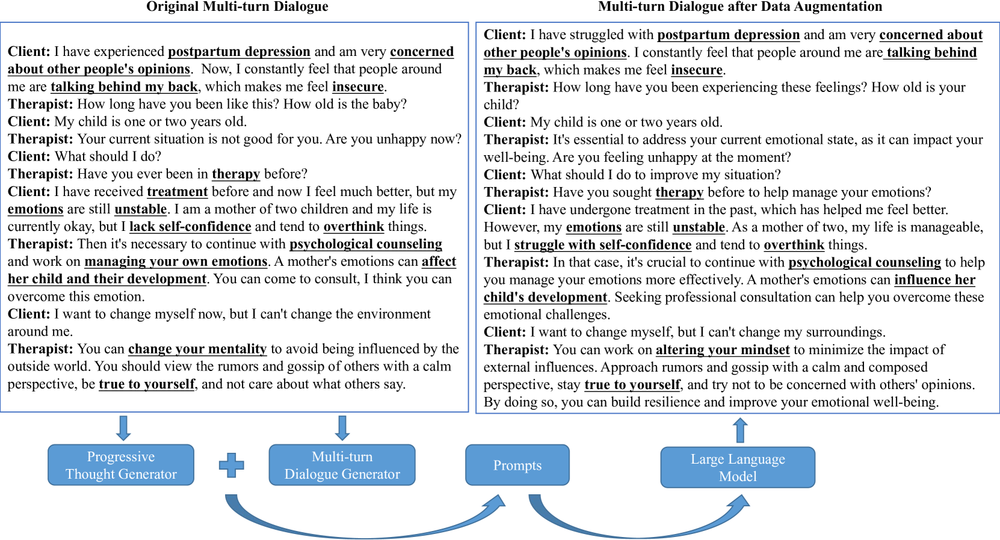
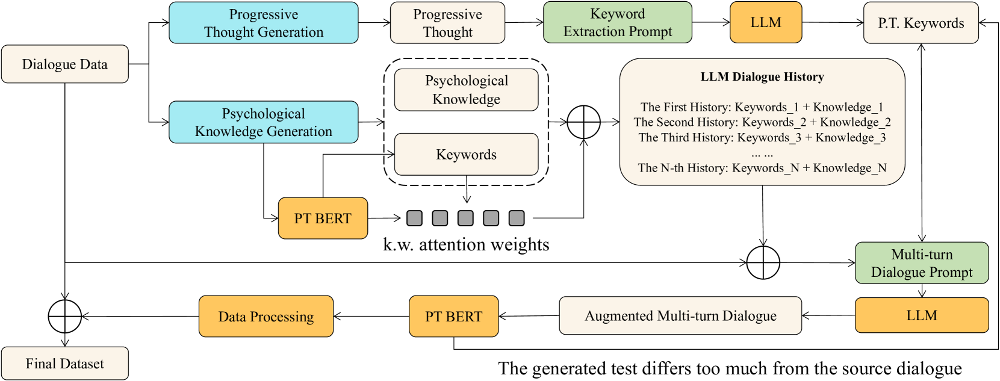
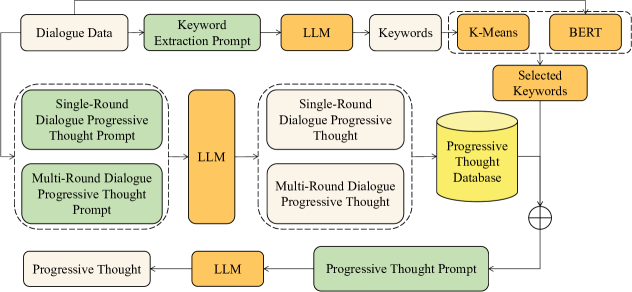
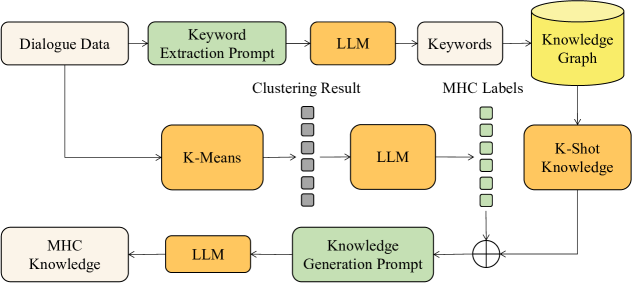

# 借助知识驱动的渐进思维提示，增强多轮心理对话的数据丰富性

发布时间：2024年06月24日

`Agent

这篇论文主要关注的是在心理领域中多轮对话的数据增强问题，并提出了一种知识驱动的渐进思维提示方法。这种方法通过特定的生成器来确保生成的对话内容符合心理学知识，并且能够避免语义偏差。论文的核心在于开发和应用一个特定的Agent（即知识驱动的渐进思维提示方法）来改善特定领域（心理对话）中的多轮对话质量。因此，这篇论文更适合归类到Agent分类中，因为它描述了一个特定领域的解决方案，并且这个解决方案是通过一个特定的Agent实现的。` `心理健康` `对话系统`

> Data Augmentation of Multi-turn Psychological Dialogue via Knowledge-driven Progressive Thought Prompting

# 摘要

> 当前的对话数据增强技术主要关注话语级别的对话增强，忽略了对话的上下文信息。大型语言模型的兴起虽然简化了多轮对话的实现，但在如心理对话这样的低资源领域，由于缺乏专业知识，达到满意性能仍是一大挑战。本文针对心理领域中多轮对话的数据增强问题，提出了一种知识驱动的渐进思维提示方法，旨在提升性能。该方法通过整合渐进思维生成器、心理学知识生成器和多轮对话生成器，确保生成的对话不仅避免语义偏差，还能准确反映心理学知识。为验证LLM生成多轮心理对话的精确性，我们进行了细致的专业评估，并在三个心理对话相关数据集上进行了广泛实验，结果证实了该方法的有效性。

> Existing dialogue data augmentation (DA) techniques predominantly focus on augmenting utterance-level dialogues, which makes it difficult to take dialogue contextual information into account. The advent of large language models (LLMs) has simplified the implementation of multi-turn dialogues. Due to absence of professional understanding and knowledge, it remains challenging to deliver satisfactory performance in low-resource domain, like psychological dialogue dialogue. DA involves creating new training or prompting data based on the existing data, which help the model better understand and generate psychology-related responses. In this paper, we aim to address the issue of multi-turn dialogue data augmentation for boosted performance in the psychology domain. We propose a knowledge-driven progressive thought prompting method to guide LLM to generate multi-turn psychology-related dialogue. This method integrates a progressive thought generator, a psychology knowledge generator, and a multi-turn dialogue generator. The thought generated by the progressive thought generator serves as a prompt to prevent the generated dialogue from having significant semantic deviations, while the psychology knowledge generator produces psychological knowledge to serve as the dialogue history for the LLM, guiding the dialogue generator to create multi-turn psychological dialogue. To ensure the precision of multi-turn psychological dialogue generation by LLM, a meticulous professional evaluation is required. Extensive experiments conducted on three datasets related to psychological dialogue verify the effectiveness of the proposed method.

[Arxiv](https://arxiv.org/abs/2406.16567)