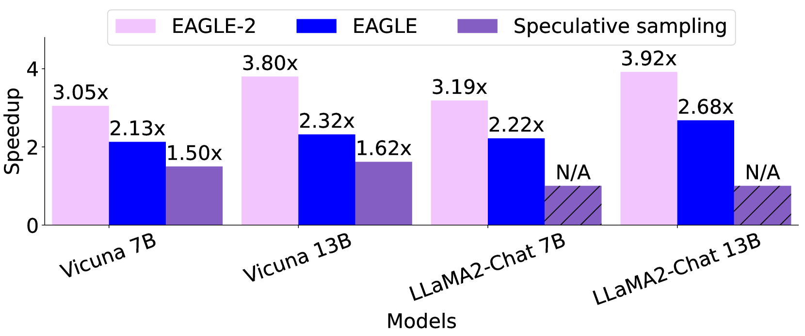
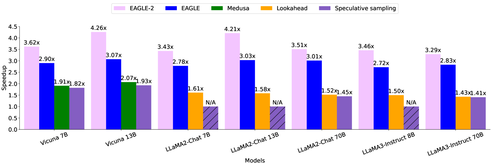
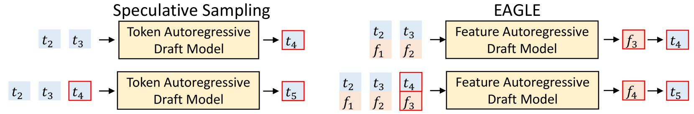
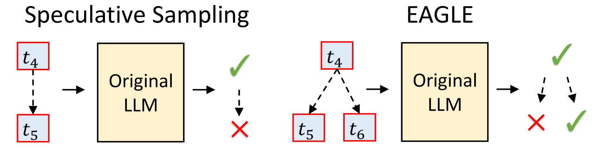
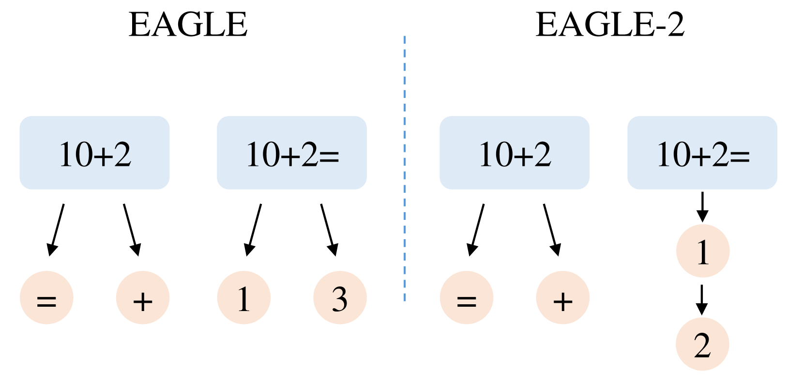
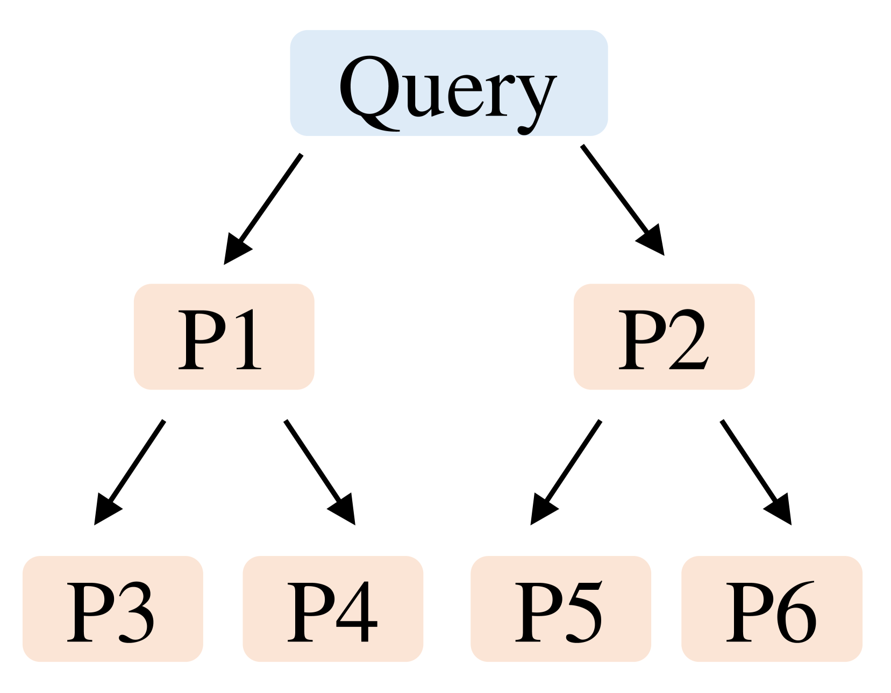
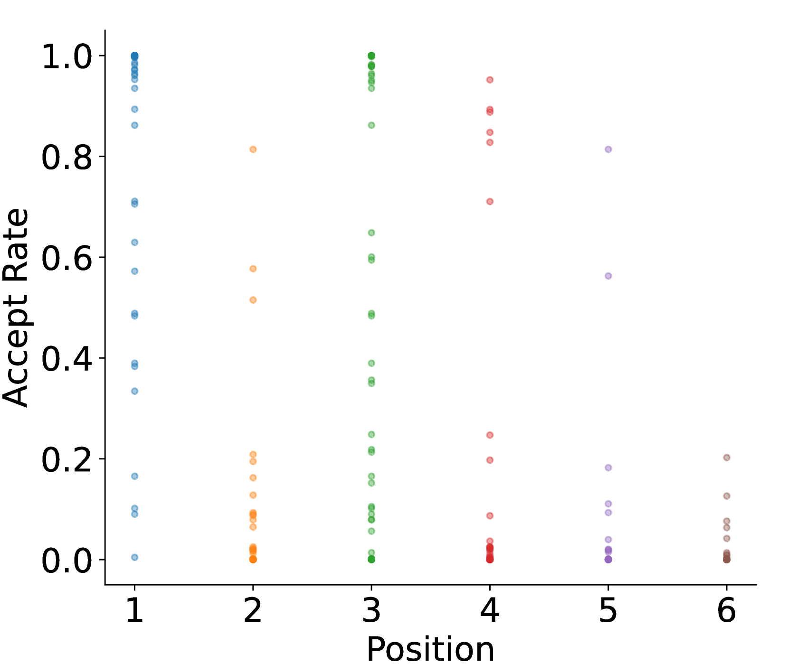
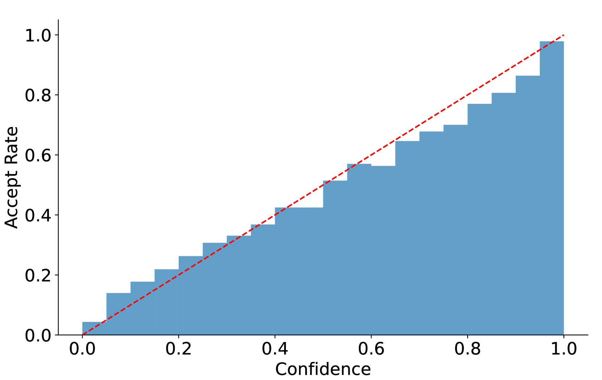
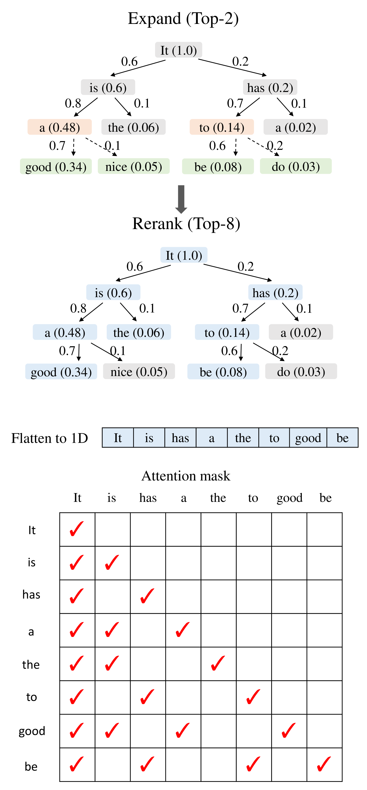

# EAGLE-2：借助动态草稿树，语言模型推理更迅捷

发布时间：2024年06月24日

`LLM应用

这篇论文主要讨论了大型语言模型（LLMs）的推理效率问题，并提出了一种改进的方法EAGLE-2，该方法通过引入上下文感知的动态草稿树技术来提高草稿建模的效率。这种方法直接应用于LLMs的实际操作中，以提高其性能和效率，因此属于LLM应用分类。` `机器学习`

> EAGLE-2: Faster Inference of Language Models with Dynamic Draft Trees

# 摘要

> 现代大型语言模型（LLMs）的推理成本高昂且耗时，推测性采样成为了解决这一问题的有效手段。然而，传统方法如EAGLE采用的静态草稿树，假设草稿令牌的接受率仅与其位置有关。我们发现，这一接受率实际上还受上下文影响。为此，我们基于EAGLE提出了EAGLE-2，它引入了上下文感知的动态草稿树技术，显著提升了草稿建模的效率。通过利用EAGLE草稿模型的高校准性，EAGLE-2在三个系列的LLMs和六个任务上实现了3.05倍至4.26倍的加速，比前代快20%至40%，同时保持了生成文本分布的一致性，实现了无损加速。

> Inference with modern Large Language Models (LLMs) is expensive and time-consuming, and speculative sampling has proven to be an effective solution. Most speculative sampling methods such as EAGLE use a static draft tree, implicitly assuming that the acceptance rate of draft tokens depends only on their position. Interestingly, we found that the acceptance rate of draft tokens is also context-dependent. In this paper, building upon EAGLE, we propose EAGLE-2, which introduces a new technique of context-aware dynamic draft tree into drafting modeling. This improvement leverages the fact that the draft model of EAGLE is well-calibrated: the confidence scores from the draft model approximate acceptance rates with small errors. We conducted extensive evaluations on three series of LLMs and six tasks, with EAGLE-2 achieving speedup ratios 3.05x-4.26x, which is 20%-40% faster than EAGLE-1. EAGLE-2 also ensures that the distribution of the generated text remains unchanged, making it a lossless acceleration algorithm.

[Arxiv](https://arxiv.org/abs/2406.16858)