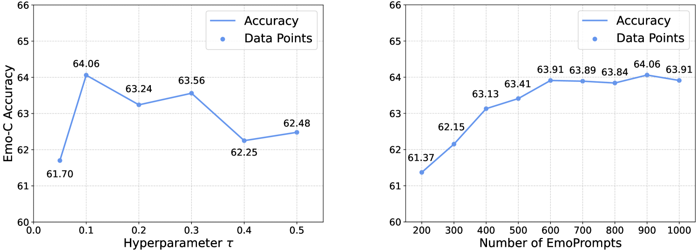

# EmoLLM：大型语言模型中的多模态情感理解探索

发布时间：2024年06月24日

`LLM应用

这篇论文介绍了多模态大型语言模型（MLLMs）在情感理解方面的应用，通过开发新的模型EmoLLM和评估基准EmoBench，旨在提升模型在处理主观、情感丰富的多模态内容时的性能。这一研究直接应用于人机交互、心理健康和同理心AI等领域，属于LLM的具体应用范畴。` `人机交互` `心理健康`

> EmoLLM: Multimodal Emotional Understanding Meets Large Language Models

# 摘要

> 多模态大型语言模型（MLLMs）在客观感知任务上表现出色，但在解读主观、情感丰富的多模态内容方面仍有待探索。为此，我们推出了EmoBench，首个专为评估MLLMs情感能力而设计的综合基准，涵盖五个情感任务，利用了287k图像和视频及其文本指令的多样化数据集。同时，我们开发了EmoLLM，一种新型模型，通过两种核心技术——多视角视觉投影和EmoPrompt，前者捕捉视觉数据中的情感线索，后者引导模型正确推理情感。实验表明，EmoLLM在EmoBench上显著提升了情感理解性能，平均提高了12.1%。我们的研究不仅深化了对人类复杂情感的理解，也为开发应用于人机交互、心理健康和同理心AI等领域的人工情感智能技术奠定了基础。相关代码、数据和模型将公开。

> Multi-modal large language models (MLLMs) have achieved remarkable performance on objective multimodal perception tasks, but their ability to interpret subjective, emotionally nuanced multimodal content remains largely unexplored. Thus, it impedes their ability to effectively understand and react to the intricate emotions expressed by humans through multimodal media. To bridge this gap, we introduce EmoBench, the first comprehensive benchmark designed specifically to evaluate the emotional capabilities of MLLMs across five popular emotional tasks, using a diverse dataset of 287k images and videos paired with corresponding textual instructions. Meanwhile, we propose EmoLLM, a novel model for multimodal emotional understanding, incorporating with two core techniques. 1) Multi-perspective Visual Projection, it captures diverse emotional cues from visual data from multiple perspectives. 2) EmoPrompt, it guides MLLMs to reason about emotions in the correct direction. Experimental results demonstrate that EmoLLM significantly elevates multimodal emotional understanding performance, with an average improvement of 12.1% across multiple foundation models on EmoBench. Our work contributes to the advancement of MLLMs by facilitating a deeper and more nuanced comprehension of intricate human emotions, paving the way for the development of artificial emotional intelligence capabilities with wide-ranging applications in areas such as human-computer interaction, mental health support, and empathetic AI systems. Code, data, and model will be released.

[Arxiv](https://arxiv.org/abs/2406.16442)