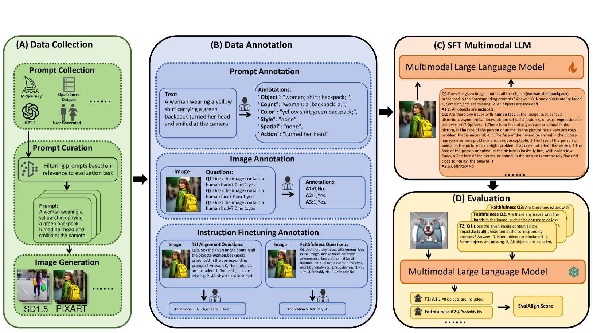
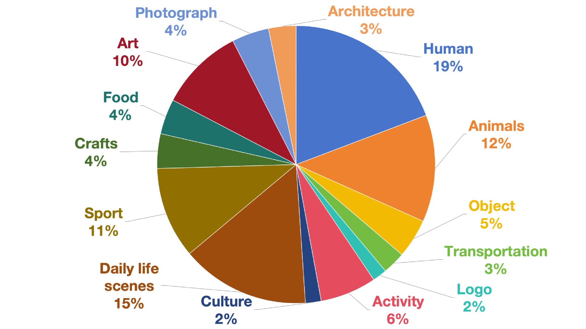
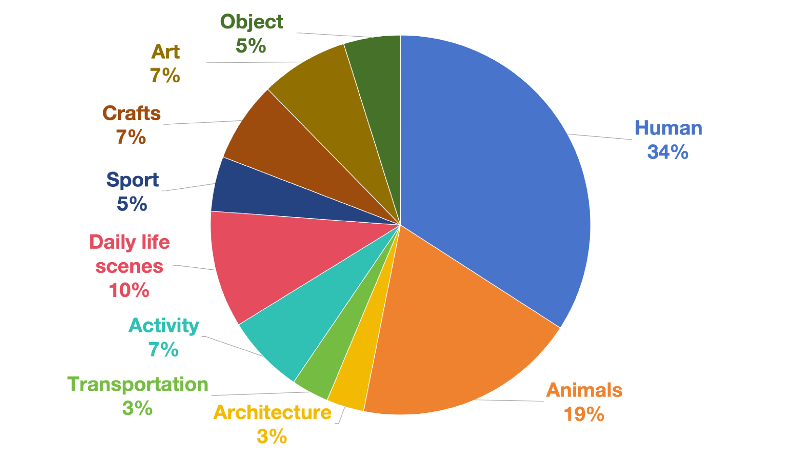
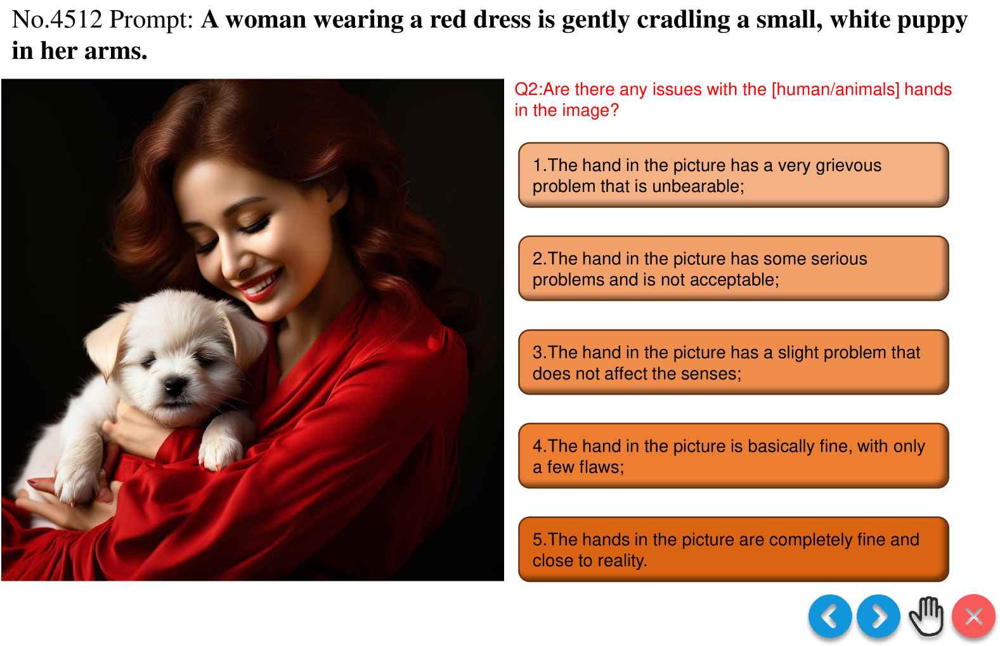
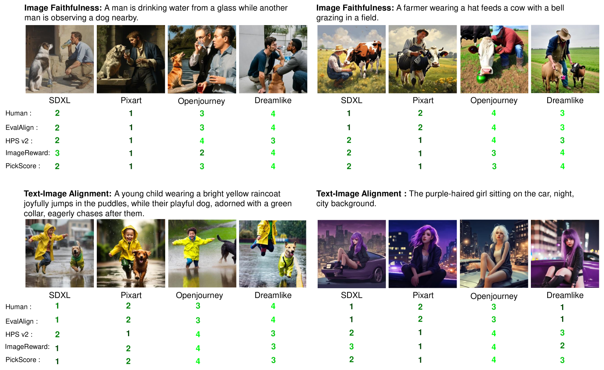
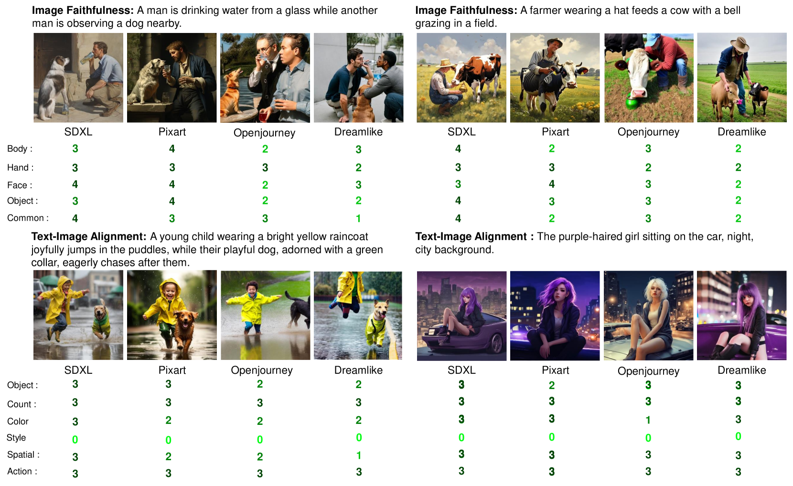

# EvalAlign：通过监督微调实现多模态大型模型与人类标注的精准对齐，以此评估文本至图像模型的性能。

发布时间：2024年06月24日

`LLM应用

这篇论文介绍了EvalAlign，一个用于评估文本到图像生成模型的指标。它利用多模态大型语言模型（MLLMs）来设计评估方案，专注于图像忠实度与文本-图像对齐。通过监督微调MLLM，使其与人类评估标准高度一致，从而创建了一个强健的评估模型。这种应用展示了大型语言模型在模型评估和优化中的实际应用，因此属于LLM应用分类。` `图像生成` `模型评估`

> EvalAlign: Evaluating Text-to-Image Models through Precision Alignment of Multimodal Large Models with Supervised Fine-Tuning to Human Annotations

# 摘要

> 文本到图像生成模型的最新进展令人印象深刻，但评估这些模型的指标却未能跟上步伐，尤其是缺乏能够精细指导模型优化的指标。本文中，我们推出了EvalAlign，这一指标以精准、稳定和细粒度著称。我们借助预训练于庞大数据集的多模态大型语言模型（MLLMs）之力，设计了聚焦于图像忠实度与文本-图像对齐两大核心维度的评估方案。每项方案均包含一系列精细的评分指南，确保了生成图像的手动评分精确无误。通过监督微调MLLM，我们使其与人类评估标准高度一致，打造出一个强健的评估模型。在24个文本到图像生成模型上的广泛测试显示，EvalAlign不仅在稳定性上超越现有指标，更贴近人类偏好，充分证明了其在模型评价中的效能与价值。

> The recent advancements in text-to-image generative models have been remarkable. Yet, the field suffers from a lack of evaluation metrics that accurately reflect the performance of these models, particularly lacking fine-grained metrics that can guide the optimization of the models. In this paper, we propose EvalAlign, a metric characterized by its accuracy, stability, and fine granularity. Our approach leverages the capabilities of Multimodal Large Language Models (MLLMs) pre-trained on extensive datasets. We develop evaluation protocols that focus on two key dimensions: image faithfulness and text-image alignment. Each protocol comprises a set of detailed, fine-grained instructions linked to specific scoring options, enabling precise manual scoring of the generated images. We Supervised Fine-Tune (SFT) the MLLM to align closely with human evaluative judgments, resulting in a robust evaluation model. Our comprehensive tests across 24 text-to-image generation models demonstrate that EvalAlign not only provides superior metric stability but also aligns more closely with human preferences than existing metrics, confirming its effectiveness and utility in model assessment.

[Arxiv](https://arxiv.org/abs/2406.16562)