# 探究大型语言向量模型中的关系幻觉现象及其影响

发布时间：2024年06月24日

`RAG

理由：这篇论文主要关注的是大型视觉-语言模型（LVLMs）中的幻觉问题，特别是物体间关系的幻觉。它提出了一个新的基准R-Bench来评估这些问题，并分析了导致幻觉的原因以及当前模型的局限性。这与RAG（Retrieval-Augmented Generation）的范畴相关，因为RAG模型通常用于改进语言模型的生成质量，尤其是在处理视觉和语言结合的任务时。论文中提到的视觉关系幻觉问题和模型对视觉内容的忽视，都是RAG模型试图解决的问题。因此，这篇论文更适合归类到RAG。` `计算机视觉` `人工智能`

> Evaluating and Analyzing Relationship Hallucinations in LVLMs

# 摘要

> 在大型视觉-语言模型（LVLMs）中，幻觉问题普遍存在，尤其是物体间关系的幻觉，这对视觉理解至关重要。为此，我们推出了R-Bench，这是一个专注于评估视觉关系幻觉的新基准。R-Bench通过图像级问题关注关系的存在，并通过实例级问题评估局部视觉理解。我们发现了三种导致幻觉的关系共现类型：关系-关系、主体-关系和关系-物体。此外，视觉指令调整数据集的长尾分布严重影响了LVLMs对视觉关系的理解。分析还显示，当前的LVLMs往往忽视视觉内容，过度依赖大型语言模型的常识知识，并且在基于上下文信息推理空间关系方面表现不佳。

> The issue of hallucinations is a prevalent concern in existing Large Vision-Language Models (LVLMs). Previous efforts have primarily focused on investigating object hallucinations, which can be easily alleviated by introducing object detectors. However, these efforts neglect hallucinations in inter-object relationships, which is essential for visual comprehension. In this work, we introduce R-Bench, a novel benchmark for evaluating Vision Relationship Hallucination. R-Bench features image-level questions that focus on the existence of relationships and instance-level questions that assess local visual comprehension. We identify three types of relationship co-occurrences that lead to hallucinations: relationship-relationship, subject-relationship, and relationship-object. The visual instruction tuning dataset's long-tail distribution significantly impacts LVLMs' understanding of visual relationships. Furthermore, our analysis reveals that current LVLMs tend to disregard visual content and overly rely on the common sense knowledge of Large Language Models. They also struggle with reasoning about spatial relationships based on contextual information.

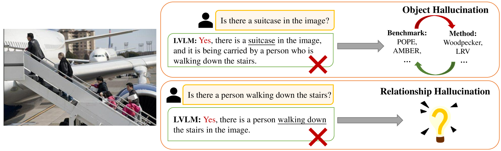

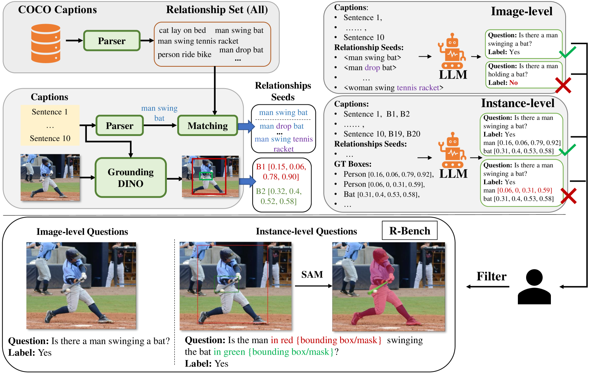

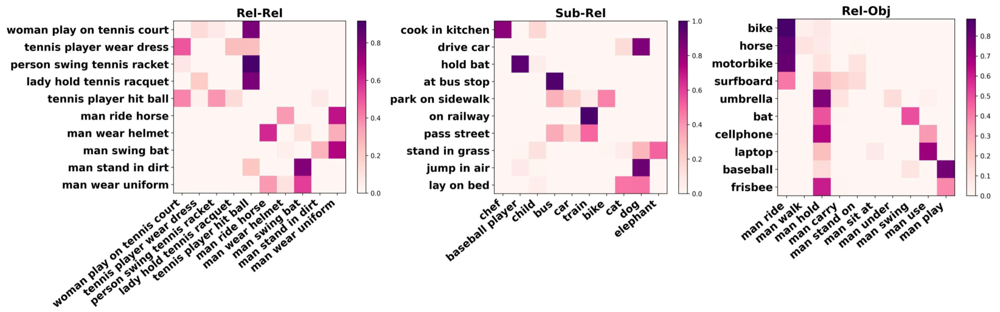

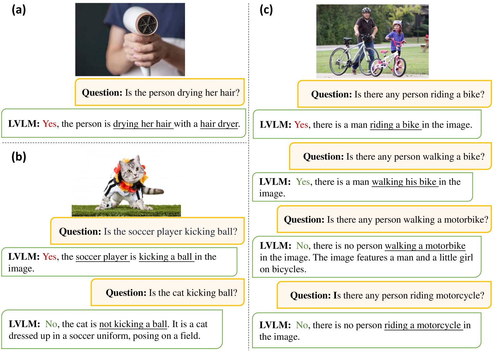

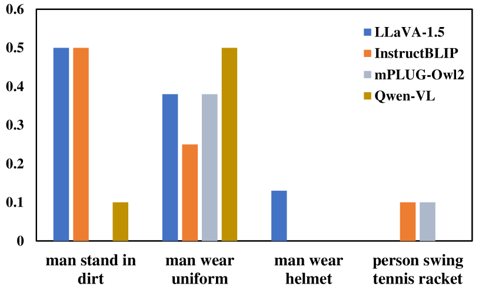

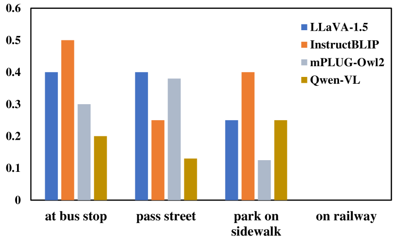

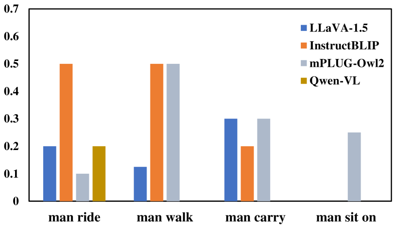

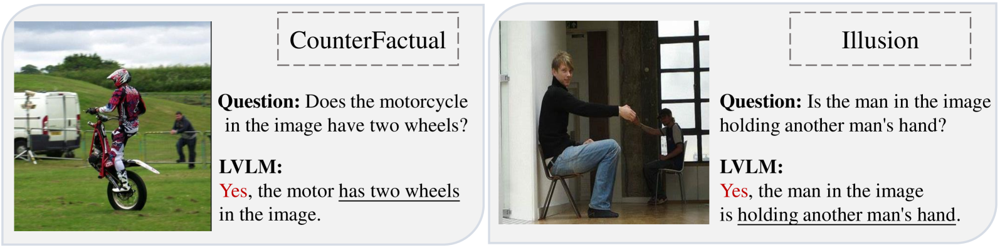

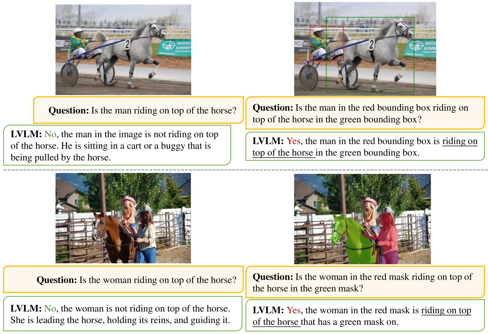

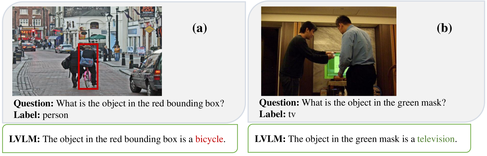

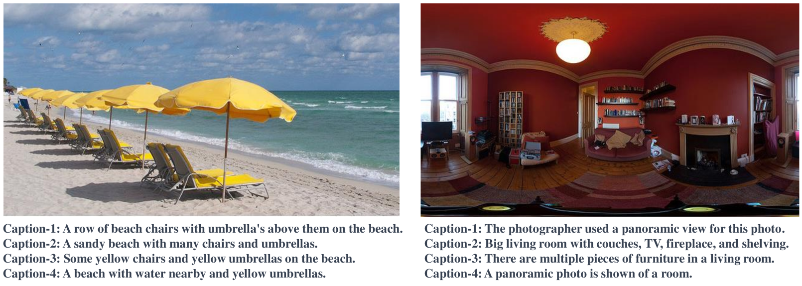

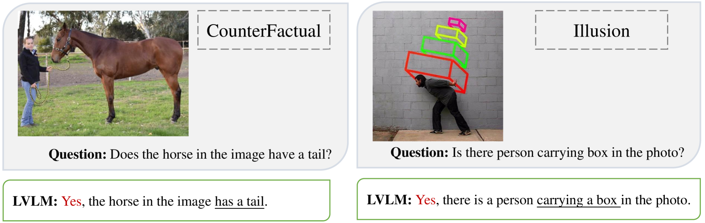

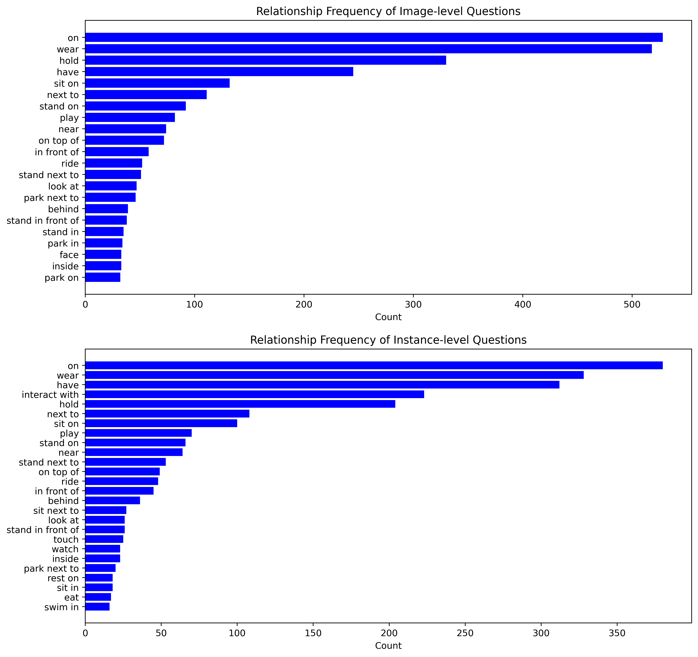

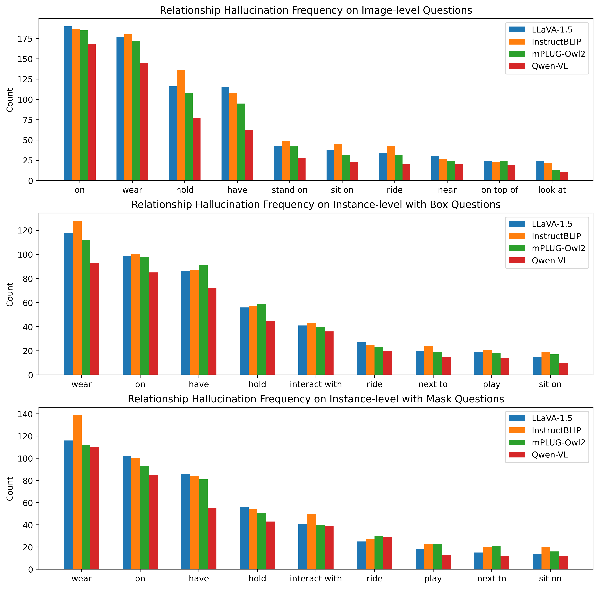

[Arxiv](https://arxiv.org/abs/2406.16449)