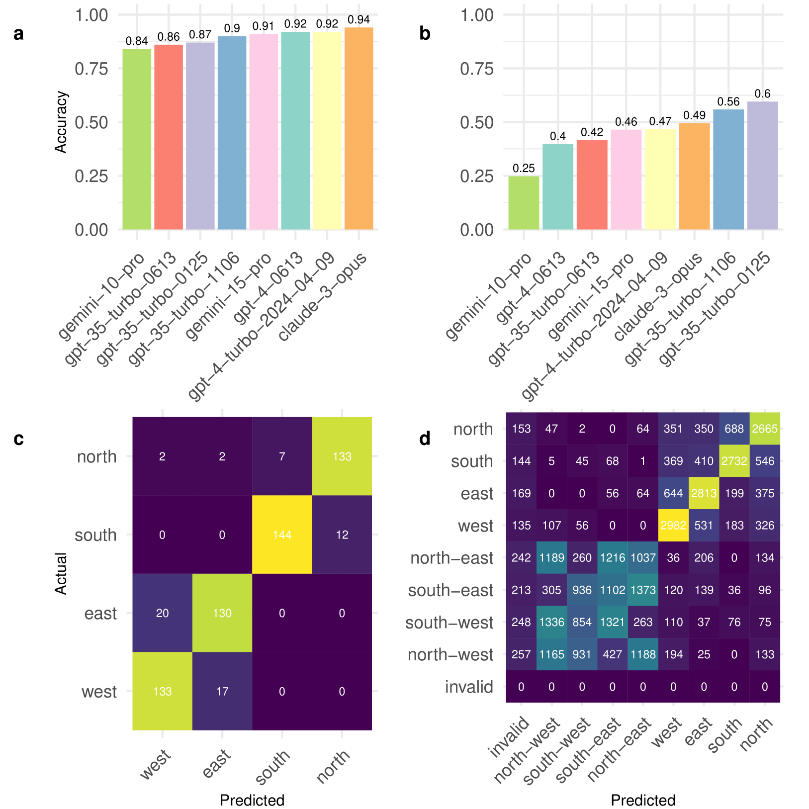
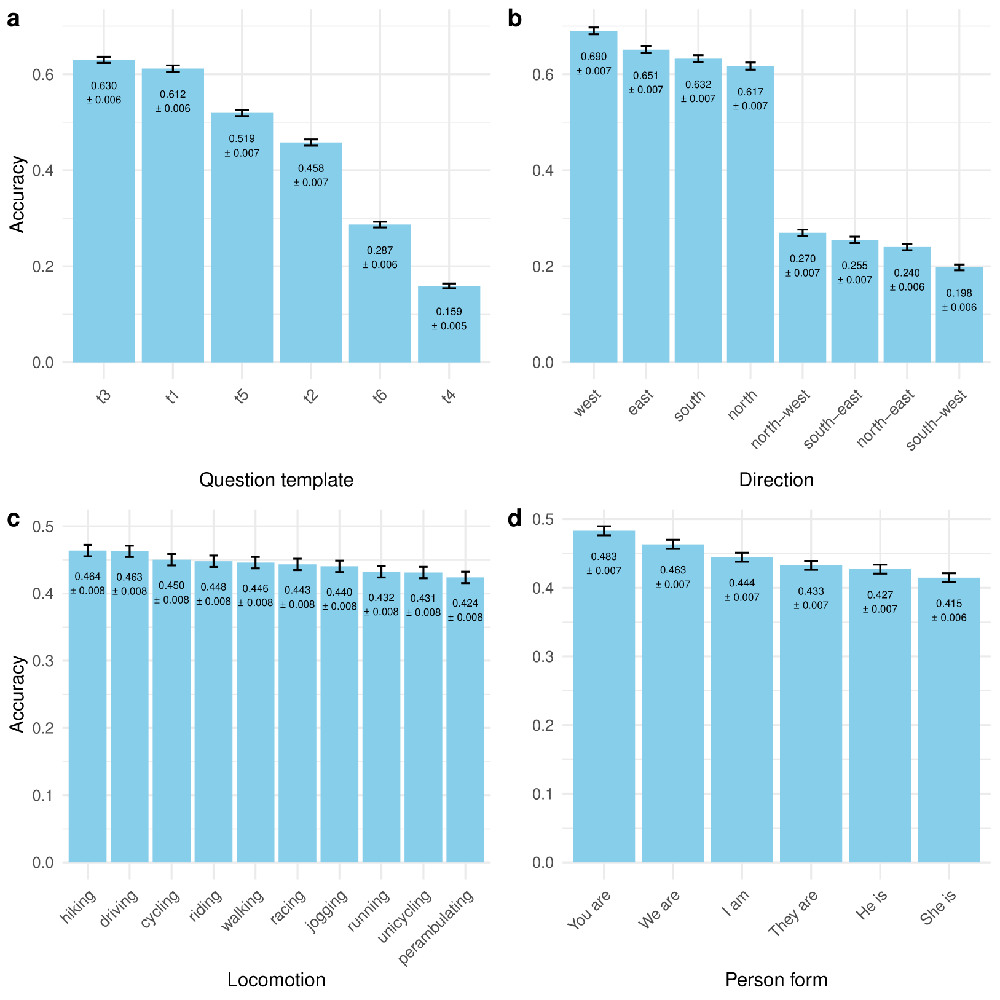
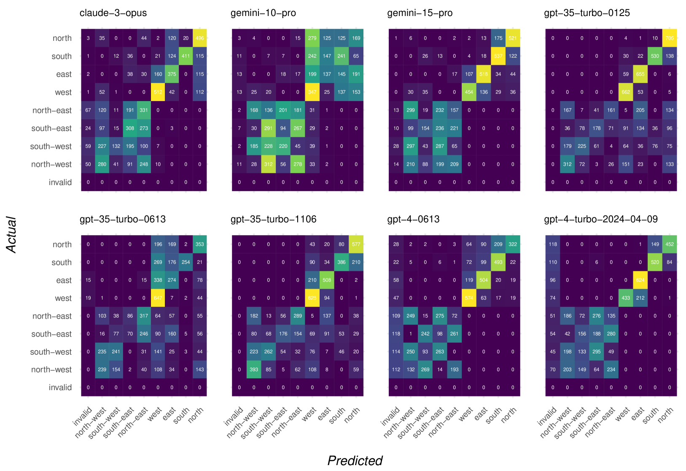
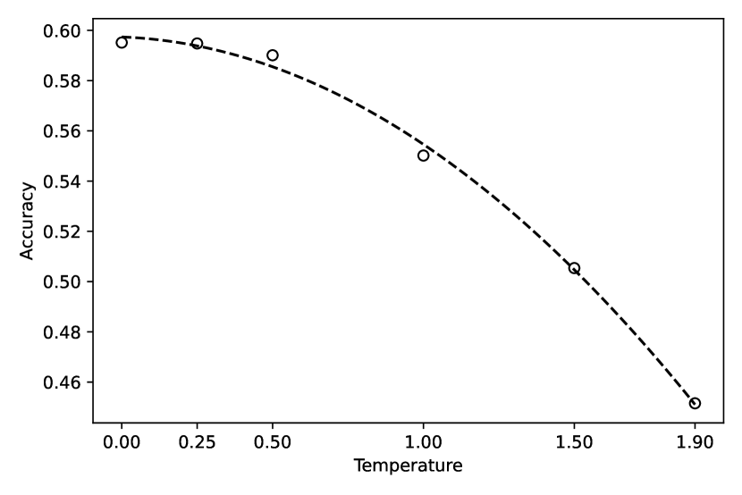

# 探究大型语言模型在基本方向推理上的能力

发布时间：2024年06月24日

`Agent

理由：这篇论文主要关注大型语言模型（LLMs）在处理基本方向（CDs）时的推理能力，特别是在涉及代理（Agent）移动方式和叙述视角的情况下。虽然论文中使用了数据集和模板来测试LLMs的能力，但其核心关注点是模型在代理行为和视角变化下的表现，这更符合Agent分类，因为它涉及模型如何理解和响应代理的行为和环境变化。` `人工智能` `数据集构建`

> Evaluating the Ability of Large Language Models to Reason about Cardinal Directions

# 摘要

> 我们探索了大型语言模型（LLMs）在处理基本方向（CDs）时的推理能力。为此，我们精心设计了两个数据集：第一个与ChatGPT合作，侧重于对CDs相关世界知识的记忆；第二个则通过一系列模板，严格检验LLM在各种情境下准确判断方向的能力。这些模板涵盖了多种变量，包括代理的移动方式和叙述视角（第一、第二或第三人称）。实验结果显示，尽管在简单数据集上LLMs表现出色，但在更为复杂的数据集中，即使将模型温度设为零，仍无LLM能稳定地给出正确方向。

> We investigate the abilities of a representative set of Large language Models (LLMs) to reason about cardinal directions (CDs). To do so, we create two datasets: the first, co-created with ChatGPT, focuses largely on recall of world knowledge about CDs; the second is generated from a set of templates, comprehensively testing an LLM's ability to determine the correct CD given a particular scenario. The templates allow for a number of degrees of variation such as means of locomotion of the agent involved, and whether set in the first , second or third person. Even with a temperature setting of zero, Our experiments show that although LLMs are able to perform well in the simpler dataset, in the second more complex dataset no LLM is able to reliably determine the correct CD, even with a temperature setting of zero.

[Arxiv](https://arxiv.org/abs/2406.16528)