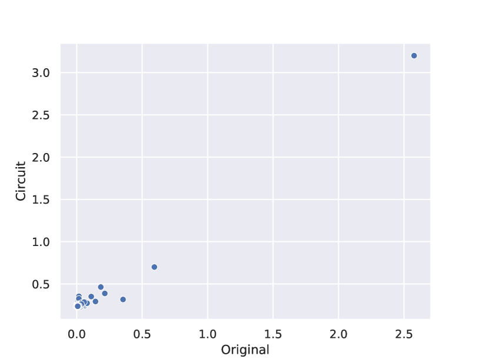
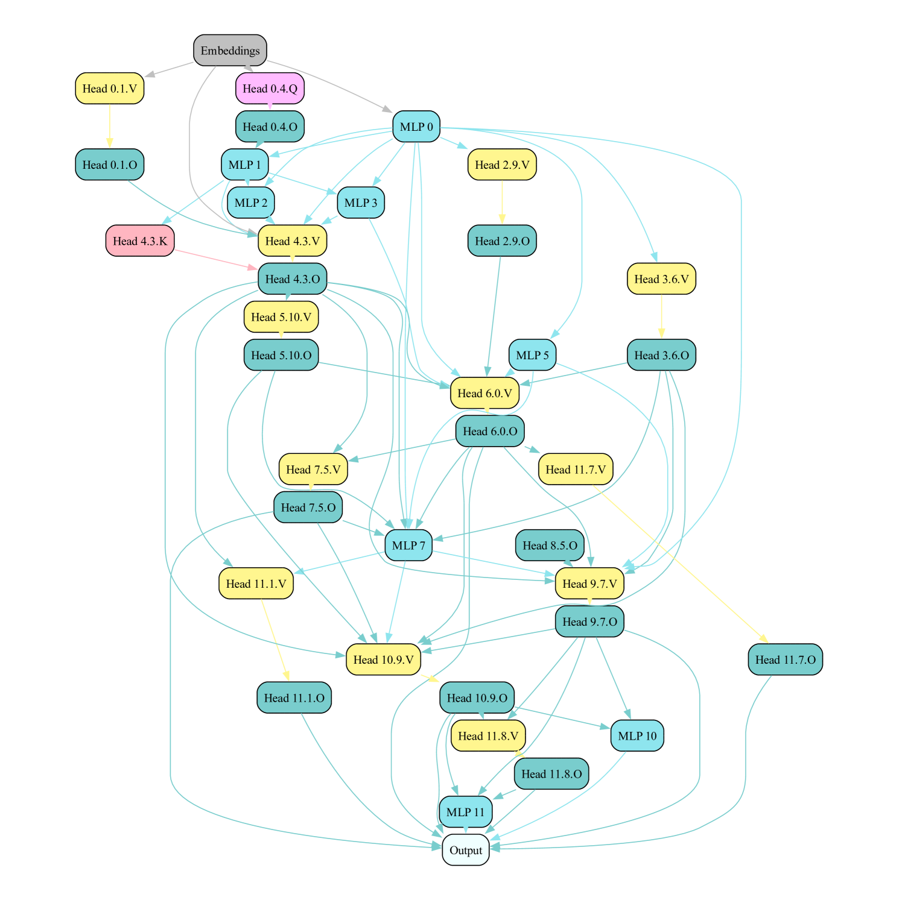

# 利用边缘修剪策略探索Transformer电路的奥秘

发布时间：2024年06月24日

`LLM理论

理由：这篇论文主要探讨了自动化电路发现的过程，并提出了“边缘修剪”这一新的优化方法，用于分析和解释语言模型的行为。这种方法涉及对模型内部结构的深入分析，特别是在大规模模型如CodeLlama-13B上的应用，以及对模型行为的解释。这些内容更偏向于对大型语言模型（LLM）的理论研究，特别是关于模型内部结构和行为的理解，而不是直接的应用或Agent的设计。因此，将其归类为LLM理论是合适的。` `机器学习` `模型解释`

> Finding Transformer Circuits with Edge Pruning

# 摘要

> 解释语言模型的过程往往涉及对电路的分析——这些稀疏的计算子图能够捕捉模型行为的特定方面。尽管已有研究自动化了电路发现的过程，但这些方法因依赖低效搜索算法或不准确近似而存在局限。本文将自动化电路发现视为优化问题，并提出“边缘修剪”作为高效且可扩展的解决方案。不同于传统的神经元或组件移除，边缘修剪专注于修剪组件间的连接。在GPT-2模型中，我们的方法发现的电路使用的边缘数量仅为先前方法的一半，同时保持了对完整模型预测的同等忠诚。即使在处理多达100,000个示例时，边缘修剪也表现出高效性，不仅速度超越了先前方法，还产生了更优质的电路。此外，它完美地恢复了两个使用Tracr编译的模型的真实电路。得益于其高效性，我们将边缘修剪应用于规模超过先前方法100倍的CodeLlama-13B模型。通过这一设置，我们进行了一项案例研究，比较了指令提示与情境学习背后的机制。研究发现，两个超过99.96%稀疏度的电路与完整模型的性能相匹配，并揭示了这两种机制之间存在显著重叠。这一案例研究不仅展示了边缘修剪作为解释性工具的实用性和可扩展性，还揭示了大模型特有的行为。

> The path to interpreting a language model often proceeds via analysis of circuits -- sparse computational subgraphs of the model that capture specific aspects of its behavior. Recent work has automated the task of discovering circuits. Yet, these methods have practical limitations, as they rely either on inefficient search algorithms or inaccurate approximations. In this paper, we frame automated circuit discovery as an optimization problem and propose *Edge Pruning* as an effective and scalable solution. Edge Pruning leverages gradient-based pruning techniques, but instead of removing neurons or components, it prunes the \emph{edges} between components. Our method finds circuits in GPT-2 that use less than half the number of edges compared to circuits found by previous methods while being equally faithful to the full model predictions on standard circuit-finding tasks. Edge Pruning is efficient even with as many as 100K examples, outperforming previous methods in speed and producing substantially better circuits. It also perfectly recovers the ground-truth circuits in two models compiled with Tracr. Thanks to its efficiency, we scale Edge Pruning to CodeLlama-13B, a model over 100x the scale that prior methods operate on. We use this setting for a case study comparing the mechanisms behind instruction prompting and in-context learning. We find two circuits with more than 99.96% sparsity that match the performance of the full model and reveal that the mechanisms in the two settings overlap substantially. Our case study shows that Edge Pruning is a practical and scalable tool for interpretability and sheds light on behaviors that only emerge in large models.

[Arxiv](https://arxiv.org/abs/2406.16778)