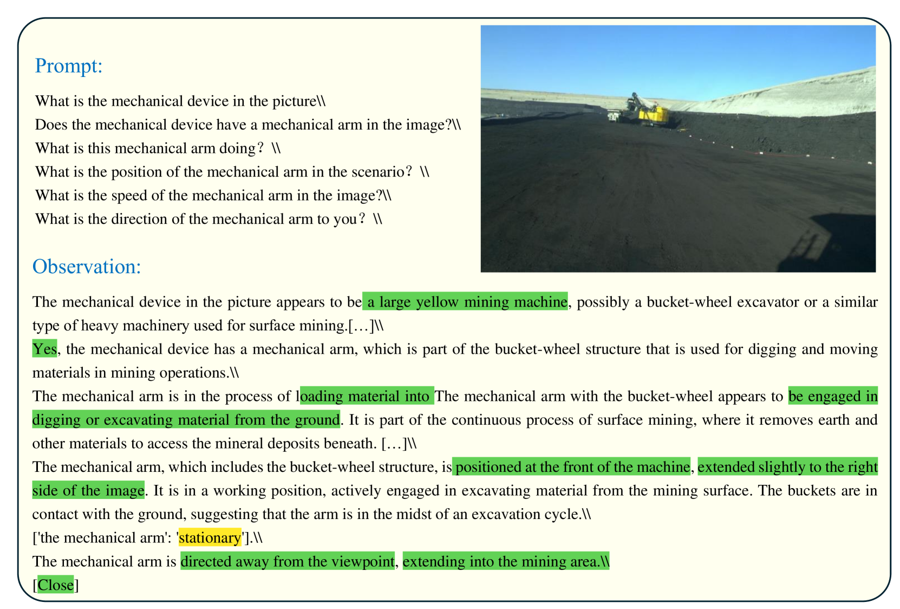
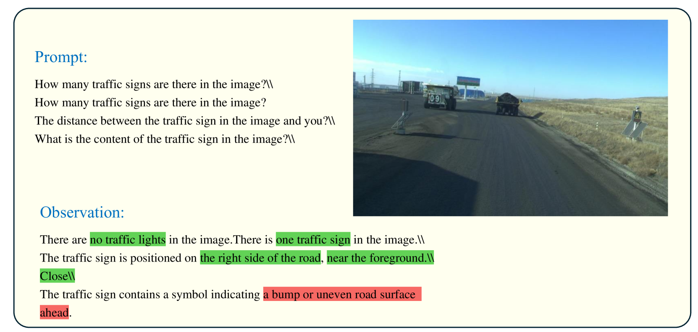
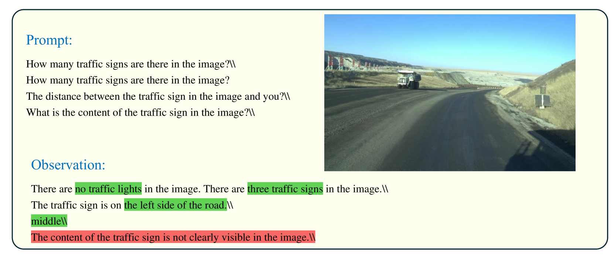

# GPT-4V 深度探索：自动驾驶的挖掘之旅

发布时间：2024年06月24日

`Agent

理由：这篇论文主要探讨了GPT-4V(ision)模型在矿区自动驾驶中的应用，特别是在场景理解、逻辑推理及驾驶操作方面的表现。论文强调了该模型作为自动驾驶系统中的一个智能代理，能够有效应对复杂环境中的决策问题。因此，这篇论文更符合Agent分类，因为它主要关注的是一个智能模型在特定应用场景中的代理行为和决策能力。` `矿区自动驾驶` `工业自动化`

> GPT-4V Explorations: Mining Autonomous Driving

# 摘要

> 本文深入研究了GPT-4V(ision)模型在矿区自动驾驶中的应用，该模型通过增强视觉问答和复杂场景理解能力，有效应对了传统系统在紧急情况下的决策难题。我们特别评估了其在场景理解、逻辑推理及驾驶操作方面的表现，尤其是对行人、各类车辆及交通设施的识别与解析能力。虽然GPT-4V在理解和决策上表现出色，但在精确识别特定车型和处理动态交互方面仍有提升空间。尽管如此，其卓越的导航能力和战略决策展示了它在矿区复杂环境中作为自动驾驶可靠代理的潜力，彰显了其在工业领域的适应性和操作可行性。

> This paper explores the application of the GPT-4V(ision) large visual language model to autonomous driving in mining environments, where traditional systems often falter in understanding intentions and making accurate decisions during emergencies. GPT-4V introduces capabilities for visual question answering and complex scene comprehension, addressing challenges in these specialized settings.Our evaluation focuses on its proficiency in scene understanding, reasoning, and driving functions, with specific tests on its ability to recognize and interpret elements such as pedestrians, various vehicles, and traffic devices. While GPT-4V showed robust comprehension and decision-making skills, it faced difficulties in accurately identifying specific vehicle types and managing dynamic interactions. Despite these challenges, its effective navigation and strategic decision-making demonstrate its potential as a reliable agent for autonomous driving in the complex conditions of mining environments, highlighting its adaptability and operational viability in industrial settings.

[Arxiv](https://arxiv.org/abs/2406.16817)