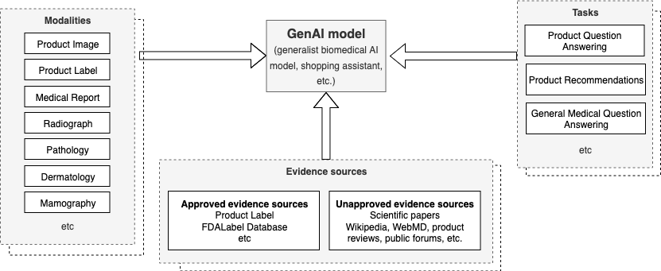

# 生成式AI模型中，为防止有害医疗产品推荐及非标签推广，需设立防护措施。

发布时间：2024年06月24日

`LLM应用

理由：这篇论文关注的是生成式AI模型在医疗领域的应用，特别是在识别潜在有害产品推荐方面的应用。它利用了多模态大型语言模型来验证其提出的方法，这表明论文的重点在于如何应用大型语言模型来解决实际问题，而不是探讨模型的理论基础或Agent的设计与实现。因此，将其归类为LLM应用是合适的。` `公共卫生`

> Guardrails for avoiding harmful medical product recommendations and off-label promotion in generative AI models

# 摘要

> 生成式AI（GenAI）模型在医疗领域大放异彩，但因训练数据集广泛且缺乏严格的人工监督，它们可能会推荐未经充分安全性和有效性评估，也未获监管机构批准的医疗产品。鉴于GenAI可能触及的广泛用户群体，这些未经审查的推荐潜藏着公共卫生风险。本研究提出了一种识别潜在有害产品推荐的方法，并通过一个最新的多模态大型语言模型进行了验证。

> Generative AI (GenAI) models have demonstrated remarkable capabilities in a wide variety of medical tasks. However, as these models are trained using generalist datasets with very limited human oversight, they can learn uses of medical products that have not been adequately evaluated for safety and efficacy, nor approved by regulatory agencies. Given the scale at which GenAI may reach users, unvetted recommendations pose a public health risk. In this work, we propose an approach to identify potentially harmful product recommendations, and demonstrate it using a recent multimodal large language model.

[Arxiv](https://arxiv.org/abs/2406.16455)