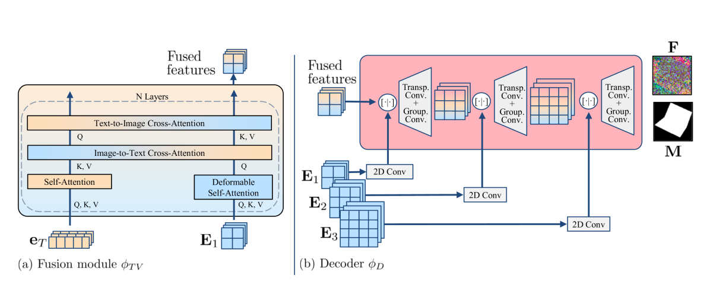

# 开放词汇下的高分辨率6D物体姿态估计

发布时间：2024年06月24日

`Agent

理由：这篇论文介绍了一种名为Horyon的新架构，它是一个基于开放词汇视觉-语言模型（VLMs）的系统，专门设计来处理未见物体的6D姿态估计问题。Horyon通过文本提示来定位和估计未见物体的姿态，这表明它是一个能够根据特定任务（如姿态估计）和环境（如不同场景）自主操作的智能系统。因此，它符合Agent的定义，即一个能够感知环境并执行动作以达到目标的实体。虽然它使用了VLMs，但重点在于其作为Agent的应用，而不是VLMs的理论或应用。` `机器人技术` `计算机视觉`

> High-resolution open-vocabulary object 6D pose estimation

# 摘要

> 在6D姿态估计领域，对未见物体的泛化能力极具挑战。尽管视觉-语言模型（VLMs）能借助自然语言描述辅助未见物体的姿态估计，但它们的表现仍不及传统模型方法。本研究中，我们推出了Horyon，一种基于开放词汇VLMs的新架构，专门针对仅通过文本提示描述的未见物体在不同场景间的相对姿态进行估计。我们利用文本提示精准定位场景中的未见物体，并提取高分辨率的多尺度特征，进而实现跨场景匹配与注册。在涵盖四个数据集（REAL275、Toyota-Light、Linemod和YCB-Video）的广泛基准测试中，Horyon展现了卓越性能，平均召回率超越先前最佳方法12.6个百分点，刷新了行业记录。

> The generalisation to unseen objects in the 6D pose estimation task is very challenging. While Vision-Language Models (VLMs) enable using natural language descriptions to support 6D pose estimation of unseen objects, these solutions underperform compared to model-based methods. In this work we present Horyon, an open-vocabulary VLM-based architecture that addresses relative pose estimation between two scenes of an unseen object, described by a textual prompt only. We use the textual prompt to identify the unseen object in the scenes and then obtain high-resolution multi-scale features. These features are used to extract cross-scene matches for registration. We evaluate our model on a benchmark with a large variety of unseen objects across four datasets, namely REAL275, Toyota-Light, Linemod, and YCB-Video. Our method achieves state-of-the-art performance on all datasets, outperforming by 12.6 in Average Recall the previous best-performing approach.

[Arxiv](https://arxiv.org/abs/2406.16384)