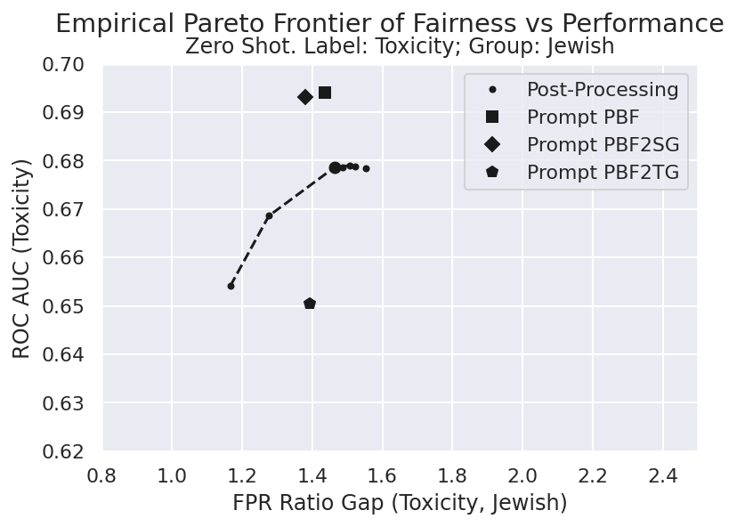
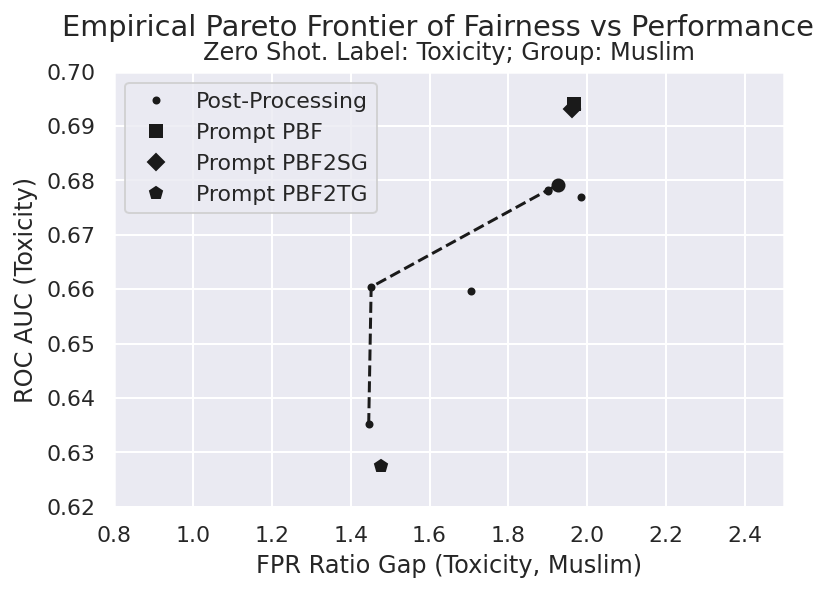
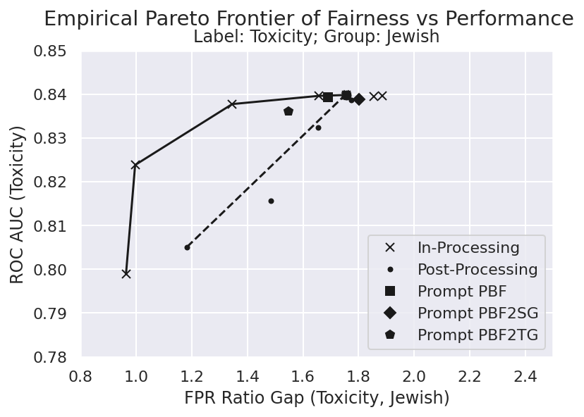
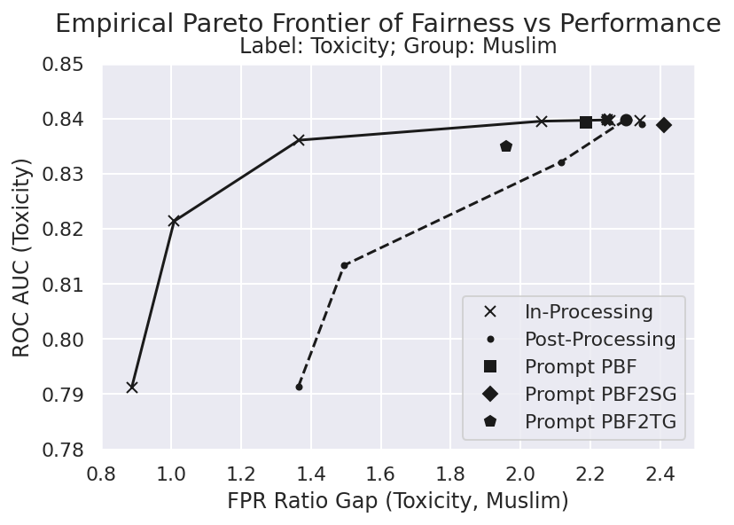
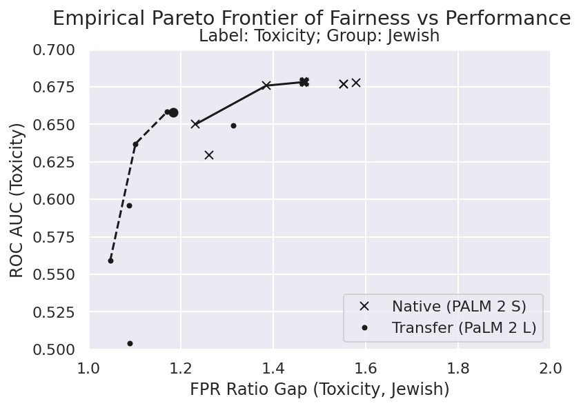
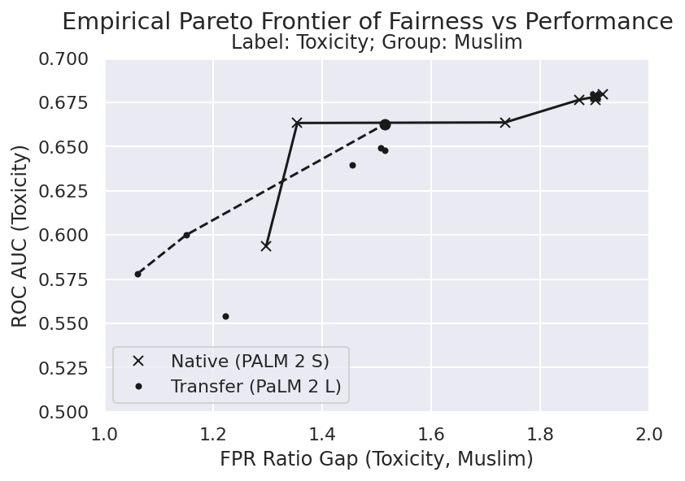
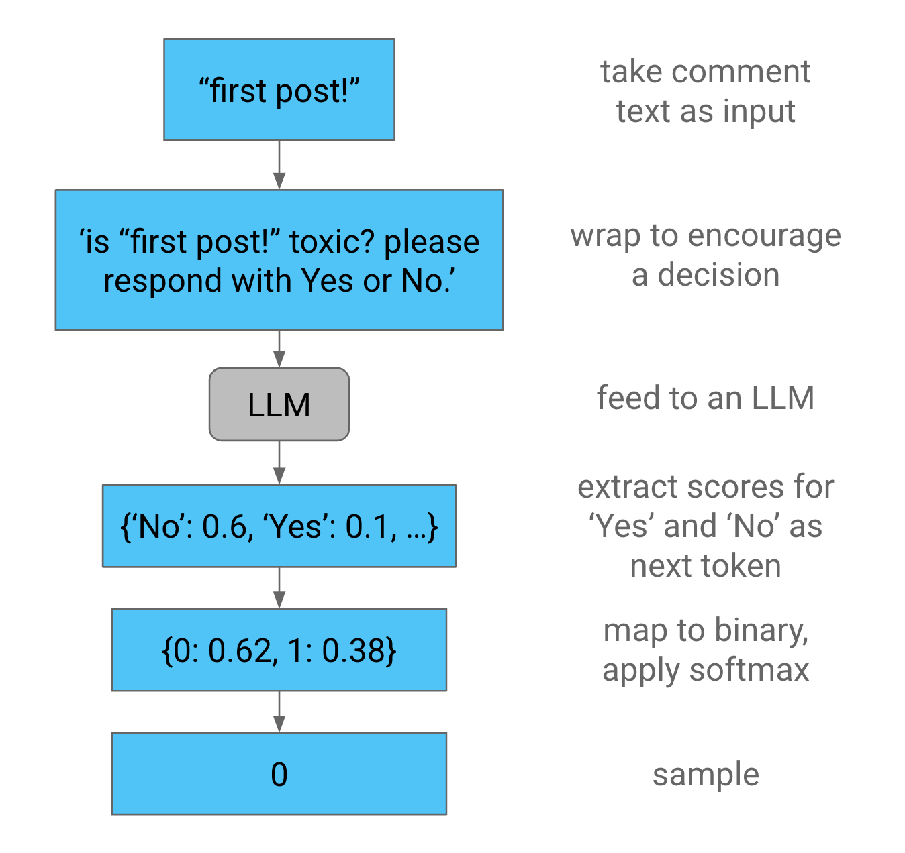
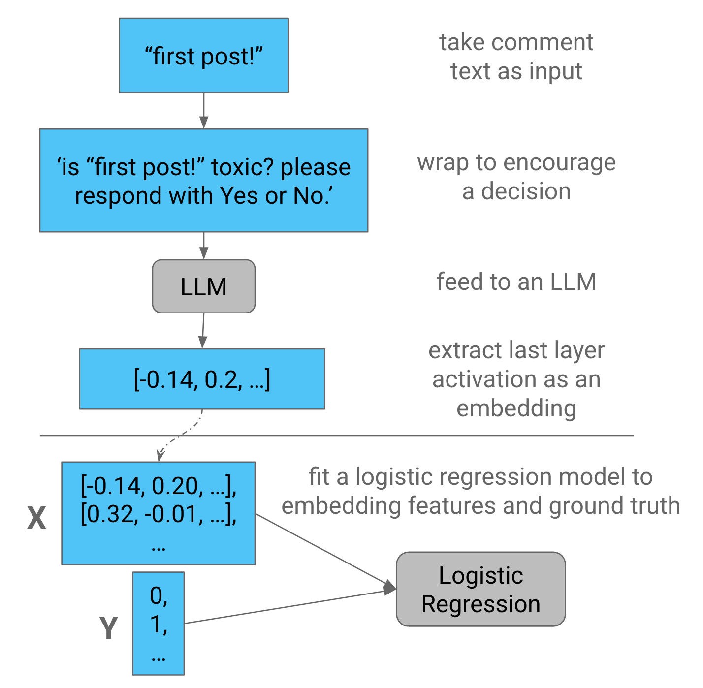

# 确保 LLM 决策中的群体公平性

发布时间：2024年06月24日

`LLM应用

这篇论文摘要讨论了使用大型语言模型（LLMs）进行文本数据分类，并特别关注了分类器的公平性问题。它提到了传统方法在解决群体公平性问题上的不足，并探讨了基于提示的修复方法。此外，论文还提出了一系列修复策略，并评估了它们在公平性与性能之间的权衡。这些内容表明，该论文主要关注的是LLM在实际应用中的问题和解决方案，特别是关于分类器公平性的应用，因此将其归类为LLM应用。` `文本分类` `公平性评估`

> Inducing Group Fairness in LLM-Based Decisions

# 摘要

> 通过提示大型语言模型（LLMs），我们开辟了文本数据分类的新途径。尽管在分类器公平性领域，评估和解决群体公平性问题已有深入研究，但传统方法（如正则化）在此并不奏效，反而催生了新的解决方案（如基于提示的修复）。我们在毒性分类任务上检验了基于LLM的分类器的公平性，并发现基于提示的分类器可能做出不公平的决策。为此，我们提出了一系列修复策略，并评估了它们在公平性与性能之间的权衡。我们期望这项研究能够激发更多关于基于LLM的分类器群体公平性的探讨。

> Prompting Large Language Models (LLMs) has created new and interesting means for classifying textual data. While evaluating and remediating group fairness is a well-studied problem in classifier fairness literature, some classical approaches (e.g., regularization) do not carry over, and some new opportunities arise (e.g., prompt-based remediation). We measure fairness of LLM-based classifiers on a toxicity classification task, and empirically show that prompt-based classifiers may lead to unfair decisions. We introduce several remediation techniques and benchmark their fairness and performance trade-offs. We hope our work encourages more research on group fairness in LLM-based classifiers.

[Arxiv](https://arxiv.org/abs/2406.16738)