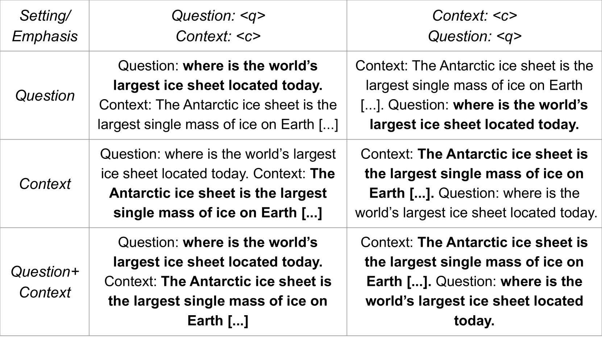

# 关键不在于内容，而在于表达方式：一种简单却高效的提升阅读理解技巧的方法

发布时间：2024年06月24日

`LLM应用

这篇论文主要探讨了在自然语言处理领域中，如何通过调整输入顺序和强调技术来提升大型语言模型的性能。研究内容涉及模型的实际应用和性能优化，因此属于LLM应用分类。论文通过实验分析了不同的输入处理方法对模型准确率的影响，并提出了有效的优化策略，这些内容与Agent、RAG或LLM理论分类不符，因为它们不涉及代理行为、检索增强生成技术或语言模型的理论研究。` `阅读理解`

> It Is Not About What You Say, It Is About How You Say It: A Surprisingly Simple Approach for Improving Reading Comprehension

# 摘要

> 自然语言处理领域在过去十年中飞速发展，一些未经充分评估的实践也随之确立。针对阅读理解，我们首先探讨：输入顺序——问题与上下文的排列——如何影响模型表现？其次，鉴于输入强调技术的进步，我们进一步探究：强调问题、上下文或两者是否能提升模型性能？实验涵盖9个大型语言模型和3个数据集，结果显示，先展示上下文再提出问题可使模型准确率提升高达31%。强调上下文比强调问题更为有效，尤其在处理模型因缺乏参数知识而难以回答的问题时。通过比较基于提示和基于注意力的强调方法，我们发现最优方法极为简便：仅需在输入中附加几个标记，即可使准确率提升高达36%，让小型模型在性能上超越大型模型。

> Natural language processing has seen rapid progress over the past decade. Due to the speed of developments, some practices get established without proper evaluation. Considering one such case and focusing on reading comprehension, we ask our first research question: 1) How does the order of inputs -- i.e., question and context -- affect model performance? Additionally, given recent advancements in input emphasis, we ask a second research question: 2) Does emphasizing either the question, the context, or both enhance performance? Experimenting with 9 large language models across 3 datasets, we find that presenting the context before the question improves model performance, with an accuracy increase of up to $31\%$. Furthermore, emphasizing the context yields superior results compared to question emphasis, and in general, emphasizing parts of the input is particularly effective for addressing questions that models lack the parametric knowledge to answer. Experimenting with both prompt-based and attention-based emphasis methods, we additionally find that the best method is surprisingly simple: it only requires concatenating a few tokens to the input and results in an accuracy improvement of up to $36\%$, allowing smaller models to outperform their significantly larger counterparts.

[Arxiv](https://arxiv.org/abs/2406.16779)