# 大型语言模型，跨语言推理的无知者

发布时间：2024年06月24日

`LLM理论

这篇论文主要探讨了大型语言模型在多语言推理方面的表现，并深入分析了推理过程中的知识检索与无知识推理的跨语言迁移性。研究通过特定的数据集和模型内部状态的分析，揭示了无知识推理能力在跨语言迁移中的优势，并推测了可能存在的语言共享机制。这些内容更偏向于对大型语言模型理论层面的探讨和理解，因此归类为LLM理论。` `跨语言研究`

> Large Language Models Are Cross-Lingual Knowledge-Free Reasoners

# 摘要

> 大型语言模型在多语言推理上表现出色，但不同语言间能力的联系尚未深入探讨。本研究将推理过程细分为知识检索与无知识推理两部分，并探究了它们的跨语言迁移性。我们通过特制数据集发现，无知识推理能力几乎能无障碍地跨语言迁移，尽管某些语言资源的影响有限，而跨语言知识检索则成为迁移的障碍。进一步分析模型内部状态和神经元激活揭示，隐藏表示的相似度与激活神经元的重叠度，是解释无知识推理优于知识检索跨语言迁移的关键。据此，我们推测无知识推理可能基于一种语言共享机制，而知识则按语言分别存储。

> Large Language Models have demonstrated impressive reasoning capabilities across multiple languages. However, the relationship between capabilities in different languages is less explored. In this work, we decompose the process of reasoning tasks into two separated parts: knowledge retrieval and knowledge-free reasoning, and analyze the cross-lingual transferability of them. With adapted and constructed knowledge-free reasoning datasets, we show that the knowledge-free reasoning capability can be nearly perfectly transferred across various source-target language directions despite the secondary impact of resource in some specific target languages, while cross-lingual knowledge retrieval significantly hinders the transfer. Moreover, by analyzing the hidden states and feed-forward network neuron activation during the reasoning tasks, we show that higher similarity of hidden representations and larger overlap of activated neurons could explain the better cross-lingual transferability of knowledge-free reasoning than knowledge retrieval. Thus, we hypothesize that knowledge-free reasoning embeds in some language-shared mechanism, while knowledge is stored separately in different languages.

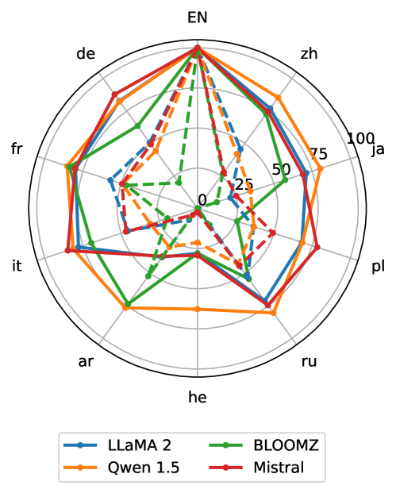

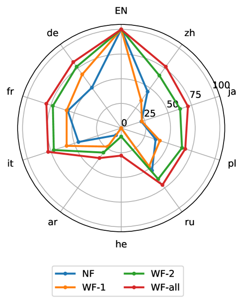

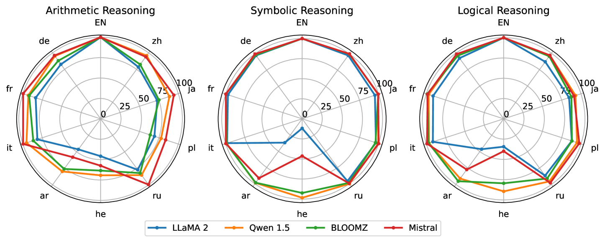

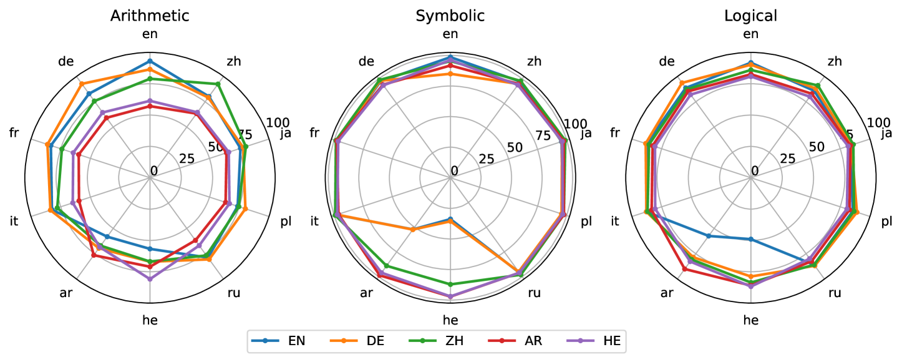

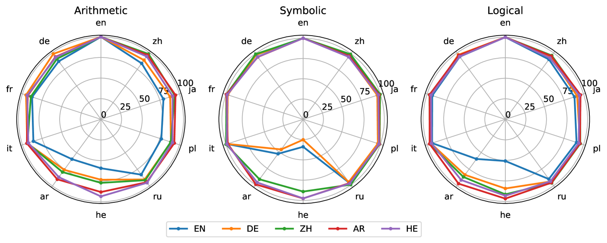

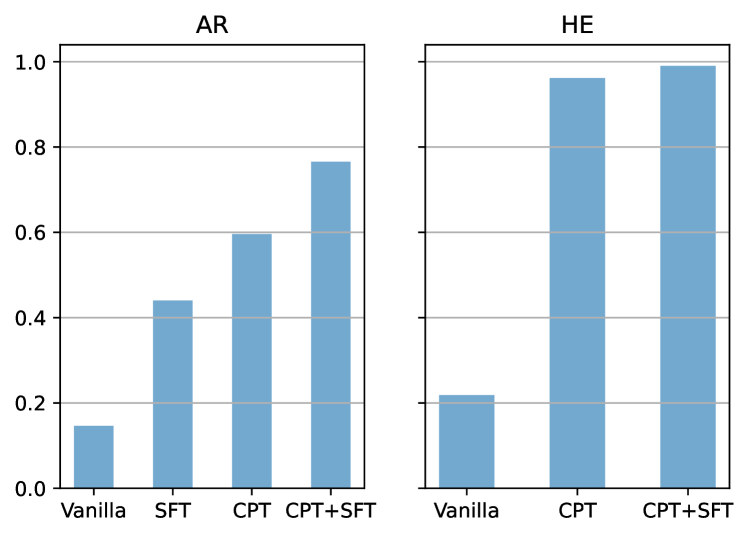

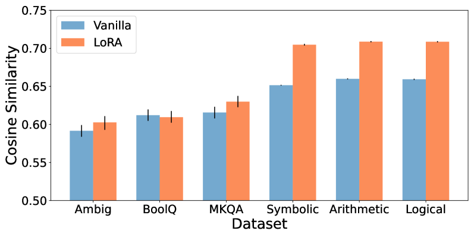

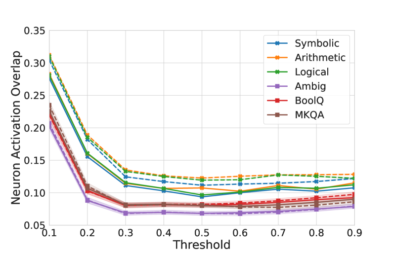

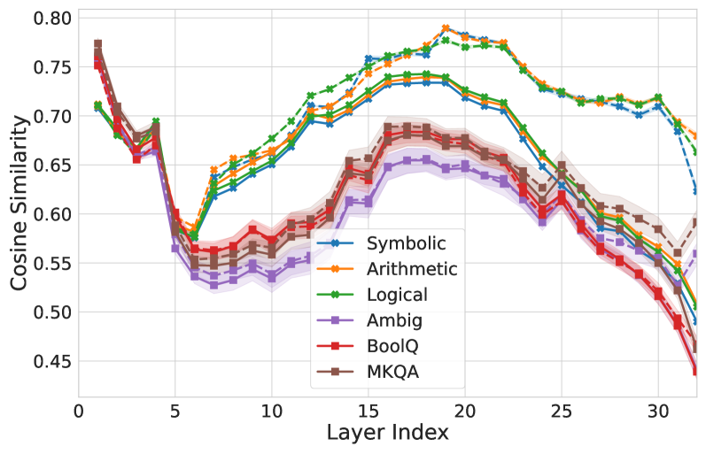

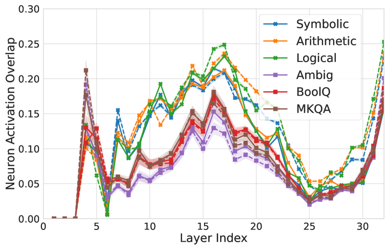

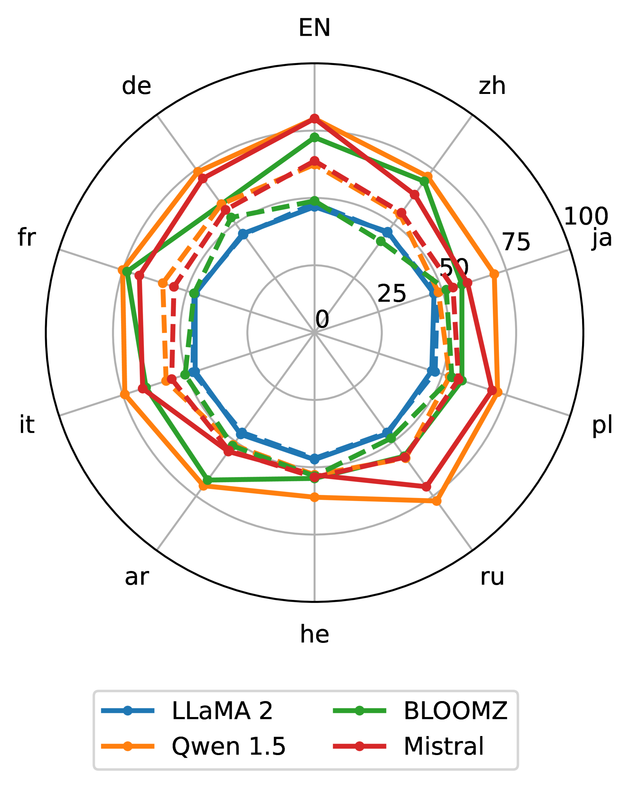

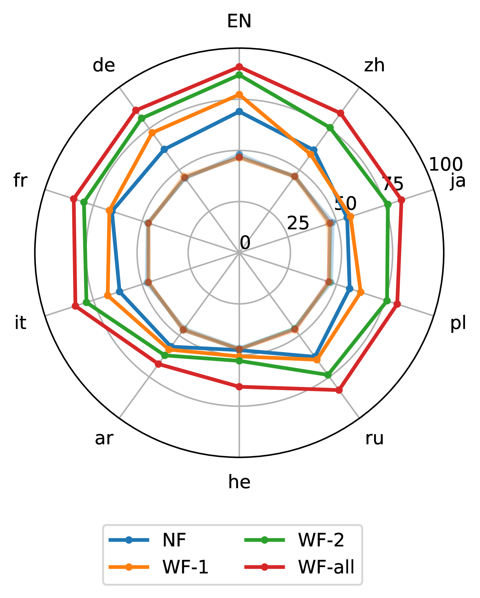

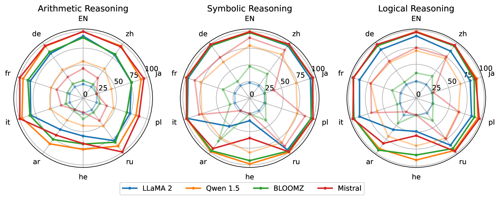

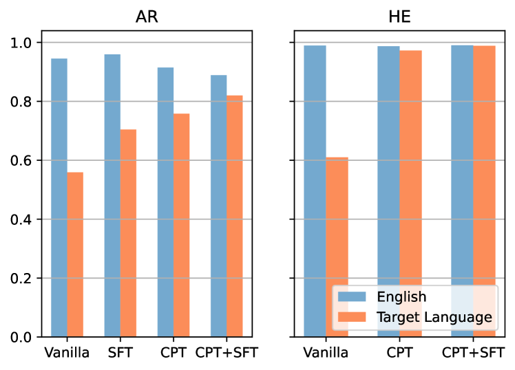

[Arxiv](https://arxiv.org/abs/2406.16655)