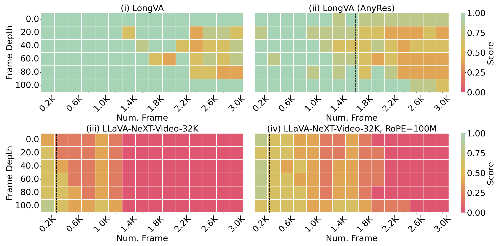

# 语言至视觉的长上下文迁移

发布时间：2024年06月24日

`LLM 应用

这篇论文主要探讨了如何通过延长语言模型的上下文长度来增强大型多模态模型（LMMs）处理极长视频序列的能力。这种方法不需要额外的视频训练，而是通过“长上下文转移”技术来实现。论文还介绍了Long Video Assistant（LongVA）系统，该系统能够处理大量的视觉令牌，并在特定基准测试上取得了优异的性能。此外，论文还提到了创建的新基准V-NIAH，用于评估LMMs在视觉模态中处理长上下文的能力。这些内容主要集中在LLM的应用层面，即如何改进和应用LLM技术来解决实际问题，因此归类为LLM应用。` `视频处理` `人工智能`

> Long Context Transfer from Language to Vision

# 摘要

> 视频序列虽富含时间信息，但现有的大型多模态模型（LMMs）在处理极长视频时显得力不从心。为此，一些研究采用视觉重采样器减少视觉令牌数量。本文另辟蹊径，从语言模型的视角出发，通过延长语言模型的上下文长度，使LMMs无需额外视频训练便能处理更多视觉令牌，我们称之为“长上下文转移”，并对其特性进行了深入分析。为评估LMMs在视觉模态中处理长上下文的能力，我们创建了V-NIAH（视觉针在干草堆中），一个纯合成的长视觉基准，灵感源自语言模型的NIAH测试。我们的Long Video Assistant（LongVA）能处理2000帧或超过200K视觉令牌，无需复杂附加技术。凭借其扩展的上下文长度，LongVA在7B规模模型中，通过密集采样更多输入帧，在Video-MME上取得了领先性能。我们的研究成果已在https://github.com/EvolvingLMMs-Lab/LongVA开源。

> Video sequences offer valuable temporal information, but existing large multimodal models (LMMs) fall short in understanding extremely long videos. Many works address this by reducing the number of visual tokens using visual resamplers. Alternatively, in this paper, we approach this problem from the perspective of the language model. By simply extrapolating the context length of the language backbone, we enable LMMs to comprehend orders of magnitude more visual tokens without any video training. We call this phenomenon long context transfer and carefully ablate its properties. To effectively measure LMMs' ability to generalize to long contexts in the vision modality, we develop V-NIAH (Visual Needle-In-A-Haystack), a purely synthetic long vision benchmark inspired by the language model's NIAH test. Our proposed Long Video Assistant (LongVA) can process 2000 frames or over 200K visual tokens without additional complexities. With its extended context length, LongVA achieves state-of-the-art performance on Video-MME among 7B-scale models by densely sampling more input frames. Our work is open-sourced at https://github.com/EvolvingLMMs-Lab/LongVA.

[Arxiv](https://arxiv.org/abs/2406.16852)