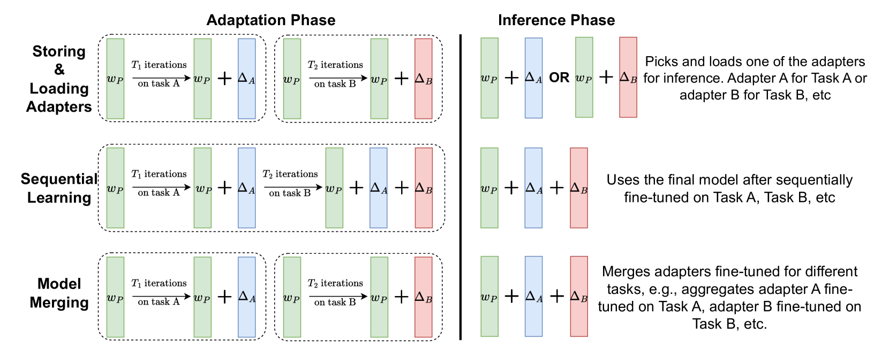
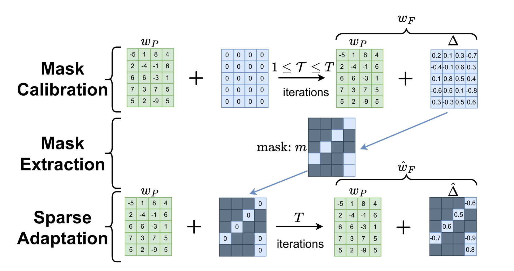

# 彩票票适应策略：缓解大型语言模型中的破坏性干扰现象

发布时间：2024年06月24日

`LLM应用

这篇论文探讨了如何有效地适应大型语言模型（LLMs）以处理多个不同任务，同时避免任务间的破坏性干扰和灾难性遗忘。提出的方法，即彩票票适应（LoTA），是一种稀疏适应策略，专注于优化模型的稀疏子网络。这种方法在多个任务上进行了测试，并显示出了优于其他适应方法的性能，同时能够保持对先前任务的记忆。因此，这篇论文属于LLM应用类别，因为它关注的是如何应用LLMs来解决实际的多任务问题。` `人工智能` `多任务学习`

> Lottery Ticket Adaptation: Mitigating Destructive Interference in LLMs

# 摘要

> 现有的适应大型语言模型（LLMs）至新任务的方法，由于全面调整模型权重，导致任务间产生破坏性干扰，因而不适用于多任务场景。这种干扰带来的问题，如早期任务的灾难性遗忘，使得在多个任务上同时取得优异表现变得困难。为此，我们提出了彩票票适应（LoTA），一种专注于优化模型稀疏子网络的稀疏适应策略。我们在包括指令遵循、推理、数学和摘要生成等多样且挑战性的任务上测试了LoTA。结果显示，LoTA不仅超越了完全微调和低秩适应（LoRA）的性能，而且在处理其他任务后仍能保持高水准，有效避免了灾难性遗忘。通过提取并微调“彩票票”（即“稀疏任务向量”），LoTA还实现了在高度不相似任务间的模型合并。

> Existing methods for adapting large language models (LLMs) to new tasks are not suited to multi-task adaptation because they modify all the model weights -- causing destructive interference between tasks. The resulting effects, such as catastrophic forgetting of earlier tasks, make it challenging to obtain good performance on multiple tasks at the same time. To mitigate this, we propose Lottery Ticket Adaptation (LoTA), a sparse adaptation method that identifies and optimizes only a sparse subnetwork of the model. We evaluate LoTA on a wide range of challenging tasks such as instruction following, reasoning, math, and summarization. LoTA obtains better performance than full fine-tuning and low-rank adaptation (LoRA), and maintains good performance even after training on other tasks -- thus, avoiding catastrophic forgetting. By extracting and fine-tuning over \emph{lottery tickets} (or \emph{sparse task vectors}), LoTA also enables model merging over highly dissimilar tasks.

[Arxiv](https://arxiv.org/abs/2406.16797)