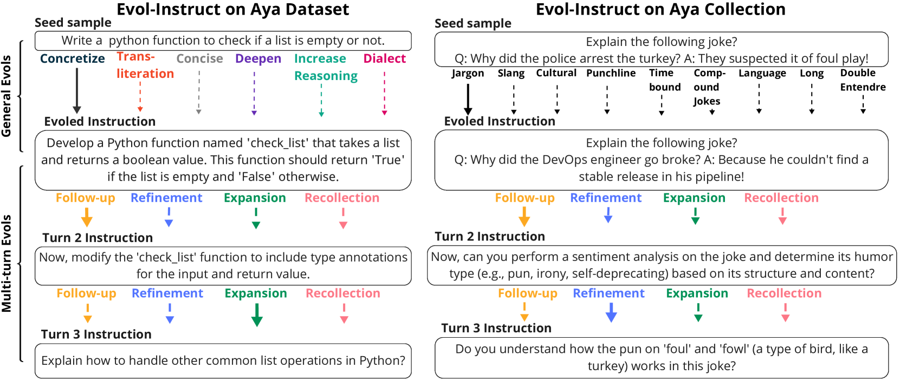
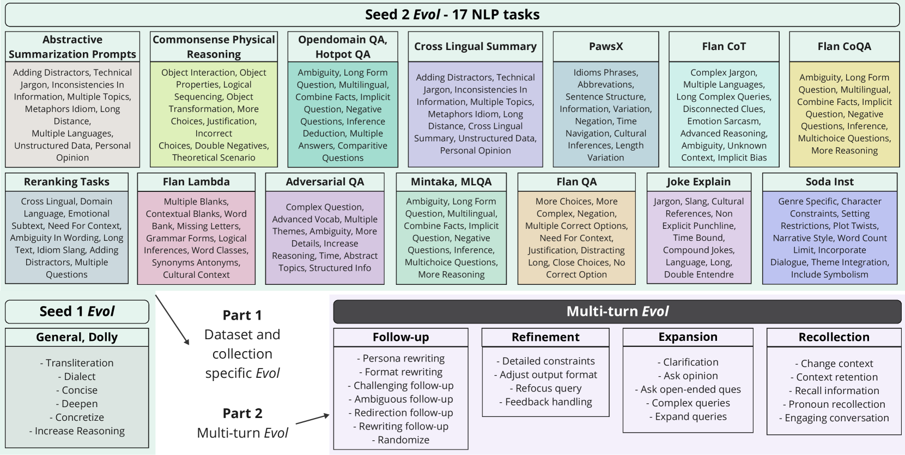
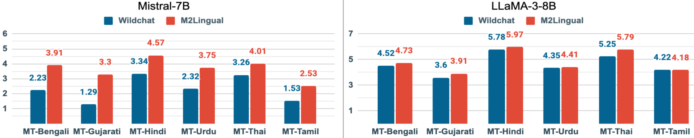

# M2Lingual：提升大型语言模型在多语言、多轮对话中的指令对齐能力

发布时间：2024年06月24日

`LLM应用

这篇论文介绍了M2Lingual数据集，这是一个多语言、多轮指令微调数据集，旨在提升大型语言模型（LLMs）在多种语言和任务上的适应性。论文中提到，经过M2Lingual微调的LLMs在多个多语言IFT数据集上表现出色，并在广泛的评估基准上展现出竞争力。这表明该研究主要关注于LLM的应用层面，即如何通过特定的数据集来优化和提升LLMs的性能，特别是在多语言环境下的应用。因此，这篇论文应归类为LLM应用。` `多语言技术`

> M2Lingual: Enhancing Multilingual, Multi-Turn Instruction Alignment in Large Language Models

# 摘要

> 指令微调（IFT）是确保大型语言模型（LLMs）遵循指令的关键。尽管已有多种IFT数据集问世，但多数侧重于英语等高资源语言。本研究推出了一种全新的、完全合成的多语言、多轮指令微调数据集M2Lingual，旨在提升LLMs在多样语言和任务上的适应性。M2Lingual涵盖了182K个基于多样化种子的IFT对，涉及70种语言、17项NLP任务及通用指令-响应对。经M2Lingual微调的LLMs在众多现有多语言IFT数据集上表现卓越，并在广泛的评估基准上持续展现出竞争力。特别是在我们的翻译多语言、多轮评估基准及各类多语言任务中，M2Lingual微调的LLMs表现出色。我们为此贡献了创建M2Lingual的2步进化分类法，并提供了数据集仓库链接：https://huggingface.co/datasets/ServiceNow-AI/M2Lingual。

> Instruction finetuning (IFT) is critical for aligning Large Language Models (LLMs) to follow instructions. Numerous effective IFT datasets have been proposed in the recent past, but most focus on high resource languages such as English. In this work, we propose a fully synthetic, novel taxonomy (Evol) guided Multilingual, Multi-turn instruction finetuning dataset, called M2Lingual, to better align LLMs on a diverse set of languages and tasks. M2Lingual contains a total of 182K IFT pairs that are built upon diverse seeds, covering 70 languages, 17 NLP tasks and general instruction-response pairs. LLMs finetuned with M2Lingual substantially outperform the majority of existing multilingual IFT datasets. Importantly, LLMs trained with M2Lingual consistently achieve competitive results across a wide variety of evaluation benchmarks compared to existing multilingual IFT datasets. Specifically, LLMs finetuned with M2Lingual achieve strong performance on our translated multilingual, multi-turn evaluation benchmark as well as a wide variety of multilingual tasks. Thus we contribute, and the 2 step Evol taxonomy used for its creation. M2Lingual repository - https://huggingface.co/datasets/ServiceNow-AI/M2Lingual

[Arxiv](https://arxiv.org/abs/2406.16783)