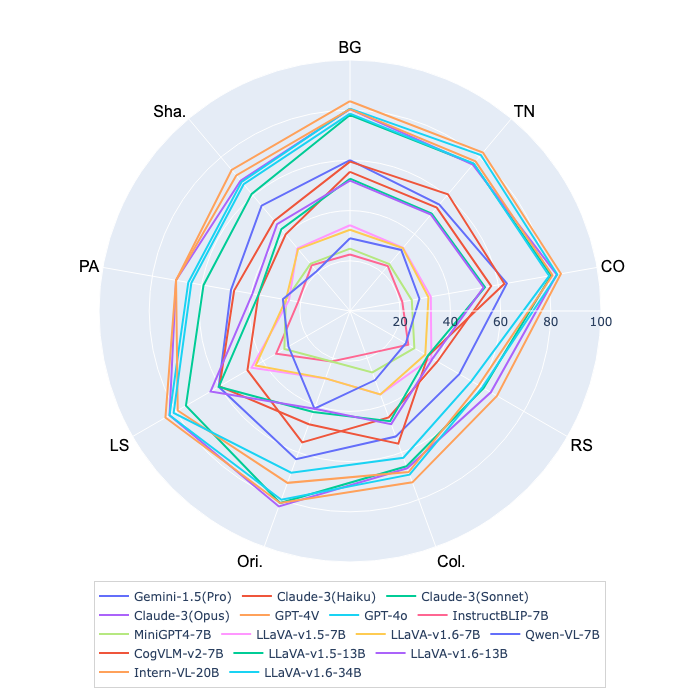
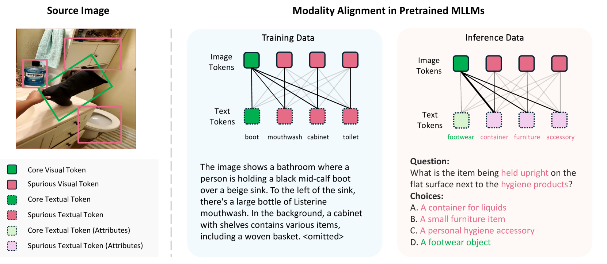
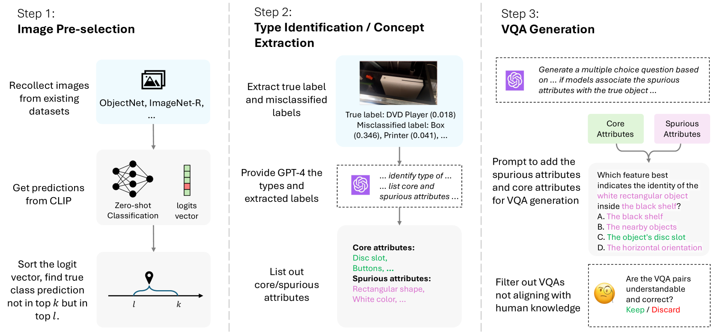
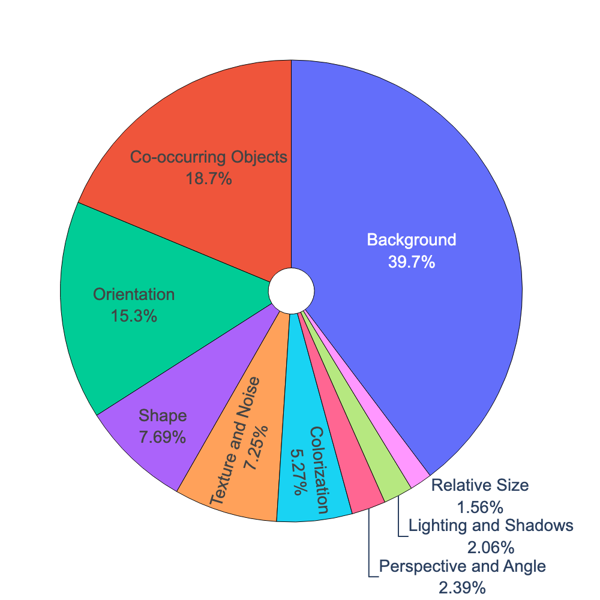
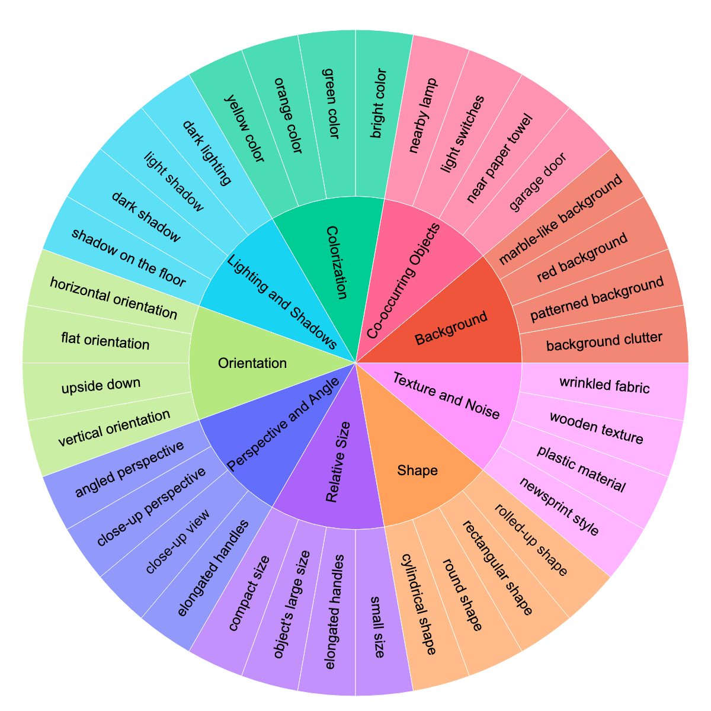
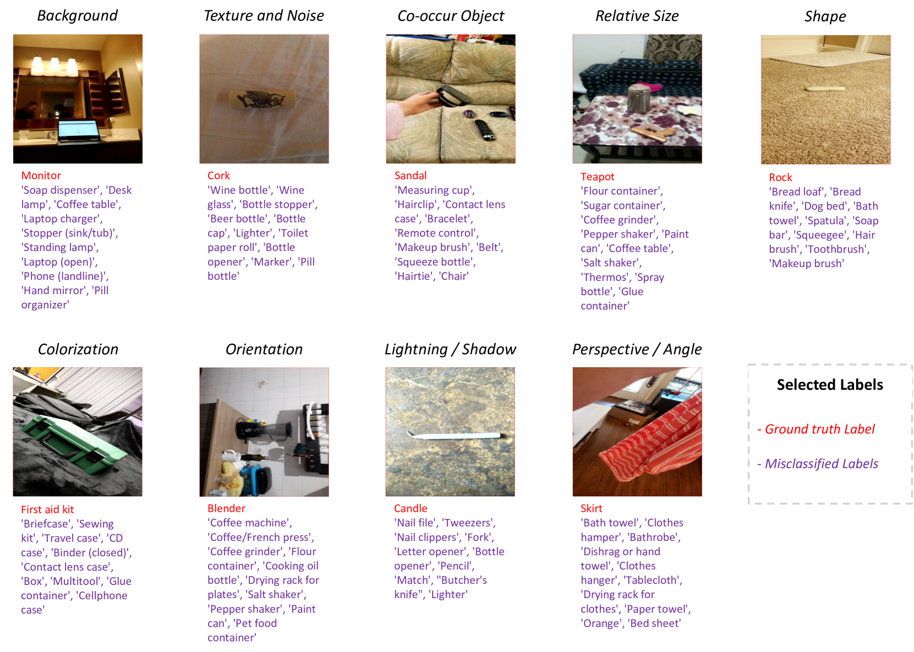

# MM-SpuBench：探索多模态LLMs中虚假偏差的深层理解

发布时间：2024年06月24日

`LLM应用

这篇论文主要关注多模态大型语言模型（MLLMs）中的虚假偏差问题，并提出了一个评估基准MM-SpuBench来评估MLLMs对虚假关联的依赖性。论文的研究重点在于应用层面，即如何通过评估和改进模型来增强MLLMs的鲁棒性，而不是在理论层面探讨LLM的基本原理或机制。因此，这篇论文更适合归类于LLM应用。` `视觉问答` `多模态学习`

> MM-SpuBench: Towards Better Understanding of Spurious Biases in Multimodal LLMs

# 摘要

> 虚假偏差，即利用非关键输入与目标变量间的虚假关联进行预测的倾向，已在单一模态数据训练的深度学习模型中暴露出严重的鲁棒性问题。多模态大型语言模型（MLLMs），融合视觉与语言模型，展现出卓越的视觉-语言联合理解能力。但MLLMs中虚假偏差的存在与否尚待深入探究。我们通过多模态环境下的虚假偏差分析填补了这一空白，揭示了特定测试数据模式，这些模式在视觉模型偏差影响MLLMs中视觉与文本令牌对齐时显现问题。为此，我们推出了MM-SpuBench，一个专为评估MLLMs对九类虚假关联依赖性的全面视觉问答（VQA）基准，该基准基于五个开源图像数据集的人类可理解概念信息构建。通过这一基准，我们对顶尖MLLMs进行了深入评估，发现它们仍依赖于虚假关联，凸显了开发新方法以减轻虚假偏差的紧迫性。为推动MLLM鲁棒性研究，我们已在https://huggingface.co/datasets/mmbench/MM-SpuBench发布VQA基准。

> Spurious bias, a tendency to use spurious correlations between non-essential input attributes and target variables for predictions, has revealed a severe robustness pitfall in deep learning models trained on single modality data. Multimodal Large Language Models (MLLMs), which integrate both vision and language models, have demonstrated strong capability in joint vision-language understanding. However, whether spurious biases are prevalent in MLLMs remains under-explored. We mitigate this gap by analyzing the spurious biases in a multimodal setting, uncovering the specific test data patterns that can manifest this problem when biases in the vision model cascade into the alignment between visual and text tokens in MLLMs. To better understand this problem, we introduce MM-SpuBench, a comprehensive visual question-answering (VQA) benchmark designed to evaluate MLLMs' reliance on nine distinct categories of spurious correlations from five open-source image datasets. The VQA dataset is built from human-understandable concept information (attributes). Leveraging this benchmark, we conduct a thorough evaluation of current state-of-the-art MLLMs. Our findings illuminate the persistence of the reliance on spurious correlations from these models and underscore the urge for new methodologies to mitigate spurious biases. To support the MLLM robustness research, we release our VQA benchmark at https://huggingface.co/datasets/mmbench/MM-SpuBench.

[Arxiv](https://arxiv.org/abs/2406.17126)