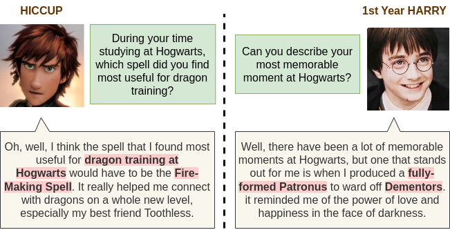
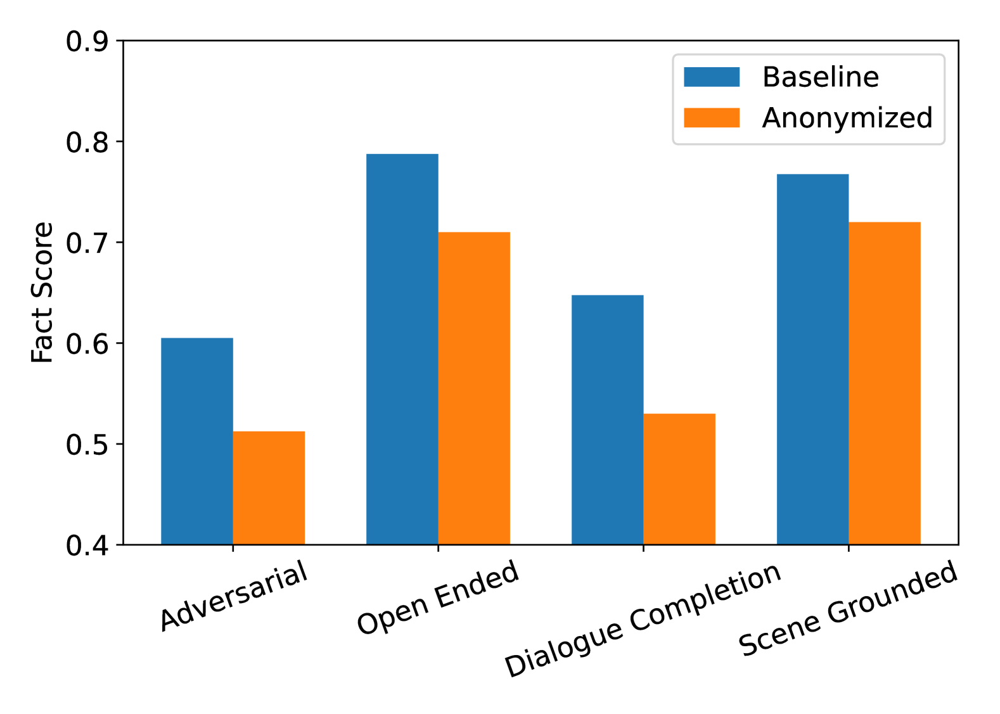
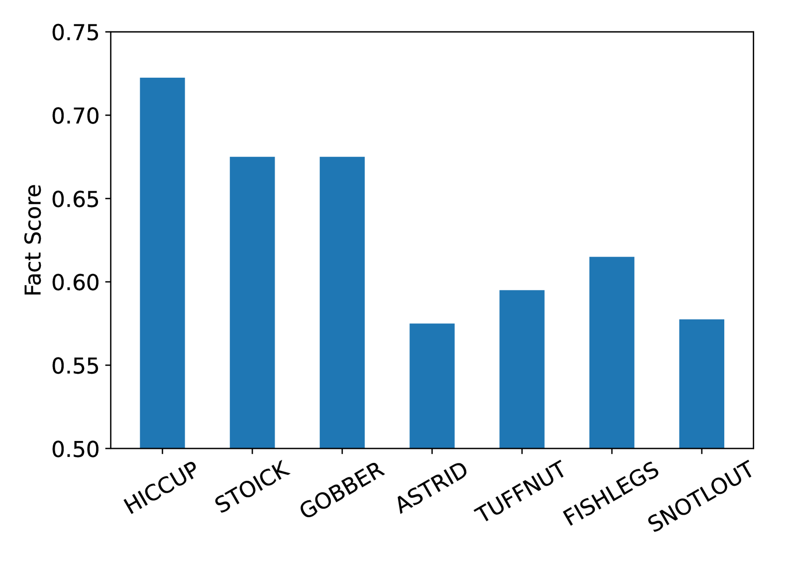
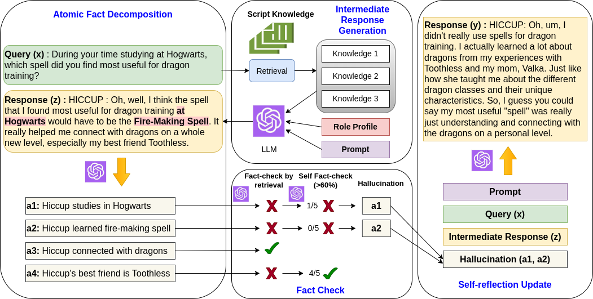
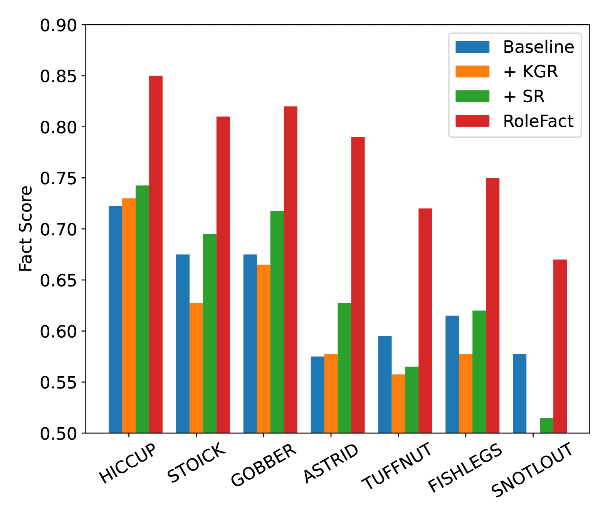
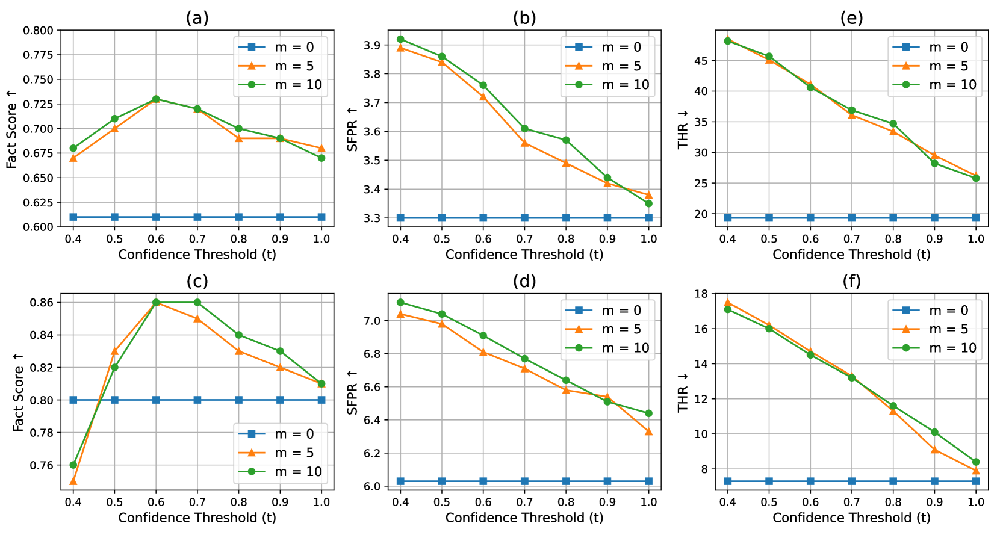
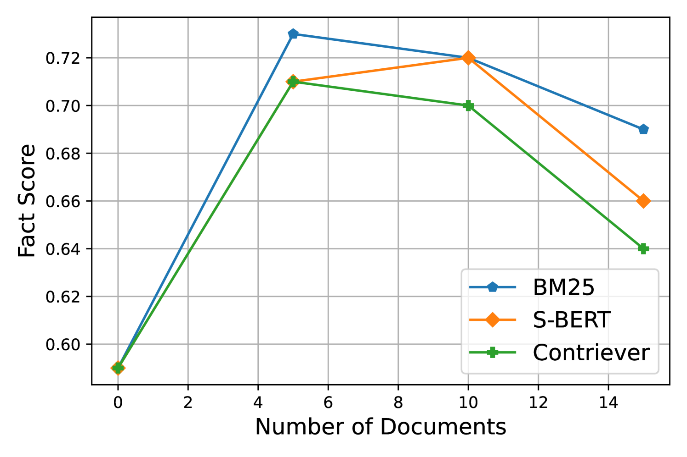

# 缓解虚构角色扮演中的幻觉问题

发布时间：2024年06月24日

`Agent

理由：这篇论文主要关注的是如何通过特定的方法（RoleFact）来评估和缓解大型语言模型（LLMs）在角色扮演应用中的幻觉问题。这涉及到创建一个大规模的数据集，并提出一种新的方法来调整模型参数以减少幻觉。这种研究更偏向于Agent的范畴，因为它处理的是如何使模型更好地适应特定的角色扮演任务，即如何使模型更像一个智能代理，能够根据预设的角色和情境进行有效和准确的交互。` `角色扮演` `客户支持`

> Mitigating Hallucination in Fictional Character Role-Play

# 摘要

> 角色扮演广泛应用于客户支持、实体代理及计算社会科学等领域，但大型语言模型（LLMs）的参数化世界知识常使角色行为偏离设定，产生知识范围外的幻觉。本研究聚焦于虚构角色扮演中幻觉的评估与缓解。我们创建了一个包含2,000多个角色和72,000次访谈的数据集，其中包含18,000个挑战性问题。我们提出的RoleFact方法，通过预设的置信度阈值调整参数化知识的影响，有效减少了幻觉现象。实验结果显示，该方法在对抗性问题上提升了18%的事实精确度，并在时间敏感的访谈中降低了44%的时间幻觉。相关代码和数据集将发布于https://github.com/NafisSadeq/rolefact.git。

> Role-playing has wide-ranging applications in customer support, embodied agents, computational social science, etc. The influence of parametric world knowledge of large language models (LLMs) often causes role-playing characters to act out of character and hallucinate about things outside the scope of their knowledge. In this work, we focus on the evaluation and mitigation of hallucination in fictional character role-play. We introduce a dataset with more than 2,000 characters and 72,000 interviews, including 18,000 adversarial questions. We propose RoleFact, a role-playing method that mitigates hallucination by modulating the influence of parametric knowledge using a pre-calibrated confidence threshold. Experiments show that the proposed method improves the factual precision of generated responses by 18% for adversarial questions with a 44% reduction in temporal hallucination for time-sensitive interviews. The code and the dataset will be available at https://github.com/NafisSadeq/rolefact.git.

[Arxiv](https://arxiv.org/abs/2406.17260)