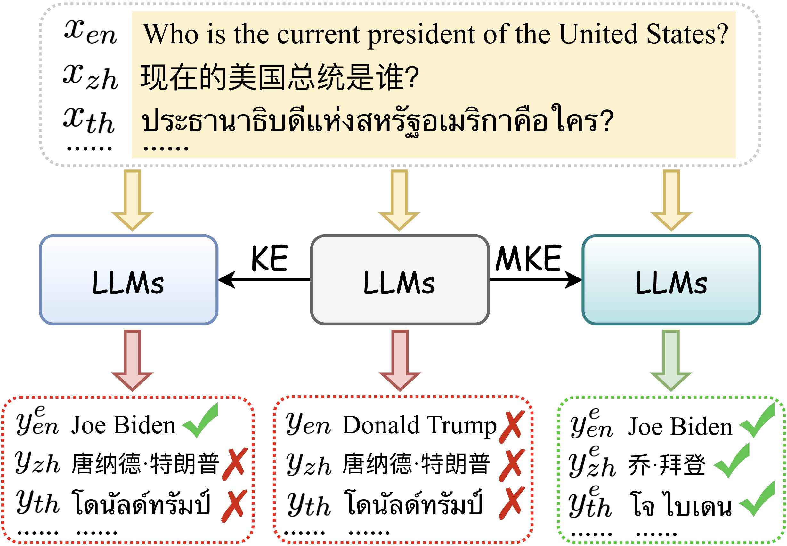
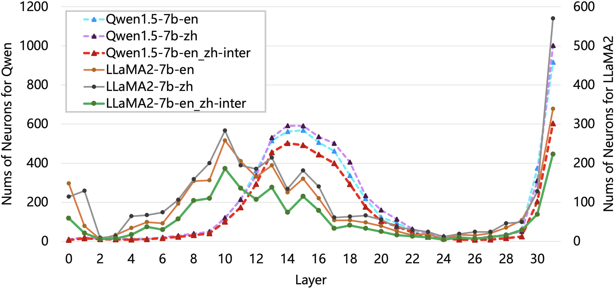
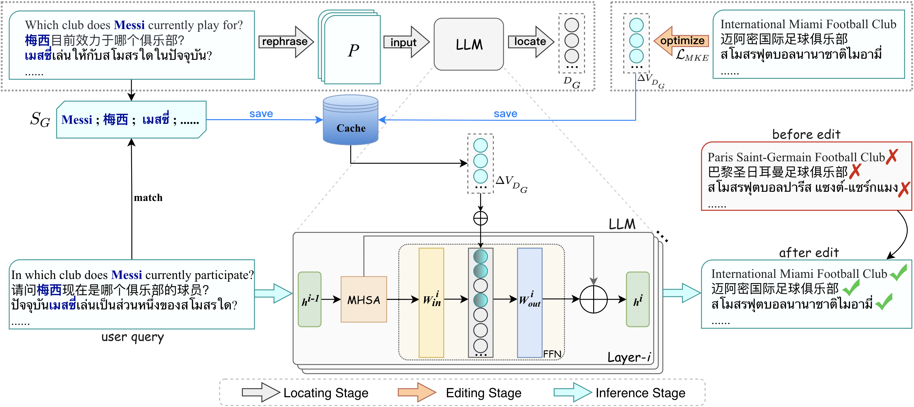
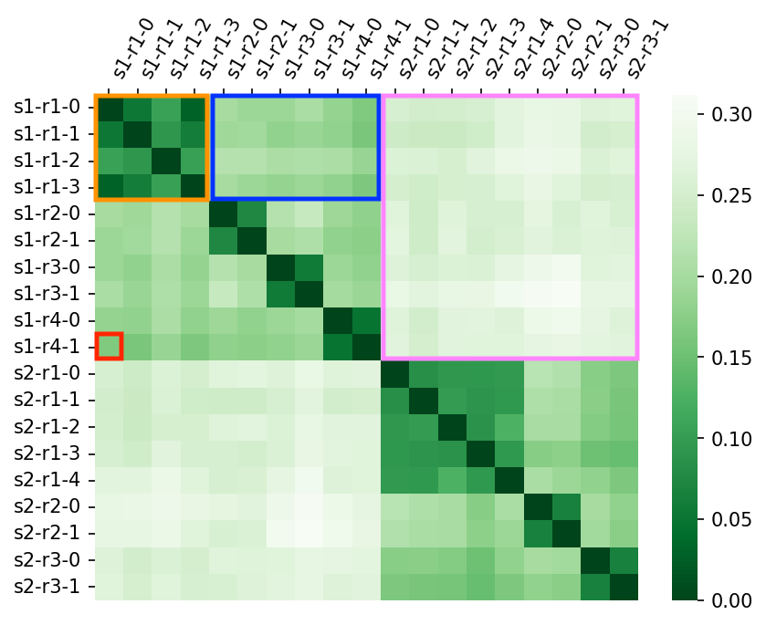

# 跨语言知识编辑：利用与语言无关的事实神经元

发布时间：2024年06月24日

`LLM应用

这篇论文主要探讨了在大型语言模型（LLMs）中如何有效地进行多语言知识编辑（MKE），通过识别和修改语言无关事实神经元（LAFN）来同步修正跨语言的事实知识。这种方法特别关注了不同语言间事实知识的深层语义联系，并通过实验证明了其有效性。因此，这篇论文属于LLM应用类别，因为它提供了一种具体的应用方法来改进LLMs在多语言环境下的性能。` `知识编辑`

> Multilingual Knowledge Editing with Language-Agnostic Factual Neurons

# 摘要

> 多语言知识编辑（MKE）旨在大型语言模型（LLMs）中同步修正跨语言的事实知识。然而，现有方法多忽视了不同语言间事实知识的深层语义联系，导致编辑效果受限。我们发现，LLMs中不同语言的相同事实知识激活一组共享神经元，即语言无关事实神经元（LAFN），这些神经元主要位于特定层，并代表多语言知识的语义联系。基于此，我们提出了一种新方法，通过定位并修改LAFN来同步编辑多语言知识。具体操作包括为每项待编辑知识生成释义以精确定位LAFN，并优化其更新值以实现跨语言的同步修改。实验证明，我们的方法在Bi-ZsRE和MzsRE基准上超越了现有方法，显著提升了编辑性能，凸显了考虑多语言知识间语义联系的重要性。

> Multilingual knowledge editing (MKE) aims to simultaneously revise factual knowledge across multilingual languages within large language models (LLMs). However, most existing MKE methods just adapt existing monolingual editing methods to multilingual scenarios, overlooking the deep semantic connections of the same factual knowledge between different languages, thereby limiting edit performance. To address this issue, we first investigate how LLMs represent multilingual factual knowledge and discover that the same factual knowledge in different languages generally activates a shared set of neurons, which we call language-agnostic factual neurons. These neurons represent the semantic connections between multilingual knowledge and are mainly located in certain layers. Inspired by this finding, we propose a new MKE method by locating and modifying Language-Agnostic Factual Neurons (LAFN) to simultaneously edit multilingual knowledge. Specifically, we first generate a set of paraphrases for each multilingual knowledge to be edited to precisely locate the corresponding language-agnostic factual neurons. Then we optimize the update values for modifying these located neurons to achieve simultaneous modification of the same factual knowledge in multiple languages. Experimental results on Bi-ZsRE and MzsRE benchmarks demonstrate that our method outperforms existing MKE methods and achieves remarkable edit performance, indicating the importance of considering the semantic connections among multilingual knowledge.

[Arxiv](https://arxiv.org/abs/2406.16416)