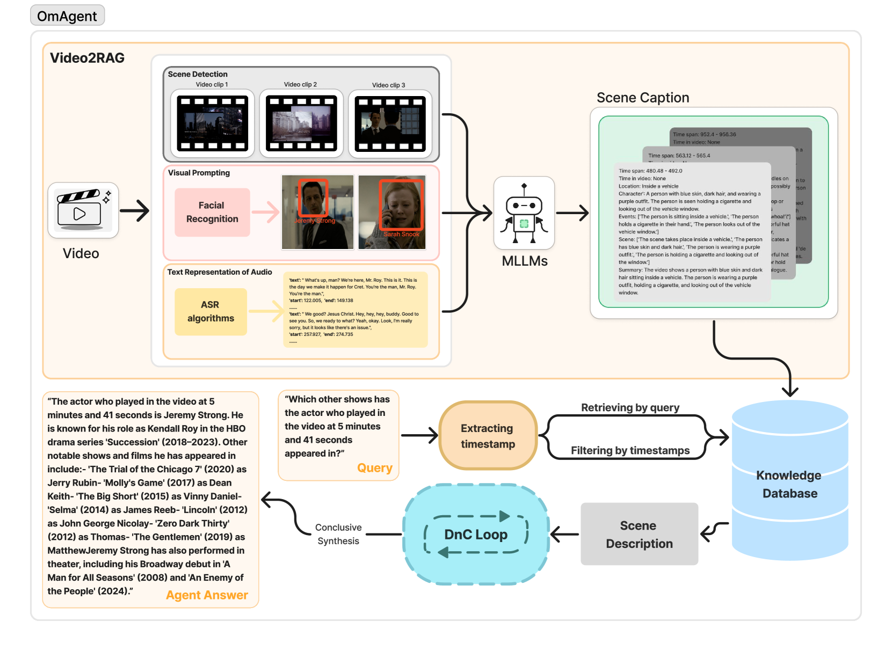
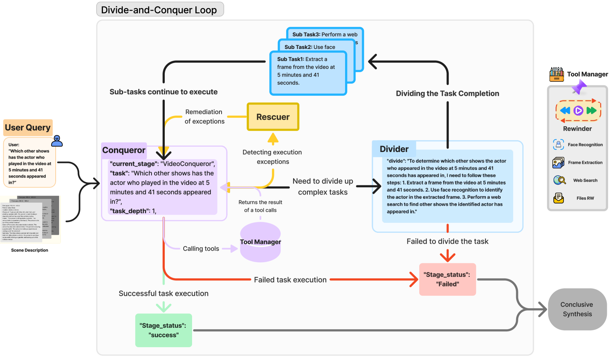
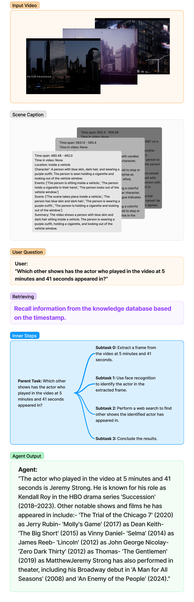
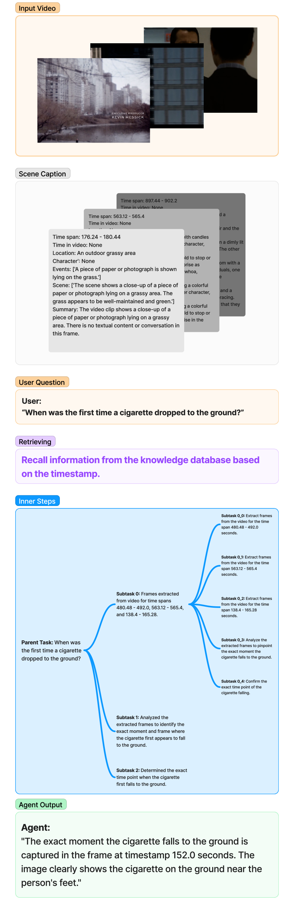

# OmAgent：专为复杂视频理解设计的多模态代理框架，通过任务分解与征服策略优化处理流程。

发布时间：2024年06月24日

`Agent

理由：论文摘要中提到的OmAgent是一个能够高效存储和检索视频帧的系统，并且具有自主推理循环，能够动态调用API和工具来提升处理效率和准确性。这些特性表明OmAgent是一个智能代理（Agent），它能够自主地执行任务并适应不同的查询需求。因此，这篇论文更适合归类到Agent分类中。` `视频监控` `多媒体处理`

> OmAgent: A Multi-modal Agent Framework for Complex Video Understanding with Task Divide-and-Conquer

# 摘要

> 大型语言模型（LLMs）的最新进展已将其能力扩展至多模态领域，涵盖了全面视频理解。尽管如此，处理如24小时监控录像或完整电影这类海量视频时，因数据量和处理需求庞大，仍面临严峻挑战。传统方法，如关键帧提取或帧转文本，往往导致信息大量流失。为此，我们研发了OmAgent，它能高效地存储和检索与特定查询相关的视频帧，确保视频内容的完整性。OmAgent还拥有一个分而治之的自主推理循环，能动态调用API和工具，提升查询处理效率和准确性。这一策略极大地增强了视频理解能力，减少了信息损失。实验证明，OmAgent在应对各类视频及复杂任务时表现出色。此外，我们还增强了其自主性，并配备了一个强大的工具调用系统，使其能胜任更为精细的任务。

> Recent advancements in Large Language Models (LLMs) have expanded their capabilities to multimodal contexts, including comprehensive video understanding. However, processing extensive videos such as 24-hour CCTV footage or full-length films presents significant challenges due to the vast data and processing demands. Traditional methods, like extracting key frames or converting frames to text, often result in substantial information loss. To address these shortcomings, we develop OmAgent, efficiently stores and retrieves relevant video frames for specific queries, preserving the detailed content of videos. Additionally, it features an Divide-and-Conquer Loop capable of autonomous reasoning, dynamically invoking APIs and tools to enhance query processing and accuracy. This approach ensures robust video understanding, significantly reducing information loss. Experimental results affirm OmAgent's efficacy in handling various types of videos and complex tasks. Moreover, we have endowed it with greater autonomy and a robust tool-calling system, enabling it to accomplish even more intricate tasks.

[Arxiv](https://arxiv.org/abs/2406.16620)