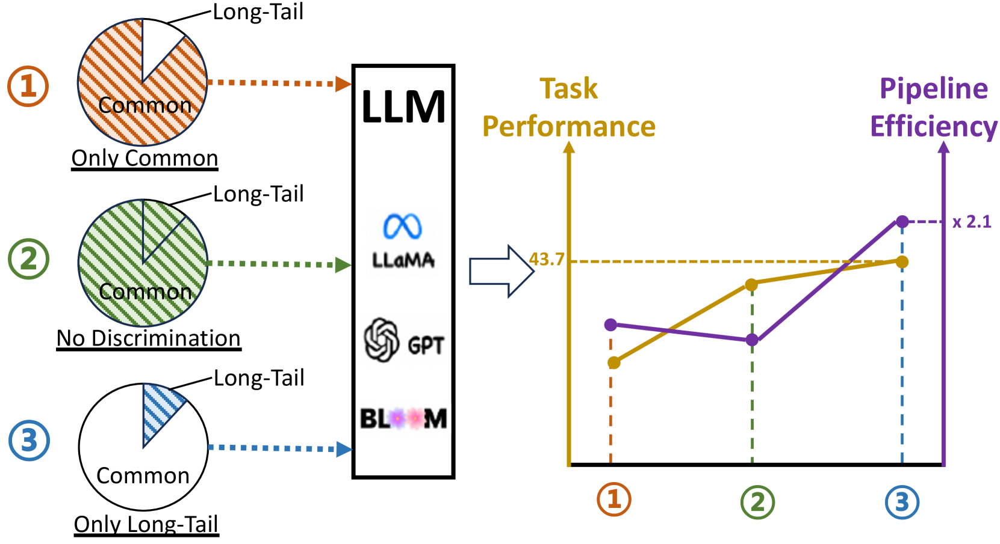

# 探讨长尾知识在检索增强大型语言模型中的关键角色

发布时间：2024年06月24日

`RAG

这篇论文主要探讨了检索增强生成（RAG）模型在处理长尾知识时的优化方法，提出了一种新的知识识别和评估机制，并通过实验验证了其有效性。因此，它属于RAG分类，专注于RAG模型的改进和应用。` `知识管理`

> On the Role of Long-tail Knowledge in Retrieval Augmented Large Language Models

# 摘要

> 检索增强生成（RAG）通过整合与用户查询相关的文档，显著提升了大型语言模型（LLMs）的知识处理能力。但RAG主要通过无差别地增强检索信息来优化LLMs的回答质量，忽视了LLMs需要哪类知识才能更精准地回应原始查询。本文指出，长尾知识对RAG至关重要，因为LLMs在广泛预训练中已掌握了大量常见知识。为此，我们提出了一种简便高效的长尾知识识别方法，并创新性地引入了生成期望校准误差（GECE）指标，从统计和语义层面评估知识的“长尾性”。当查询涉及长尾知识时，我们才检索相关文档并注入模型以填补知识空白。实验结果显示，相比现有RAG流程，我们的方法在推理速度上提升了4倍以上，并在下游任务中实现了稳定的性能提升。

> Retrieval augmented generation (RAG) exhibits outstanding performance in promoting the knowledge capabilities of large language models (LLMs) with retrieved documents related to user queries. However, RAG only focuses on improving the response quality of LLMs via enhancing queries indiscriminately with retrieved information, paying little attention to what type of knowledge LLMs really need to answer original queries more accurately. In this paper, we suggest that long-tail knowledge is crucial for RAG as LLMs have already remembered common world knowledge during large-scale pre-training. Based on our observation, we propose a simple but effective long-tail knowledge detection method for LLMs. Specifically, the novel Generative Expected Calibration Error (GECE) metric is derived to measure the ``long-tailness'' of knowledge based on both statistics and semantics. Hence, we retrieve relevant documents and infuse them into the model for patching knowledge loopholes only when the input query relates to long-tail knowledge. Experiments show that, compared to existing RAG pipelines, our method achieves over 4x speedup in average inference time and consistent performance improvement in downstream tasks.

[Arxiv](https://arxiv.org/abs/2406.16367)