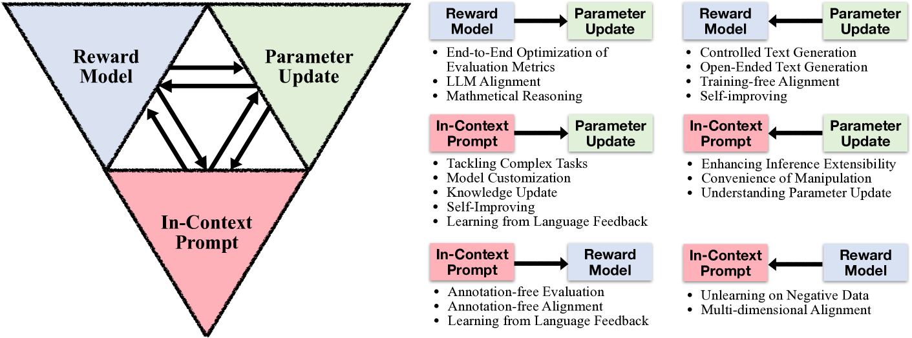

# 探讨奖励模型、参数更新与上下文提示间的相互作用

发布时间：2024年06月24日

`LLM理论

这篇论文探讨了大型语言模型（LLMs）的适应性问题，特别是通过参数更新、奖励建模和情境提示这三种主流适应工具的互换性。论文构建了一个包含六种转换路径的三角框架，旨在拓宽LLMs的应用范围，并为未来的研究提供方向。这种研究属于对LLMs理论层面的探讨，因为它关注的是模型调整和适应性的理论框架，而不是具体的应用或模型作为代理（Agent）的行为，也不是检索增强生成（RAG）的具体技术。因此，最合适的分类是LLM理论。` `机器学习`

> On the Transformations across Reward Model, Parameter Update, and In-Context Prompt

# 摘要

> 预训练的大型语言模型（LLMs）虽已具备广泛能力，但在实际应用中仍需进一步调整。本文探讨了三种主流适应工具——参数更新、奖励建模与情境提示之间的互换性，构建了一个包含六种转换路径的三角框架，每条路径均拓宽了应用范围。我们的研究不仅整合了现有研究成果，还指明了未来研究方向，为LLMs领域的进一步探索提供了宝贵的指南。

> Despite the general capabilities of pre-trained large language models (LLMs), they still need further adaptation to better serve practical applications. In this paper, we demonstrate the interchangeability of three popular and distinct adaptation tools: parameter updating, reward modeling, and in-context prompting. This interchangeability establishes a triangular framework with six transformation directions, each of which facilitates a variety of applications. Our work offers a holistic view that unifies numerous existing studies and suggests potential research directions. We envision our work as a useful roadmap for future research on LLMs.

[Arxiv](https://arxiv.org/abs/2406.16377)