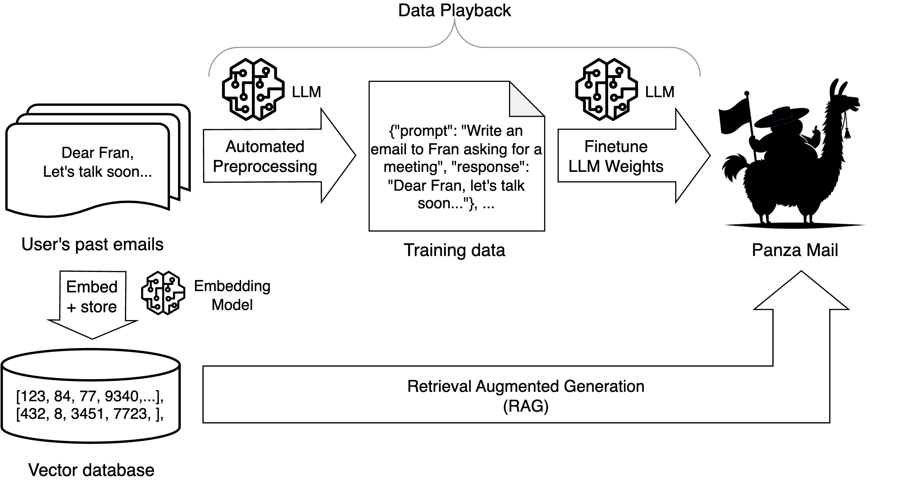
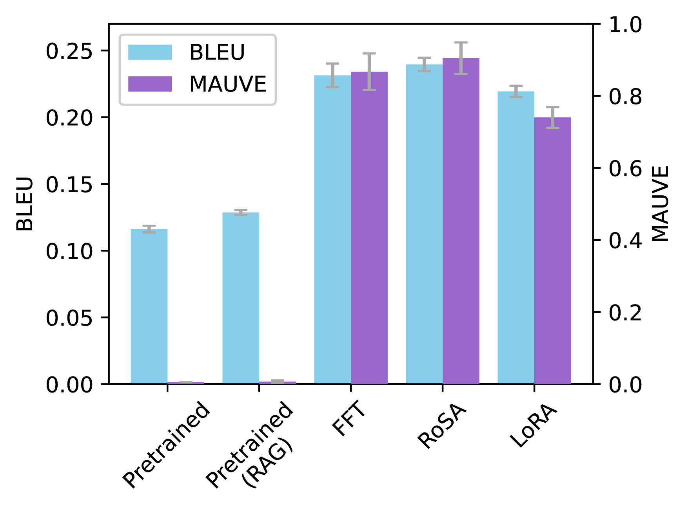
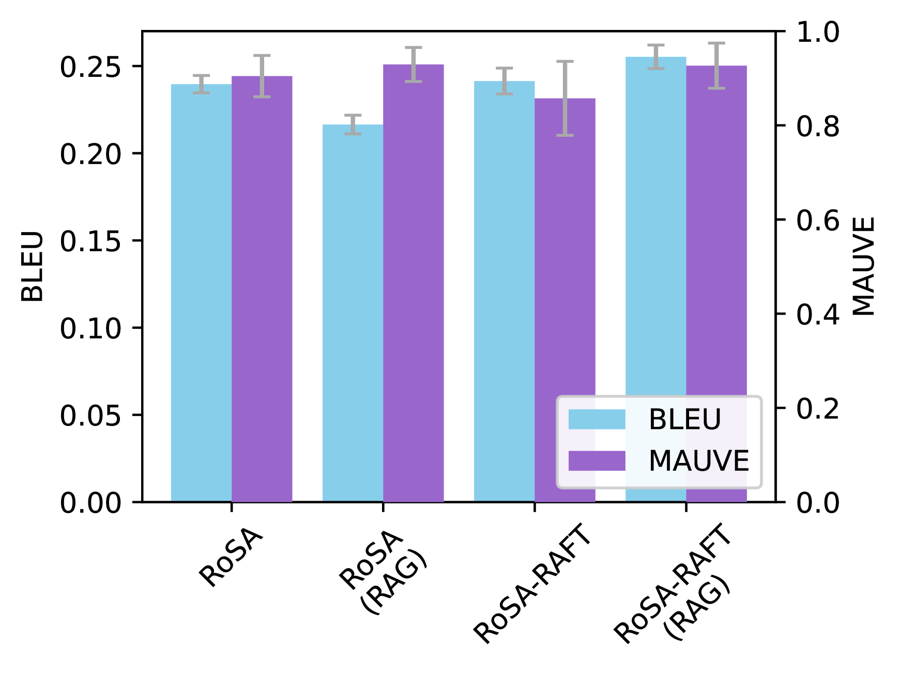
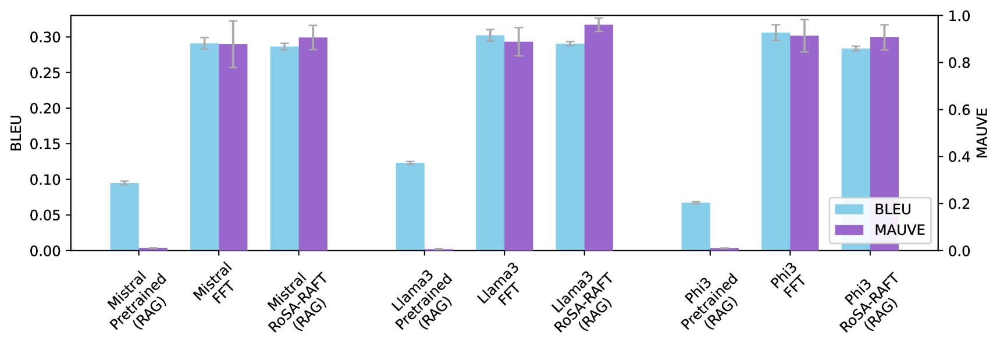
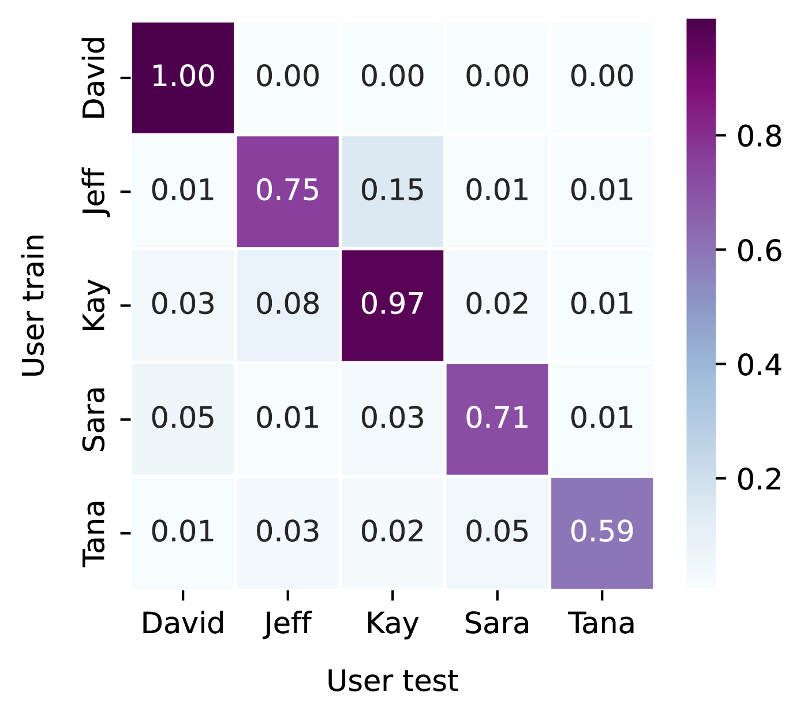
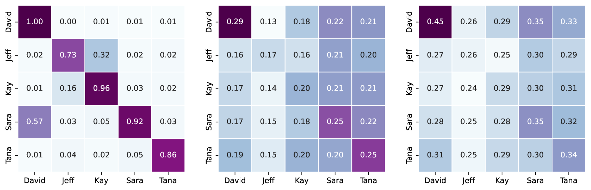

# Panza：一款结合数据回放与局部微调技术的个性化文本创作助手

发布时间：2024年06月24日

`LLM应用` `个人助手` `电子邮件`

> Panza: A Personalized Text Writing Assistant via Data Playback and Local Fine-Tuning

# 摘要

> 开源大型语言模型 (LLM) 的强大功能为自动化个人助手等应用打开了新篇章，这些助手能够适应用户的独特数据和需求。这类助手的两大关键特性是个人化和隐私保护，即助手需体现用户风格，同时用户可能希望个人数据始终存储在本地设备上。为此，我们设计了名为 Panza 的电子邮件生成个人助手。Panza 的特点在于，它不仅能在普通硬件上进行本地训练和推理，还能根据用户的写作风格进行个性化定制。这一个性化功能得益于一种名为数据回放的新技术，该技术使得即使数据有限，也能对 LLM 进行微调以贴合用户风格。我们证实，通过高效微调和推理方法的结合，Panza 完全可以在有限资源下本地运行，相当于免费 Google Colab 实例的资源水平。此外，我们的研究重点还包括评估指标的细致分析，以及不同系统组件选择（如检索增强生成或微调方法）对性能的影响。

> The availability of powerful open-source large language models (LLMs) opens exciting use-cases, such as automated personal assistants that adapt to the user's unique data and demands. Two key desiderata for such assistants are personalization-in the sense that the assistant should reflect the user's own style-and privacy-in the sense that users may prefer to always store their personal data locally, on their own computing device. We present a new design for such an automated assistant, for the specific use case of personal assistant for email generation, which we call Panza. Specifically, Panza can be both trained and inferenced locally on commodity hardware, and is personalized to the user's writing style. Panza's personalization features are based on a new technique called data playback, which allows us to fine-tune an LLM to better reflect a user's writing style using limited data. We show that, by combining efficient fine-tuning and inference methods, Panza can be executed entirely locally using limited resources-specifically, it can be executed within the same resources as a free Google Colab instance. Finally, our key methodological contribution is a careful study of evaluation metrics, and of how different choices of system components (e.g. the use of Retrieval-Augmented Generation or different fine-tuning approaches) impact the system's performance.

[Arxiv](https://arxiv.org/abs/2407.10994)