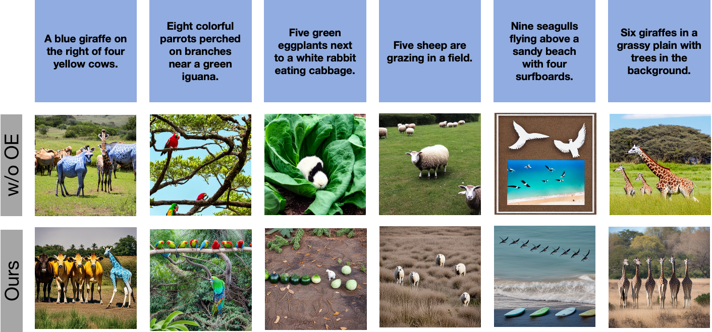
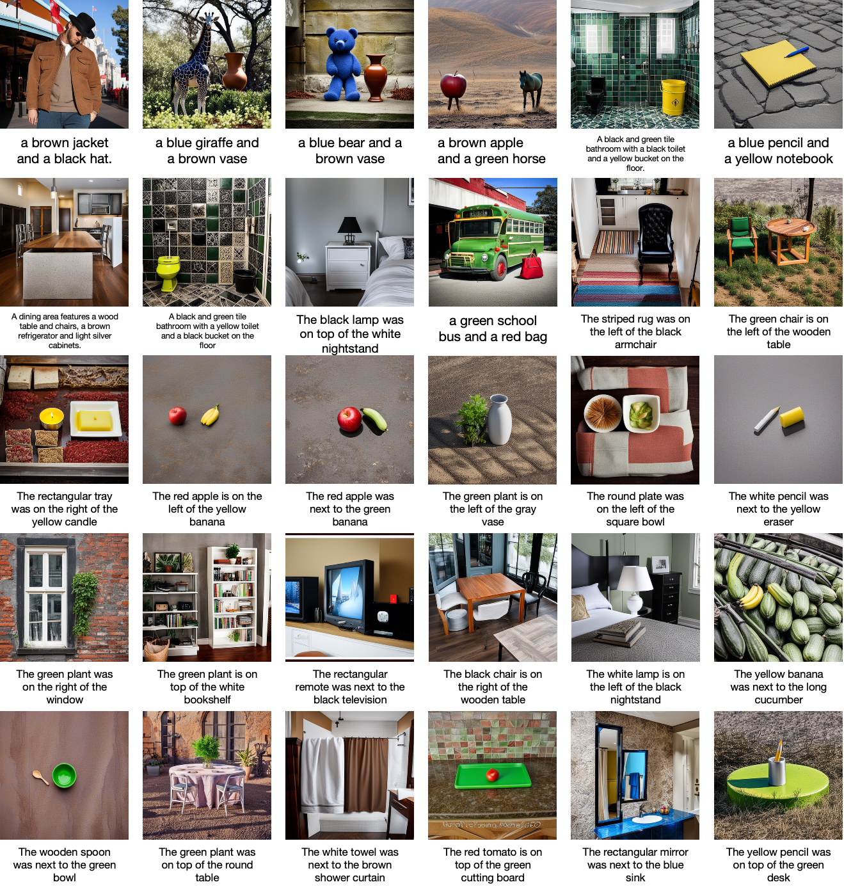

# 提示一致性图像生成（PCIG）：一种集成大型语言模型、知识图谱与可控扩散模型的统一框架

发布时间：2024年06月24日

`Agent

理由：这篇论文介绍了一种基于扩散的新颖框架，用于提升文本到图像生成技术中图像与描述之间的一致性。该框架利用大型语言模型识别图像中的对象并构建知识图谱，然后结合可控图像生成技术生成与文本描述高度一致的图像。这种方法涉及到了智能代理（Agent）的概念，即一个系统能够根据输入的文本描述自主地生成相应的图像，体现了Agent在处理跨模态任务中的应用。因此，这篇论文更适合归类到Agent分类中。` `图像生成` `跨模态学习`

> Prompt-Consistency Image Generation (PCIG): A Unified Framework Integrating LLMs, Knowledge Graphs, and Controllable Diffusion Models

# 摘要

> 文本到图像生成技术的飞速进步，使得高质量图像的合成成为可能，这一切都得益于精准的文本描述。然而，这些模型有时会生成与输入文本不符的内容，这影响了它们的可靠性和实际应用。为此，我们提出了一种基于扩散的新颖框架，旨在大幅提升图像与描述之间的一致性，解决视觉与文本之间的不协调问题。我们的框架通过对不一致现象的深入分析，并根据其在图像中的表现进行分类。借助顶尖的大型语言模块，我们首先识别图像中的对象，并构建知识图谱以预测这些对象的可能位置。接着，我们将先进的可控图像生成技术与视觉文本生成模块相结合，依据预测的对象位置，生成与原始文本提示高度一致的图像。通过在高级跨模态幻觉基准上的广泛测试，我们验证了该方法在生成无误差图像方面的卓越效果。相关代码已公开，详情请访问 https://github.com/TruthAI-Lab/PCIG。

> The rapid advancement of Text-to-Image(T2I) generative models has enabled the synthesis of high-quality images guided by textual descriptions. Despite this significant progress, these models are often susceptible in generating contents that contradict the input text, which poses a challenge to their reliability and practical deployment. To address this problem, we introduce a novel diffusion-based framework to significantly enhance the alignment of generated images with their corresponding descriptions, addressing the inconsistency between visual output and textual input. Our framework is built upon a comprehensive analysis of inconsistency phenomena, categorizing them based on their manifestation in the image. Leveraging a state-of-the-art large language module, we first extract objects and construct a knowledge graph to predict the locations of these objects in potentially generated images. We then integrate a state-of-the-art controllable image generation model with a visual text generation module to generate an image that is consistent with the original prompt, guided by the predicted object locations. Through extensive experiments on an advanced multimodal hallucination benchmark, we demonstrate the efficacy of our approach in accurately generating the images without the inconsistency with the original prompt. The code can be accessed via https://github.com/TruthAI-Lab/PCIG.

[Arxiv](https://arxiv.org/abs/2406.16333)