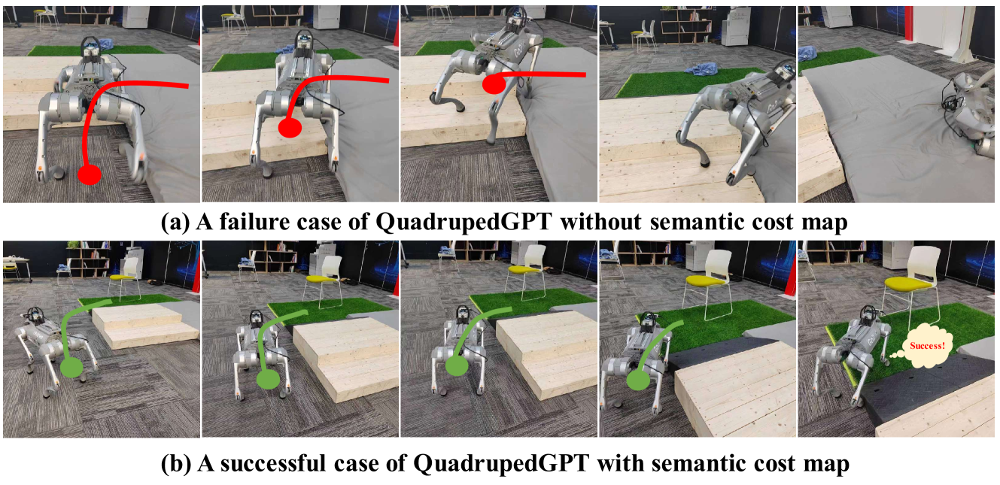

# QuadrupedGPT：探索开放世界中全能四足代理的潜力

发布时间：2024年06月24日

`Agent

这篇论文介绍了一个名为 QuadrupedGPT 的代理系统，它能够处理多模态信息、进行高级认知和推理，以及自主调整运动策略和路径规划。这些特性表明它是一个能够自主执行复杂任务的智能代理，因此适合归类在Agent分类中。` `机器人技术` `人工智能`

> QuadrupedGPT: Towards a Versatile Quadruped Agent in Open-ended Worlds

# 摘要

> 尽管宠物能提供陪伴，但它们的智力有限，难以进行高级推理和自主互动。为此，我们开发了QuadrupedGPT，一个灵活多变的代理，旨在像宠物一样敏捷地掌握各种复杂任务。其主要挑战包括：利用多模态信息进行决策、掌握灵活的运动控制和路径规划、以及发展高级认知以实现长期目标。QuadrupedGPT通过大型多模态模型处理指令和环境，利用丰富的知识库自主调整运动策略，并通过语义感知地形分析规划出既安全又高效的路径。此外，它还能通过高级推理将长期目标分解为一系列可执行的子目标。在多个基准测试中，QuadrupedGPT展现了处理复杂任务的能力，标志着向开放世界中多功能四足代理迈出了重要一步。更多信息和代码请访问我们的网站：https://quadruped-hub.github.io/Quadruped-GPT/。

> While pets offer companionship, their limited intelligence restricts advanced reasoning and autonomous interaction with humans. Considering this, we propose QuadrupedGPT, a versatile agent designed to master a broad range of complex tasks with agility comparable to that of a pet. To achieve this goal, the primary challenges include: i) effectively leveraging multimodal observations for decision-making; ii) mastering agile control of locomotion and path planning; iii) developing advanced cognition to execute long-term objectives. QuadrupedGPT processes human command and environmental contexts using a large multimodal model (LMM). Empowered by its extensive knowledge base, our agent autonomously assigns appropriate parameters for adaptive locomotion policies and guides the agent in planning a safe but efficient path towards the goal, utilizing semantic-aware terrain analysis. Moreover, QuadrupedGPT is equipped with problem-solving capabilities that enable it to decompose long-term goals into a sequence of executable subgoals through high-level reasoning. Extensive experiments across various benchmarks confirm that QuadrupedGPT can adeptly handle multiple tasks with intricate instructions, demonstrating a significant step towards the versatile quadruped agents in open-ended worlds. Our website and codes can be found at https://quadruped-hub.github.io/Quadruped-GPT/.

[Arxiv](https://arxiv.org/abs/2406.16578)