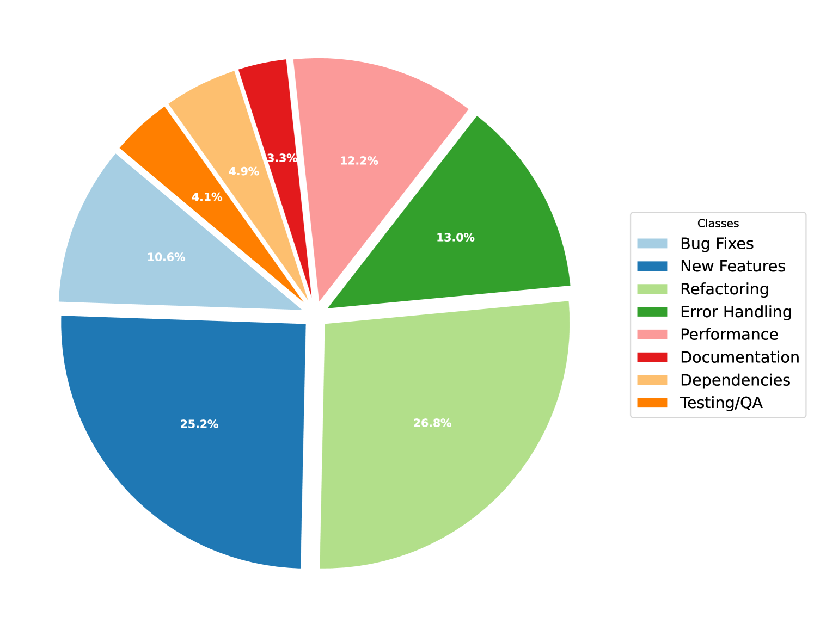
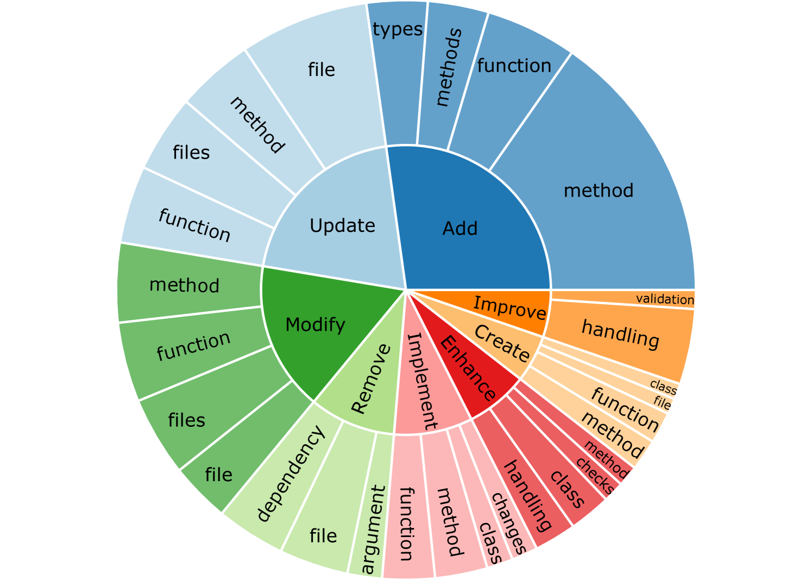
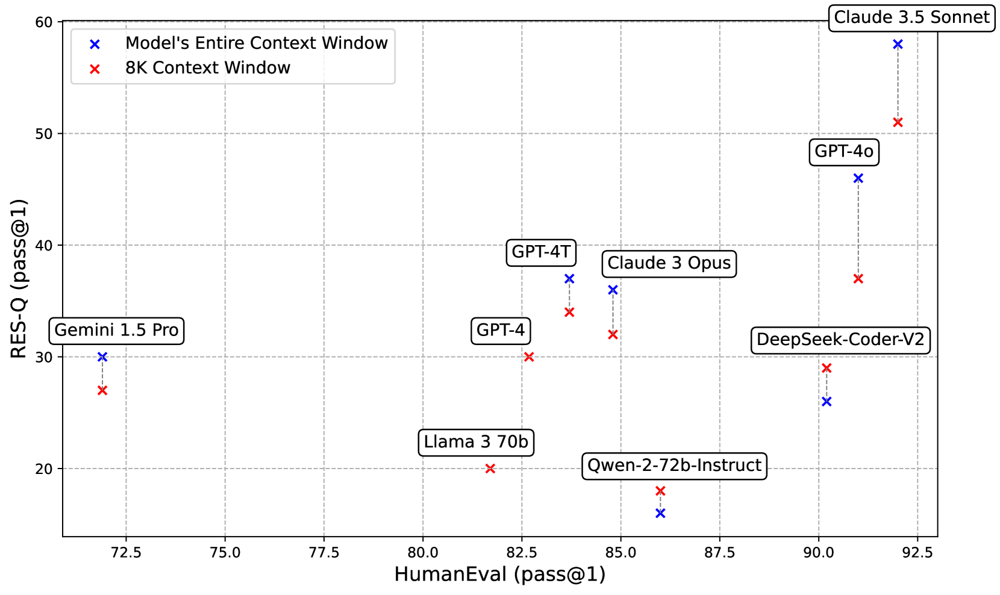
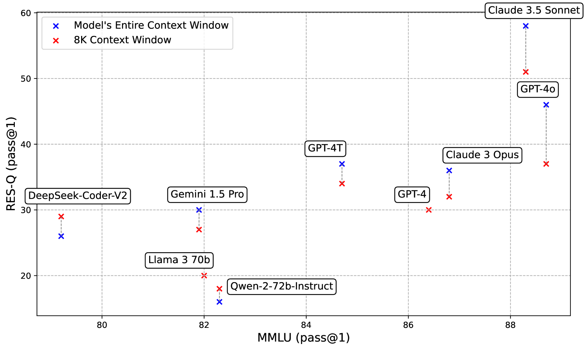
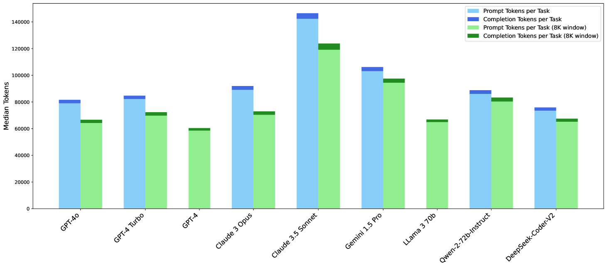

# RES-Q：大型语言模型代码编辑系统在仓库规模上的评估

发布时间：2024年06月24日

`LLM应用

这篇论文主要讨论了大型语言模型（LLMs）在处理复杂任务，如编辑大型代码仓库时的应用。它提出了一个名为RES-Q的评估基准，专门用于评估基于LLM的仓库编辑系统的能力。论文通过实际测试和比较不同LLMs的表现，展示了RES-Q在区分模型能力方面的有效性，并探讨了令牌效率、与现有基准的性能关联，以及闭源与开源LLMs之间的差异。因此，这篇论文的内容更偏向于LLM的实际应用，而不是理论研究或Agent、RAG相关的研究。` `软件开发` `人工智能`

> RES-Q: Evaluating Code-Editing Large Language Model Systems at the Repository Scale

# 摘要

> 大型语言模型（LLMs）的指令遵循能力使得基于LLM的系统能够处理复杂任务，如编辑大型代码仓库。鉴于LLM对提示变化的敏感性和不可预测性，我们提出了RES-Q，一个基于自然语言指令的评估基准，专门用于仓库编辑系统。RES-Q包含100个源自真实GitHub提交的编辑任务，旨在评估LLM系统根据指令要求进行信息收集和编辑构建的能力。我们认为，RES-Q不仅解决了传统基准的局限，还提供了对模型能力的全面评估。我们在Qurrent OS上构建的仓库编辑系统中，测试了多种顶尖LLMs的表现。尽管在HumanEval上性能差异仅为1%，Claude Sonnet 3.5在RES-Q上的表现却比GPT-4o高出12%，显示出RES-Q在区分模型能力方面的有效性。此外，我们还探讨了令牌效率、与现有基准的性能关联，以及闭源与开源LLMs之间的差异。相关代码和数据集已公开于https://github.com/Qurrent-AI/RES-Q。

> The instruction-following ability of Large Language Models (LLMs) has cultivated a class of LLM-based systems capable of approaching complex tasks such as making edits to large code repositories. Due to the high sensitivity and unpredictability of LLM behavior in response to changes in prompting, robust evaluation tools are needed to drive future iteration of these systems. We propose RES-Q, a natural language instruction-based benchmark for evaluating $\textbf{R}$epository $\textbf{E}$diting $\textbf{S}$ystems, which consists of 100 repository editing tasks derived from real GitHub commits. Given an edit instruction and a code repository, RES-Q evaluates an LLM system's ability to gather information and construct an edit that satisfies the criteria set by the instruction. We argue that evaluating LLMs in this way addresses issues with traditional benchmarks and provides a more holistic assessment of a model's abilities. We evaluate various state-of-the-art LLMs as language agents in a repository-editing system built on Qurrent OS, our language agent development software. Despite their 1% pass@1 performance difference on HumanEval, we find Claude Sonnet 3.5 outperforms GPT-4o by 12% pass@1 on RES-Q, indicating RES-Q's capacity to differentiate model capability as traditional benchmarks approach saturation. We further investigate token efficiency, performance relationships with existing benchmarks, and interesting disparities between closed and open-source LLMs. Code and dataset are available at https://github.com/Qurrent-AI/RES-Q.

[Arxiv](https://arxiv.org/abs/2406.16801)