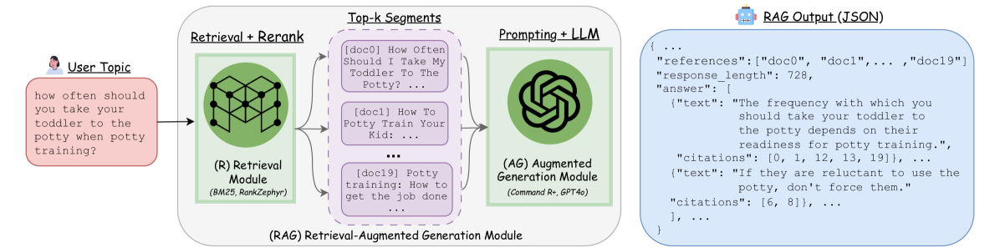
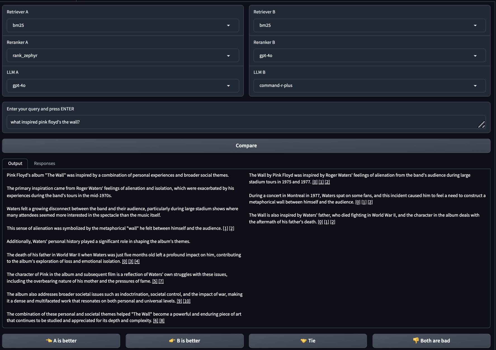
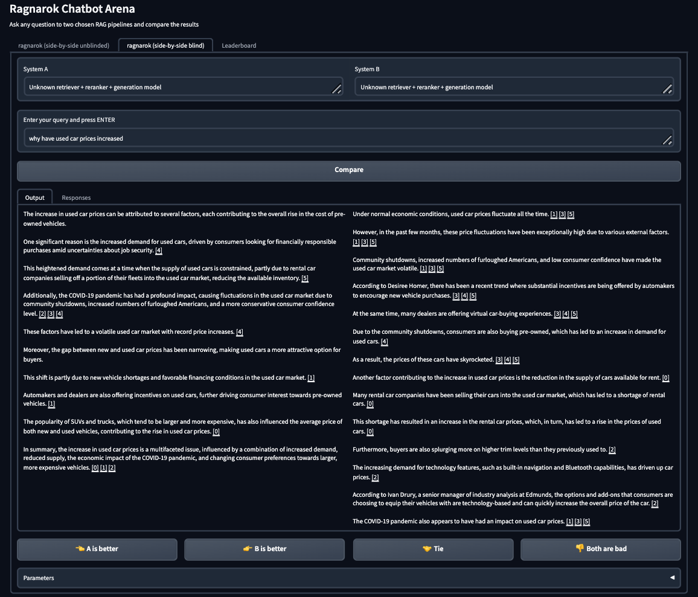
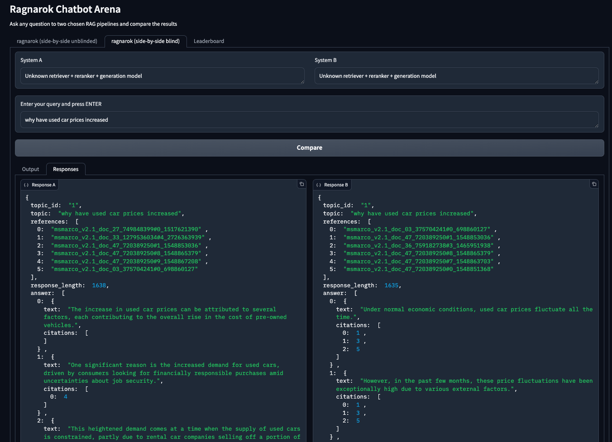

# Ragnarök：TREC 2024检索增强生成赛道的可复用RAG框架与基准

发布时间：2024年06月24日

`RAG

这篇论文主要讨论了检索增强生成（RAG）系统的评估和标准化，提出了一个名为Ragnarök的框架，并介绍了其在TREC 2024 RAG赛道的应用。论文的重点在于推动RAG系统的评估和创新，以及为RAG系统设定统一标准，这与RAG技术的应用和发展紧密相关。因此，将其归类为RAG是合适的。` `搜索引擎` `人工智能`

> Ragnarök: A Reusable RAG Framework and Baselines for TREC 2024 Retrieval-Augmented Generation Track

# 摘要

> 你体验过新版Bing搜索或Google AI的概览功能吗？这些现代搜索技术已经进化，引入了检索增强生成（RAG）系统，它们能在大型语言模型中实时整合数据，提供详尽且精炼的总结，与传统依赖文档排名的搜索方式大相径庭。鉴于这些技术进步，我们需要一个平台来构建、测试、可视化并系统评估RAG系统。为此，我们提出了TREC 2024 RAG赛道，旨在推动RAG系统评估的创新。我们详细介绍了我们的可重复使用框架Ragnarök，解释了MS MARCO V2.1数据集的选择，发布了赛道的发展主题，并标准化了输入输出定义以帮助用户。利用Ragnarök，我们确定了关键工业基准，如OpenAI的GPT-4o和Cohere的Command R+。我们还开发了一个基于网络的交互界面，通过众包方式进行RAG系统的成对基准测试。我们开源了Ragnarök框架和基准，以期为未来的RAG系统设定统一标准。

> Did you try out the new Bing Search? Or maybe you fiddled around with Google AI~Overviews? These might sound familiar because the modern-day search stack has recently evolved to include retrieval-augmented generation (RAG) systems. They allow searching and incorporating real-time data into large language models (LLMs) to provide a well-informed, attributed, concise summary in contrast to the traditional search paradigm that relies on displaying a ranked list of documents. Therefore, given these recent advancements, it is crucial to have an arena to build, test, visualize, and systematically evaluate RAG-based search systems. With this in mind, we propose the TREC 2024 RAG Track to foster innovation in evaluating RAG systems. In our work, we lay out the steps we've made towards making this track a reality -- we describe the details of our reusable framework, Ragnarök, explain the curation of the new MS MARCO V2.1 collection choice, release the development topics for the track, and standardize the I/O definitions which assist the end user. Next, using Ragnarök, we identify and provide key industrial baselines such as OpenAI's GPT-4o or Cohere's Command R+. Further, we introduce a web-based user interface for an interactive arena allowing benchmarking pairwise RAG systems by crowdsourcing. We open-source our Ragnarök framework and baselines to achieve a unified standard for future RAG systems.

[Arxiv](https://arxiv.org/abs/2406.16828)