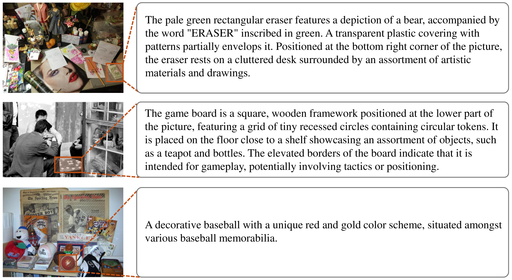
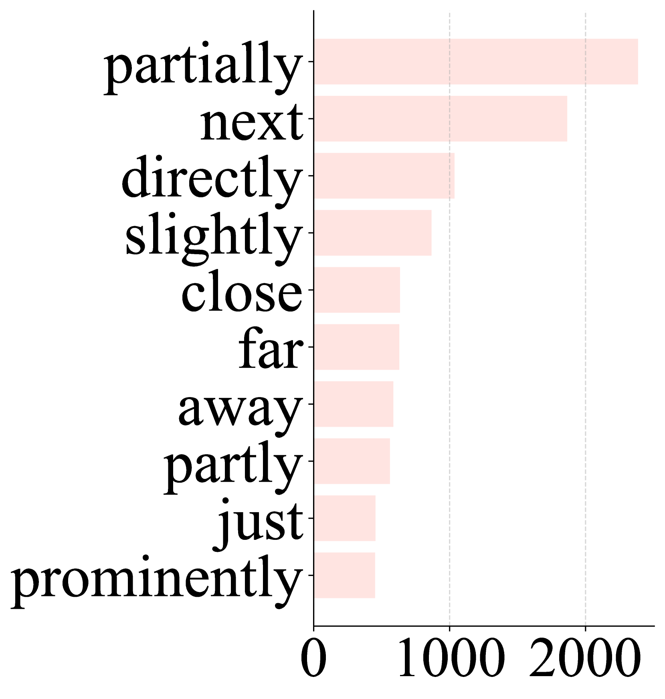

# 在大型多模态模型盛行的今天，我们重新审视指称表达理解评估。

发布时间：2024年06月24日

`LLM应用

理由：这篇论文主要关注的是大型多模态模型（LMMs）在指称表达理解（REC）领域的应用，特别是在评估和改进基准数据集方面的工作。论文通过指出现有基准的问题，并提出了一个新的、更全面的基准Ref-L4，以更好地评估和推动LMMs在REC领域的发展。这与LLM应用的分类相符，因为它涉及的是如何应用和改进现有的模型来解决具体的NLP问题，而不是探讨LLM的理论基础或Agent的设计与应用。` `计算机视觉`

> Revisiting Referring Expression Comprehension Evaluation in the Era of Large Multimodal Models

# 摘要

> 指称表达理解（REC）旨在根据文本描述精准定位目标。CogVLM等大型多模态模型（LMMs）在REC领域取得了显著成就，如在RefCOCO上准确率达92.44%。但本研究指出，现有的RefCOCO、RefCOCO+和RefCOCOg等基准可能未能全面评估LMMs的能力。通过手动审查，我们发现这些基准存在高比例的标签错误，影响了评估的可靠性。为此，我们排除了问题实例，并重新评估了多个LMMs，结果显示准确率大幅提升，凸显了基准噪声的影响。为解决这一问题，我们推出了Ref-L4，一个专为现代REC模型设计的全面基准，具有四大特点：庞大的样本量、广泛的对象类别、长指称表达和丰富的词汇。我们在Ref-L4上评估了24个大型模型，并分享了重要发现。RefCOCO、RefCOCO+和RefCOCOg的改进版本及Ref-L4的基准和评估代码，均可在https://github.com/JierunChen/Ref-L4找到。

> Referring expression comprehension (REC) involves localizing a target instance based on a textual description. Recent advancements in REC have been driven by large multimodal models (LMMs) like CogVLM, which achieved 92.44% accuracy on RefCOCO. However, this study questions whether existing benchmarks such as RefCOCO, RefCOCO+, and RefCOCOg, capture LMMs' comprehensive capabilities. We begin with a manual examination of these benchmarks, revealing high labeling error rates: 14% in RefCOCO, 24% in RefCOCO+, and 5% in RefCOCOg, which undermines the authenticity of evaluations. We address this by excluding problematic instances and reevaluating several LMMs capable of handling the REC task, showing significant accuracy improvements, thus highlighting the impact of benchmark noise. In response, we introduce Ref-L4, a comprehensive REC benchmark, specifically designed to evaluate modern REC models. Ref-L4 is distinguished by four key features: 1) a substantial sample size with 45,341 annotations; 2) a diverse range of object categories with 365 distinct types and varying instance scales from 30 to 3,767; 3) lengthy referring expressions averaging 24.2 words; and 4) an extensive vocabulary comprising 22,813 unique words. We evaluate a total of 24 large models on Ref-L4 and provide valuable insights. The cleaned versions of RefCOCO, RefCOCO+, and RefCOCOg, as well as our Ref-L4 benchmark and evaluation code, are available at https://github.com/JierunChen/Ref-L4.

[Arxiv](https://arxiv.org/abs/2406.16866)