# 线性复杂度语言模型的扩展规律

发布时间：2024年06月24日

`LLM理论

这篇论文主要探讨了大型语言模型的线性复杂度模型的扩展规律，并提供了理论基础。它详细分析了几种线性架构的扩展特性，并与传统的基于softmax注意力的模型进行了对比。这种研究属于对大型语言模型理论层面的探讨，因此应归类为LLM理论。` `机器学习`

> Scaling Laws for Linear Complexity Language Models

# 摘要

> 尽管大型语言模型的线性复杂度模型的扩展能力尚不明确，但对其的研究兴趣正日益增长。本研究揭示了线性复杂度语言模型的扩展规律，为其可扩展性提供了理论基础。我们详细分析了三种高效线性架构的扩展特性，包括TNL、HGRN2和cosFormer2，并与基于softmax注意力的LLaMA架构进行了对比。这些模型在包含300B令牌的语料库上，通过从70M到7B参数的六个变体进行训练，并在1,376个中间检查点上评估了其在验证损失、常识推理、信息检索和生成等下游任务的表现。研究结果表明，这些线性复杂度模型不仅在扩展能力上与传统变压器模型相当，还展现出更出色的语言理解和知识保持能力。

> The interest in linear complexity models for large language models is on the rise, although their scaling capacity remains uncertain. In this study, we present the scaling laws for linear complexity language models to establish a foundation for their scalability. Specifically, we examine the scaling behaviors of three efficient linear architectures. These include TNL, a linear attention model with data-independent decay; HGRN2, a linear RNN with data-dependent decay; and cosFormer2, a linear attention model without decay. We also include LLaMA as a baseline architecture for softmax attention for comparison. These models were trained with six variants, ranging from 70M to 7B parameters on a 300B-token corpus, and evaluated with a total of 1,376 intermediate checkpoints on various downstream tasks. These tasks include validation loss, commonsense reasoning, and information retrieval and generation. The study reveals that existing linear complexity language models exhibit similar scaling capabilities as conventional transformer-based models while also demonstrating superior linguistic proficiency and knowledge retention.

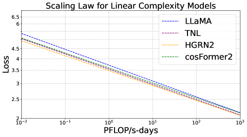

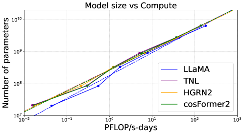

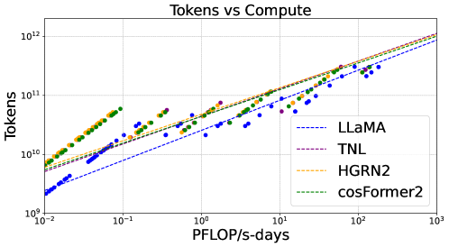

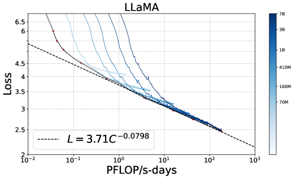

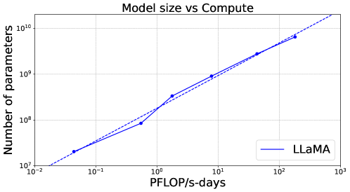

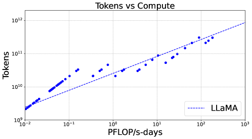

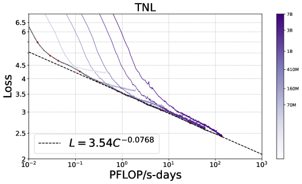

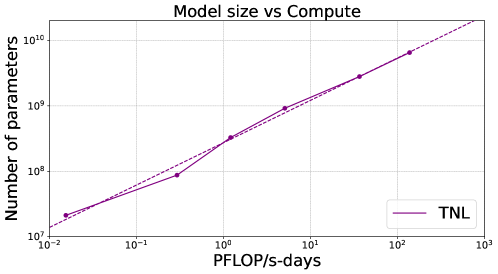

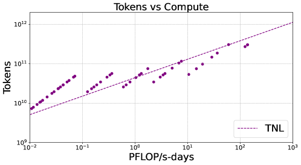

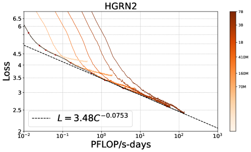

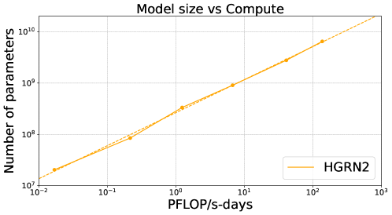

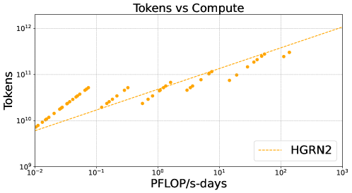

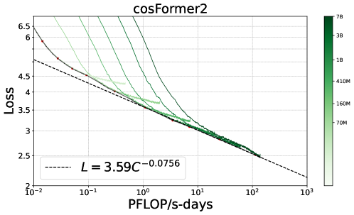

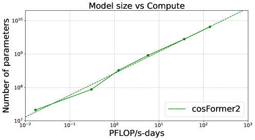

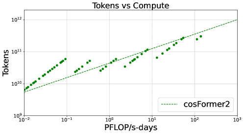

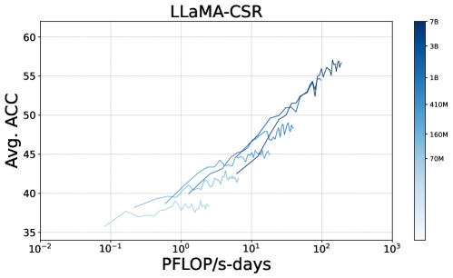

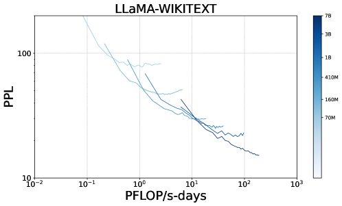

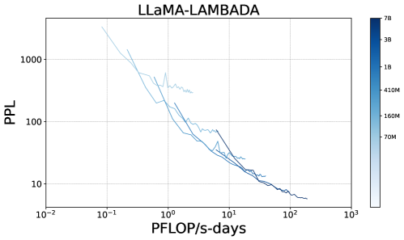

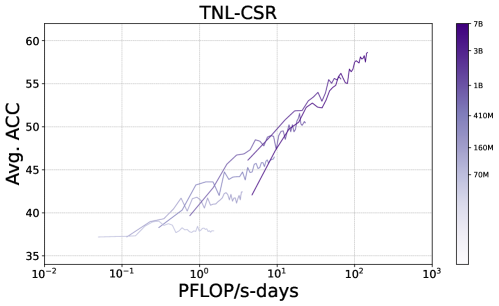

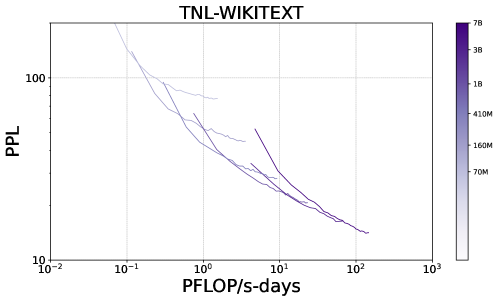

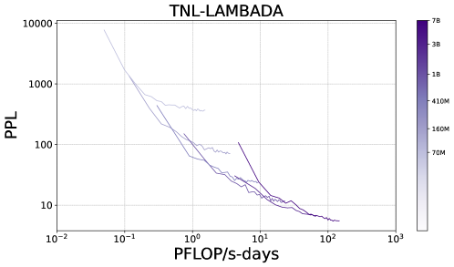

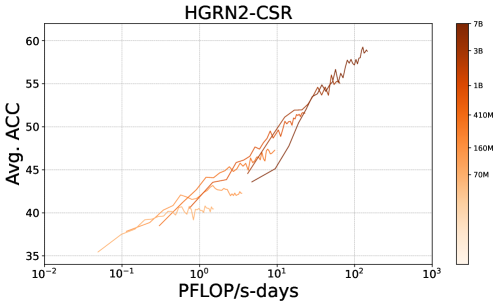

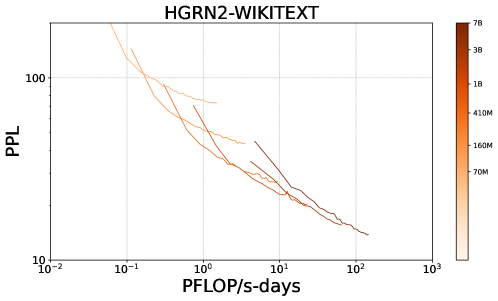

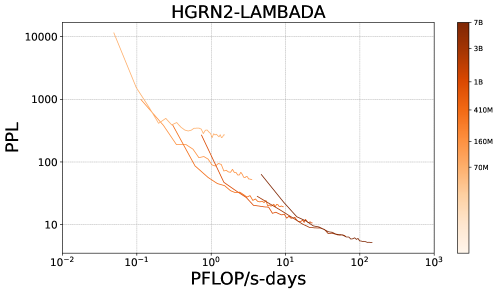

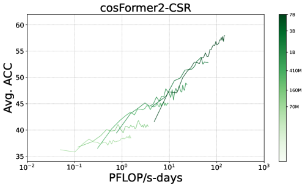

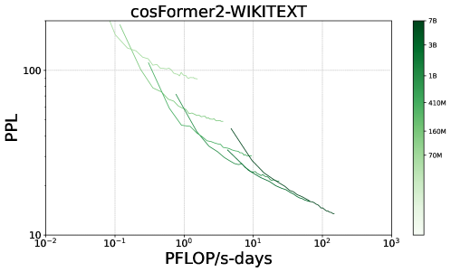

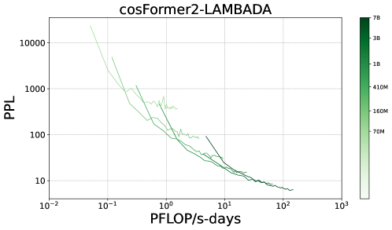

[Arxiv](https://arxiv.org/abs/2406.16690)