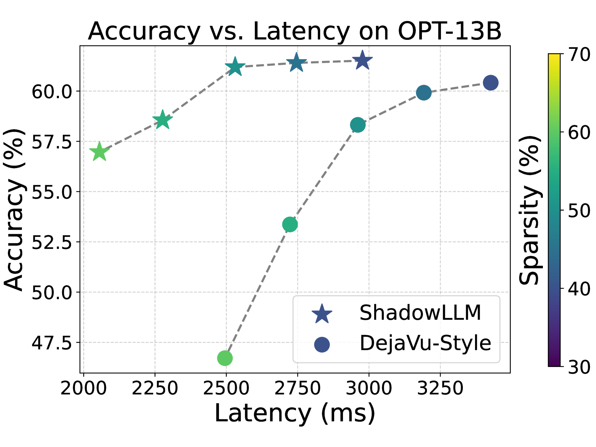
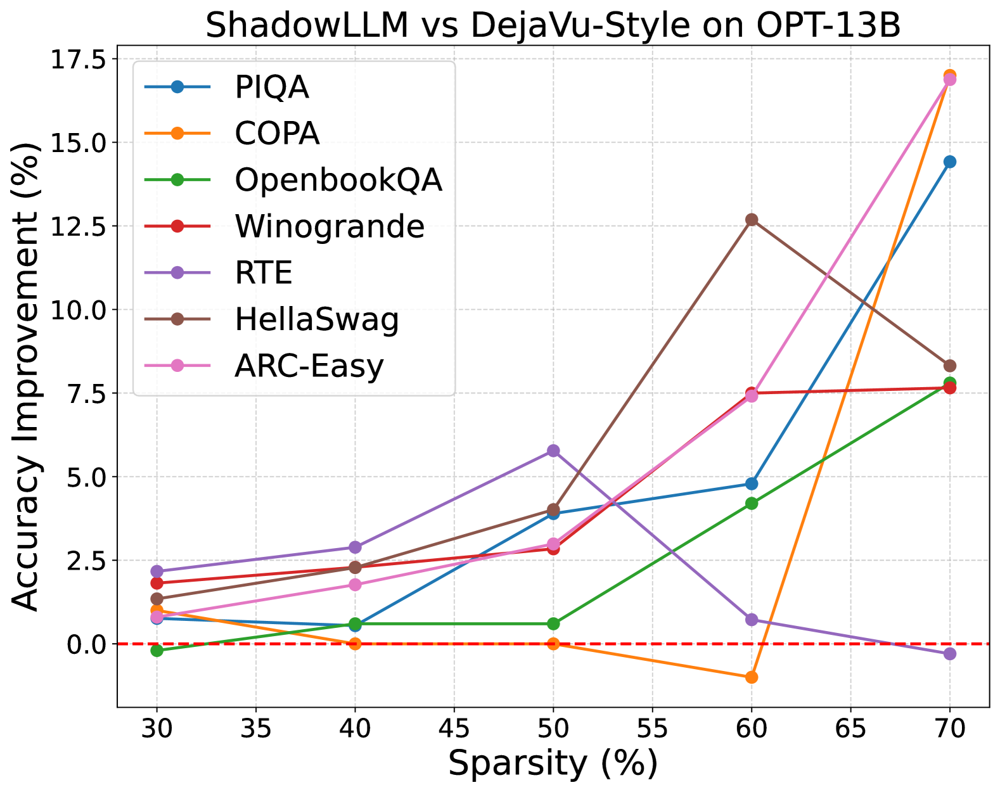

# ShadowLLM：大语言模型中基于预测器的上下文稀疏策略

发布时间：2024年06月24日

`LLM理论

理由：这篇论文主要探讨了大型语言模型（LLMs）中的量化和稀疏技术，特别是情境稀疏性对模型性能的影响。论文通过开发ShadowLLM预测器来评估和优化注意力头和神经元的重要性，以提高模型的准确性和效率。这些研究内容属于对LLM内部机制的理论分析和改进，因此归类为LLM理论。` `人工智能` `机器学习`

> ShadowLLM: Predictor-based Contextual Sparsity for Large Language Models

# 摘要

> 大型语言模型（LLMs）的高能耗和延迟敏感特性催生了量化和稀疏技术。在LLMs中，情境稀疏性至关重要，因为移除注意力头或神经元会严重影响准确性。以往研究通过训练神经网络预测激活幅度来模拟情境稀疏性，进而动态修剪低激活幅度的结构。本文中，我们不再局限于基于幅度的修剪，而是评估LLMs中注意力头和神经元的重要性。我们创新性地开发了ShadowLLM预测器，它能模拟LLM行为并优化稀疏模式，使得端到端准确性提升超过15%，且不增加延迟，相比之前的方法，速度提升了高达20%。这些改进已在高达30亿参数的模型上得到验证，代码已公开于\href{https://github.com/abdelfattah-lab/shadow_llm/}{ShadowLLM}。

> The high power consumption and latency-sensitive deployments of large language models (LLMs) have motivated techniques like quantization and sparsity. Contextual sparsity, where the sparsity pattern is input-dependent, is crucial in LLMs because the permanent removal of attention heads or neurons from LLMs can significantly degrade accuracy. Prior work has attempted to model contextual sparsity using neural networks trained to predict activation magnitudes, which can be used to dynamically prune structures with low predicted activation magnitude. In this paper, we look beyond magnitude-based pruning criteria to assess attention head and neuron importance in LLMs. We developed a novel predictor called ShadowLLM, which can shadow the LLM behavior and enforce better sparsity patterns, resulting in over 15% improvement in end-to-end accuracy without increasing latency compared to previous methods. ShadowLLM achieves up to a 20\% speed-up over the state-of-the-art DejaVu framework. These enhancements are validated on models with up to 30 billion parameters. Our code is available at \href{https://github.com/abdelfattah-lab/shadow_llm/}{ShadowLLM}.

[Arxiv](https://arxiv.org/abs/2406.16635)