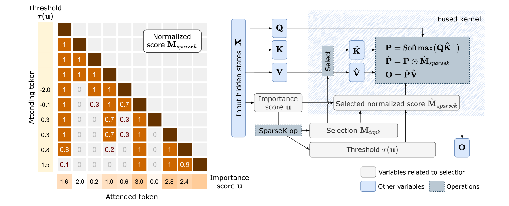
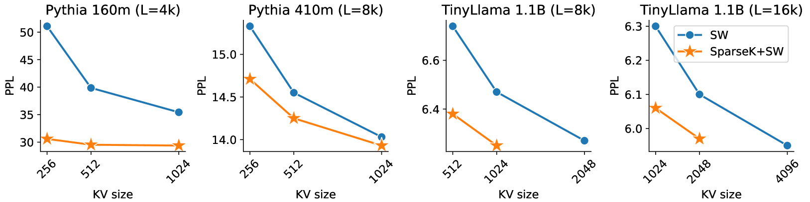
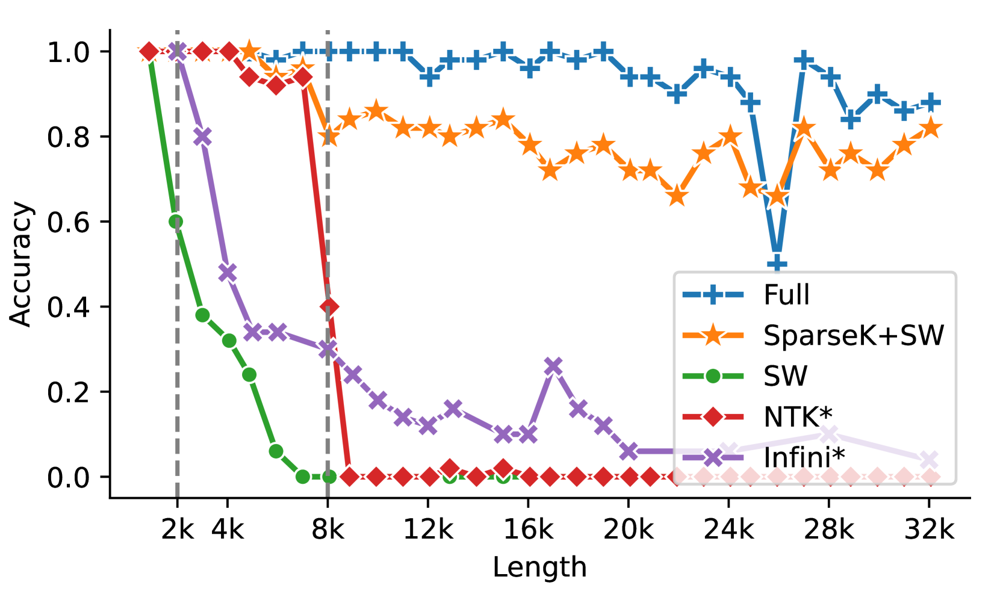
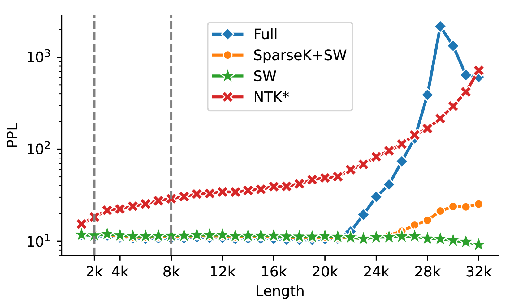
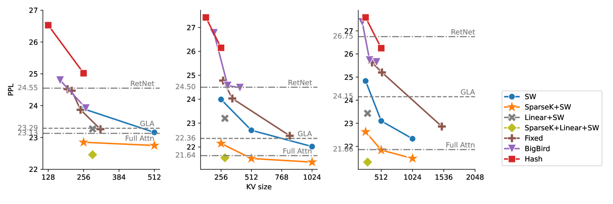
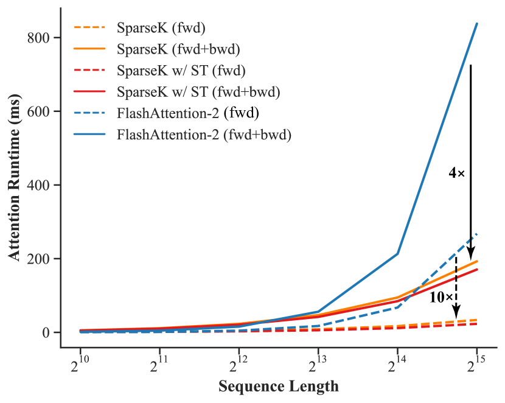
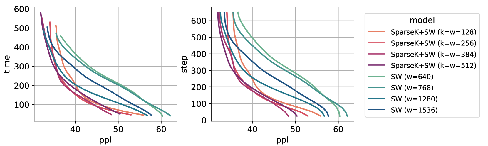

# 稀疏即迅捷，简约至上：长距离Transformer的高效稀疏注意力机制

发布时间：2024年06月24日

`LLM理论

理由：这篇论文主要探讨了自回归Transformer模型中处理长序列的问题，并提出了一种新型的稀疏注意力机制——SPARSEK Attention。这种机制旨在解决自注意力机制的二次计算复杂度和内存需求问题，同时保持模型性能。论文的内容涉及了大型语言模型（LLM）的理论改进，特别是注意力机制的优化，这对于理解LLM的工作原理和性能提升具有重要意义。因此，这篇论文更适合归类于LLM理论。` `机器学习`

> Sparser is Faster and Less is More: Efficient Sparse Attention for Long-Range Transformers

# 摘要

> 在自回归Transformer中处理长序列，尤其是在扩展的上下文窗口内，由于自注意力机制的二次计算复杂度和大量内存需求，面临重大挑战。我们提出的SPARSEK Attention，一种新型稀疏注意力机制，旨在克服这些障碍，同时保持性能。通过结合评分网络和可微分top-k掩码操作，SPARSEK Attention为每个查询精选固定数量的KV对，实现了高效的梯度优化。实验表明，SPARSEK Attention不仅在语言建模和下游任务中超越了以往方法，还显著提升了训练和推理速度。此外，它能轻松融入预训练的大型语言模型，仅需微调，为处理各种应用中的长距离依赖提供了高效解决方案。

> Accommodating long sequences efficiently in autoregressive Transformers, especially within an extended context window, poses significant challenges due to the quadratic computational complexity and substantial KV memory requirements inherent in self-attention mechanisms. In this work, we introduce SPARSEK Attention, a novel sparse attention mechanism designed to overcome these computational and memory obstacles while maintaining performance. Our approach integrates a scoring network and a differentiable top-k mask operator, SPARSEK, to select a constant number of KV pairs for each query, thereby enabling gradient-based optimization. As a result, SPARSEK Attention offers linear time complexity and constant memory footprint during generation. Experimental results reveal that SPARSEK Attention outperforms previous sparse attention methods and provides significant speed improvements during both training and inference, particularly in language modeling and downstream tasks. Furthermore, our method can be seamlessly integrated into pre-trained Large Language Models (LLMs) with minimal fine-tuning, offering a practical solution for effectively managing long-range dependencies in diverse applications.

[Arxiv](https://arxiv.org/abs/2406.16747)