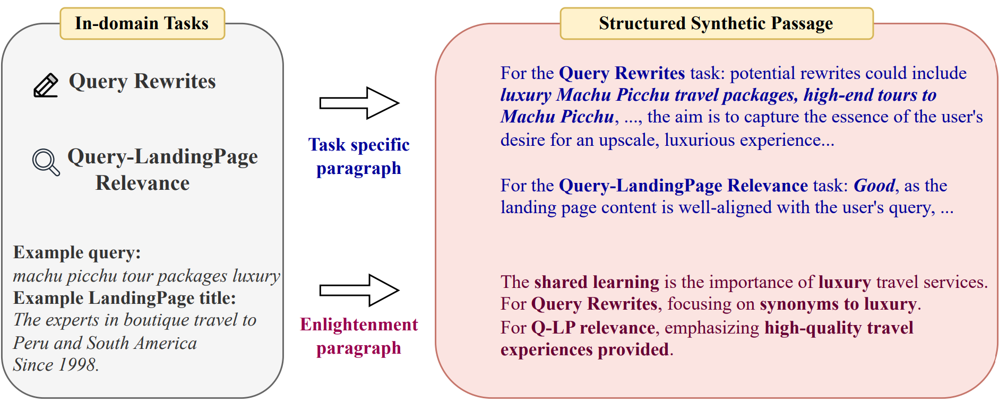
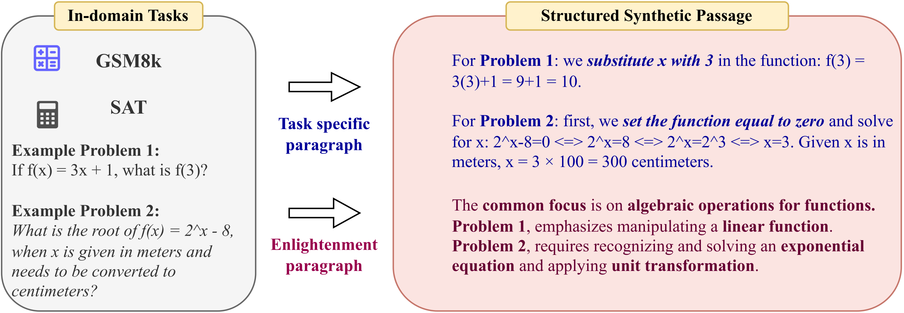
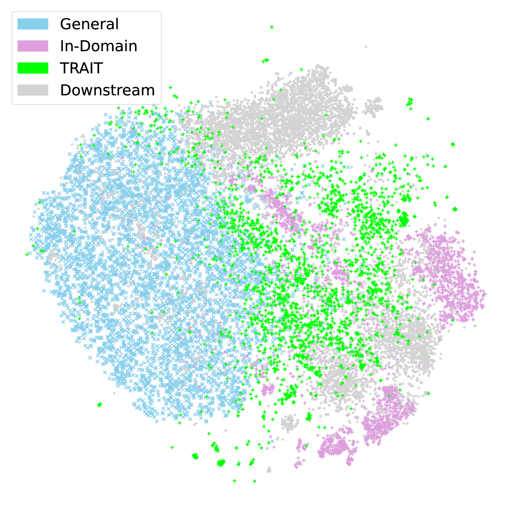
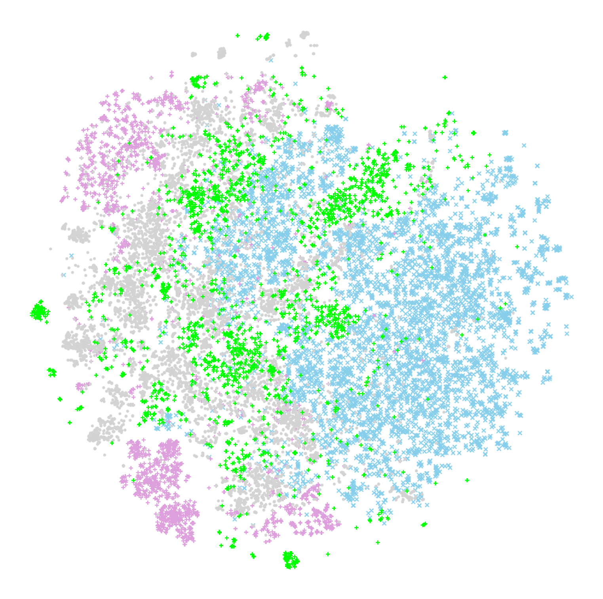
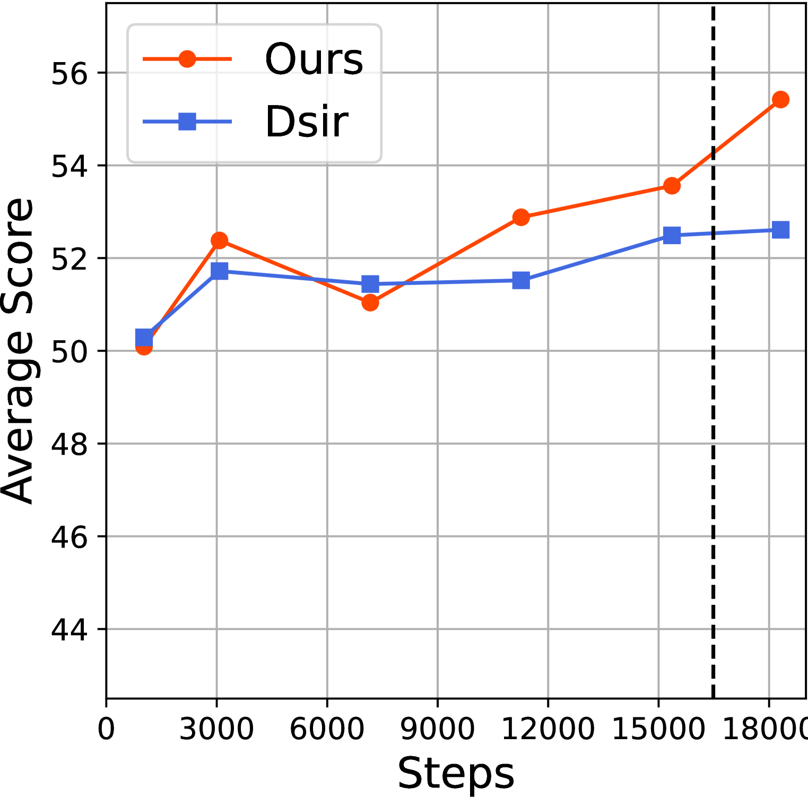
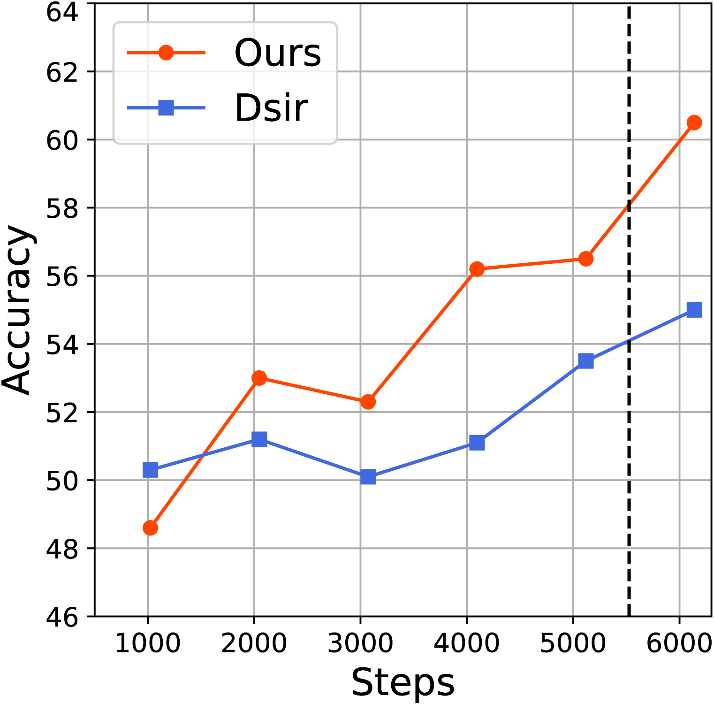

# 针对特定任务的领域内数据扩充

发布时间：2024年06月24日

`LLM应用

这篇论文主要讨论了如何通过开发TRAIT框架来增强大型语言模型（LLMs）在特定领域（如法律和广告）的性能。该框架通过精准的领域内数据筛选和任务导向的合成文本生成来增强预训练数据的领域知识含量，并提供了如何运用这些知识解答下游任务问题的具体指导。这种方法直接应用于提升LLMs在特定领域的应用性能，因此属于LLM应用分类。`

> Task Oriented In-Domain Data Augmentation

# 摘要

> 大型语言模型（LLMs）在多个领域表现出色，但在法律和广告等专业领域，为了进一步提升性能，通常需要对领域内数据进行持续预训练。现有方法存在两个主要问题：领域内数据稀缺，且预训练数据缺乏任务针对性，可能无法有效支持下游应用。为此，我们开发了TRAIT框架，这是一个针对特定任务的领域内数据增强方案。TRAIT包括两个关键部分：精准的领域内数据筛选和任务导向的合成文本生成。通过从广泛语料库中精选大量领域内数据，TRAIT显著增强了预训练数据的领域知识含量。生成的合成文本提供了如何运用领域知识解答下游任务问题的具体指导。经过这些文本的训练，模型能更好地满足下游应用的需求。我们在广告和数学领域应用了TRAIT，结果显示，TRAIT分别提升了LLMs在这两个领域的性能8%和7.5%。

> Large Language Models (LLMs) have shown superior performance in various applications and fields. To achieve better performance on specialized domains such as law and advertisement, LLMs are often continue pre-trained on in-domain data. However, existing approaches suffer from two major issues. First, in-domain data are scarce compared with general domain-agnostic data. Second, data used for continual pre-training are not task-aware, such that they may not be helpful to downstream applications. We propose TRAIT, a task-oriented in-domain data augmentation framework. Our framework is divided into two parts: in-domain data selection and task-oriented synthetic passage generation. The data selection strategy identifies and selects a large amount of in-domain data from general corpora, and thus significantly enriches domain knowledge in the continual pre-training data. The synthetic passages contain guidance on how to use domain knowledge to answer questions about downstream tasks. By training on such passages, the model aligns with the need of downstream applications. We adapt LLMs to two domains: advertisement and math. On average, TRAIT improves LLM performance by 8% in the advertisement domain and 7.5% in the math domain.

[Arxiv](https://arxiv.org/abs/2406.16694)