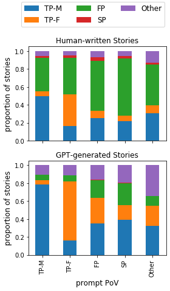
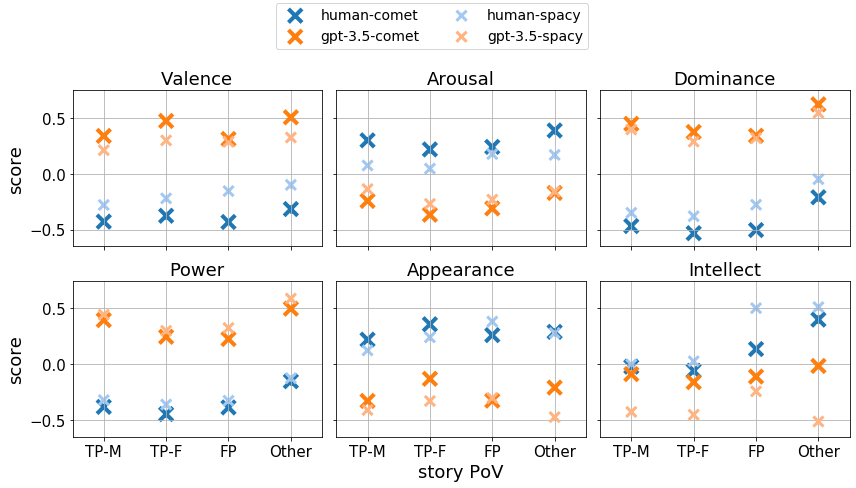
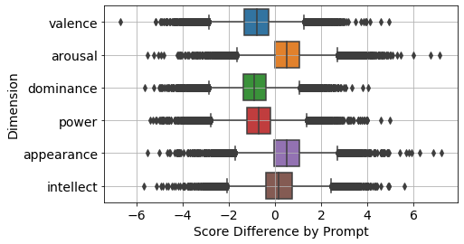
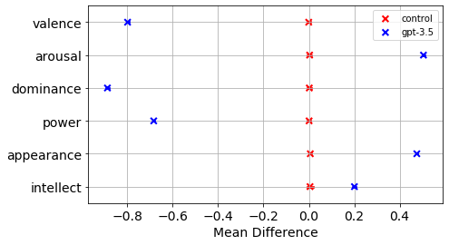

# GPT-WritingPrompts 数据集：探索短篇小说中人物描写的多样性

发布时间：2024年06月24日

`LLM应用

这篇论文主要探讨了大型语言模型（如GPT-3.5）在创意写作和叙事方面的应用，并通过对比分析机器生成故事与人类创作故事在情感和描述性特征上的差异。这种研究属于对LLM在特定应用场景下的性能和特性的分析，因此归类为LLM应用。` `创意写作` `叙事分析`

> The GPT-WritingPrompts Dataset: A Comparative Analysis of Character Portrayal in Short Stories

# 摘要

> 大型语言模型的生成能力提升，使其成为创意写作和叙事的有力工具。为了深入理解这些生成故事的特性及其与人类创作的差异，我们在Reddit WritingPrompts数据集中加入了GPT-3.5生成的短故事，并沿六个维度对比了人类与机器在情感和描述性特征上的表现。结果显示，机器生成故事在各方面均与人类创作有显著差异，且在叙事视角和主角性别上，两者展现出相似的偏见。相关数据集和代码已发布于https://github.com/KristinHuangg/gpt-writing-prompts。

> The improved generative capabilities of large language models have made them a powerful tool for creative writing and storytelling. It is therefore important to quantitatively understand the nature of generated stories, and how they differ from human storytelling. We augment the Reddit WritingPrompts dataset with short stories generated by GPT-3.5, given the same prompts. We quantify and compare the emotional and descriptive features of storytelling from both generative processes, human and machine, along a set of six dimensions. We find that generated stories differ significantly from human stories along all six dimensions, and that human and machine generations display similar biases when grouped according to the narrative point-of-view and gender of the main protagonist. We release our dataset and code at https://github.com/KristinHuangg/gpt-writing-prompts.

[Arxiv](https://arxiv.org/abs/2406.16767)