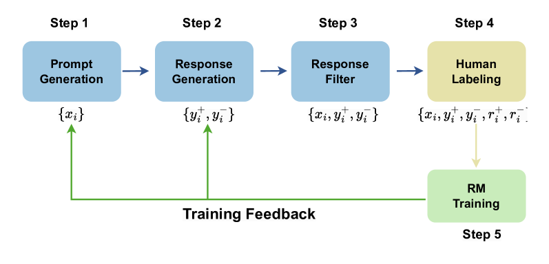
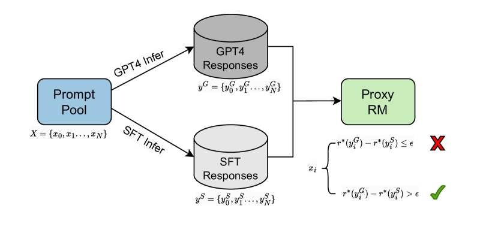
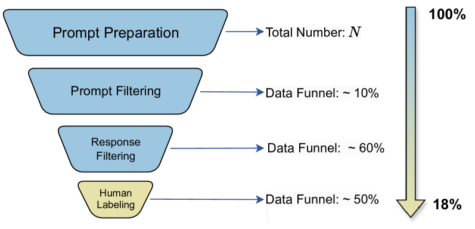

# 全面收集奖励模型偏好数据的研究方向

发布时间：2024年06月24日

`Agent

理由：这篇论文主要探讨了通过人类反馈的强化学习（RLHF）来改进大型语言模型（LLMs）的方法，特别是在奖励模型的训练和偏好数据的收集方面。这种方法涉及创建一个能够理解和适应人类偏好的智能Agent，因此属于Agent分类。论文中提出的系统化偏好数据收集框架，旨在提高数据质量和减少对人工的依赖，这进一步强调了其Agent的特性，即通过优化数据收集过程来增强模型的性能和适应性。` `人工智能` `数据收集`

> Towards Comprehensive Preference Data Collection for Reward Modeling

# 摘要

> 通过人类反馈的强化学习（RLHF），大型语言模型（LLMs）得以与人类偏好精准对齐，显著提升了响应的质量。RLHF的核心在于奖励模型，它基于人类偏好数据训练，推理时输出一个奖励值。尽管如此，偏好数据的收集方法尚未得到充分探讨。现有研究显示，这些数据或是由AI筛选，或是由人类挑选，通过对比成对响应，选出优劣。我们对此过程的噪声过滤能力和数据多样性保障表示怀疑。为此，我们首次提出了一套详尽的偏好数据收集框架，将其细化为四个步骤：提示生成、响应生成、响应筛选和人工标注。这一系统化的方法不仅确保了偏好数据的高质量，还减轻了对人力的依赖。我们通过多阶段数据收集的实验，验证了这一方法的实效性。

> Reinforcement Learning from Human Feedback (RLHF) facilitates the alignment of large language models (LLMs) with human preferences, thereby enhancing the quality of responses generated. A critical component of RLHF is the reward model, which is trained on preference data and outputs a scalar reward during the inference stage. However, the collection of preference data still lacks thorough investigation. Recent studies indicate that preference data is collected either by AI or humans, where chosen and rejected instances are identified among pairwise responses. We question whether this process effectively filters out noise and ensures sufficient diversity in collected data. To address these concerns, for the first time, we propose a comprehensive framework for preference data collection, decomposing the process into four incremental steps: Prompt Generation, Response Generation, Response Filtering, and Human Labeling. This structured approach ensures the collection of high-quality preferences while reducing reliance on human labor. We conducted comprehensive experiments based on the data collected at different stages, demonstrating the effectiveness of the proposed data collection method.

[Arxiv](https://arxiv.org/abs/2406.16486)