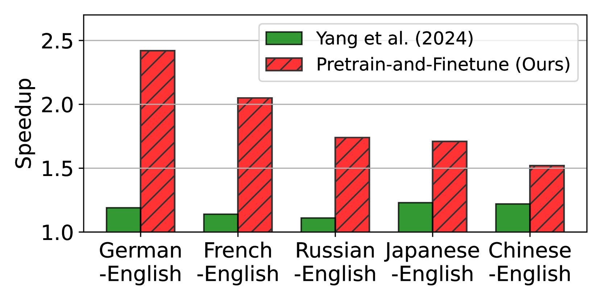

# 加速多语言大型语言模型推理：探索推测解码与专业起草策略

发布时间：2024年06月24日

`LLM应用

这篇论文探讨了在多语言环境中提高大型语言模型（LLMs）推理速度的方法，通过引入辅助模型来草拟令牌，然后由主LLM进行验证。这种方法通过针对性的预训练和微调，优化了特定语言的草稿模型，从而大幅提升了推理速度。论文的研究重点在于优化LLM在多语言环境下的应用性能，因此属于LLM应用分类。` `多语言处理`

> Towards Fast Multilingual LLM Inference: Speculative Decoding and Specialized Drafters

# 摘要

> 大型语言模型（LLMs）极大地推动了自然语言处理的发展，并扩展了其在众多商业领域的应用。但在多语言环境中，高推理时间限制了这些模型的部署。为此，本文提出了一种在推测解码中训练辅助模型的方法，该方法先由辅助模型草拟令牌，再由主LLM验证。通过针对性的预训练和微调，我们优化了特定语言的草稿模型，大幅提升了推理速度。我们在不同语言的推理时间、域外加速和GPT-4o评估中验证了这一方法的有效性。

> Large language models (LLMs) have revolutionized natural language processing and broadened their applicability across diverse commercial applications. However, the deployment of these models is constrained by high inference time in multilingual settings. To mitigate this challenge, this paper explores a training recipe of an assistant model in speculative decoding, which are leveraged to draft and-then its future tokens are verified by the target LLM. We show that language-specific draft models, optimized through a targeted pretrain-and-finetune strategy, substantially brings a speedup of inference time compared to the previous methods. We validate these models across various languages in inference time, out-of-domain speedup, and GPT-4o evaluation.

[Arxiv](https://arxiv.org/abs/2406.16758)