# UNO Arena：大型语言模型序列决策能力评估平台

发布时间：2024年06月24日

`Agent

理由：这篇论文主要关注的是大型语言模型（LLMs）在序列决策任务中的应用，特别是在UNO游戏中评估和提升LLMs的决策能力。论文中提到的UNO竞技场、蒙特卡洛方法指标以及TUTRI玩家的开发，都是为了增强LLMs作为智能代理在特定环境（如UNO游戏）中的决策能力。因此，这篇论文更符合Agent分类，因为它探讨了LLMs作为智能代理在特定任务中的应用和改进。` `人工智能`

> UNO Arena for Evaluating Sequential Decision-Making Capability of Large Language Models

# 摘要

> 序列决策算法考虑环境动态，早期决策影响后续决策。面对LLMs在多任务间的强大表现，我们不禁思考：它们能否有效进行序列决策？为此，我们设计了基于UNO游戏的UNO竞技场，用以评估LLMs的这一能力，并解释了选择UNO的理由。在UNO竞技场中，我们采用创新的蒙特卡洛方法指标，动态评估LLMs的序列决策能力，并设置了随机、强化学习及LLM玩家（如GPT-4、Gemini-pro）进行对比。为提升LLMs的序列决策能力，我们开发了TUTRI玩家，它通过总结游戏历史和策略，让LLMs反思自身行动。实验证明，TUTRI玩家在序列决策上较原始LLM玩家有显著提升。

> Sequential decision-making refers to algorithms that take into account the dynamics of the environment, where early decisions affect subsequent decisions. With large language models (LLMs) demonstrating powerful capabilities between tasks, we can't help but ask: Can Current LLMs Effectively Make Sequential Decisions? In order to answer this question, we propose the UNO Arena based on the card game UNO to evaluate the sequential decision-making capability of LLMs and explain in detail why we choose UNO. In UNO Arena, We evaluate the sequential decision-making capability of LLMs dynamically with novel metrics based Monte Carlo methods. We set up random players, DQN-based reinforcement learning players, and LLM players (e.g. GPT-4, Gemini-pro) for comparison testing. Furthermore, in order to improve the sequential decision-making capability of LLMs, we propose the TUTRI player, which can involves having LLMs reflect their own actions wtih the summary of game history and the game strategy. Numerous experiments demonstrate that the TUTRI player achieves a notable breakthrough in the performance of sequential decision-making compared to the vanilla LLM player.

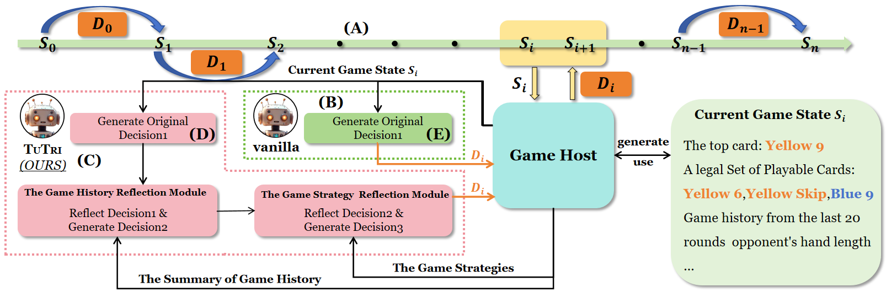

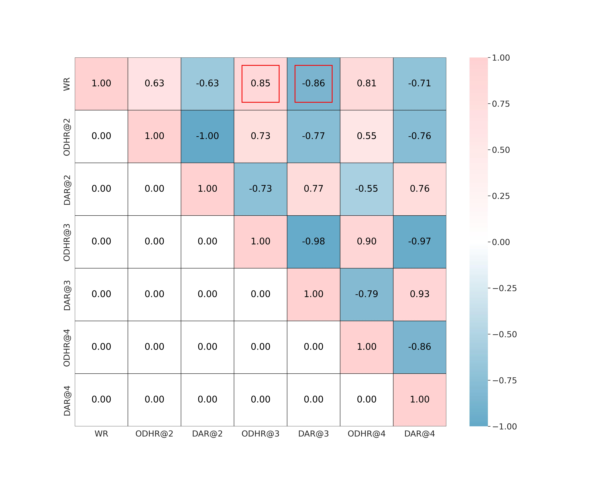

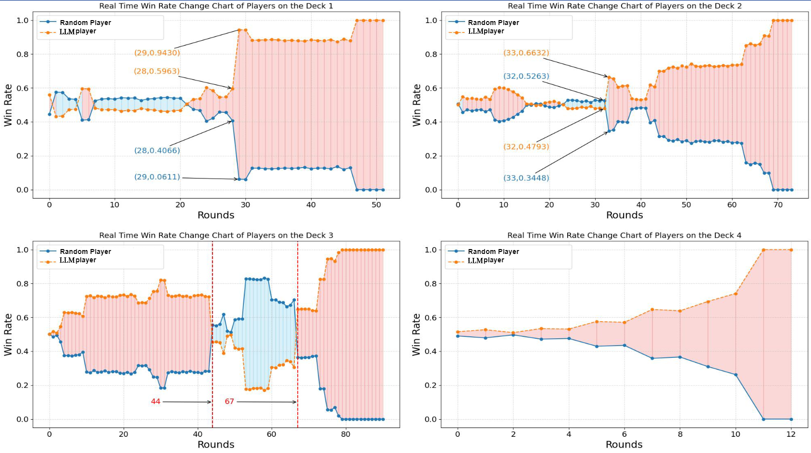

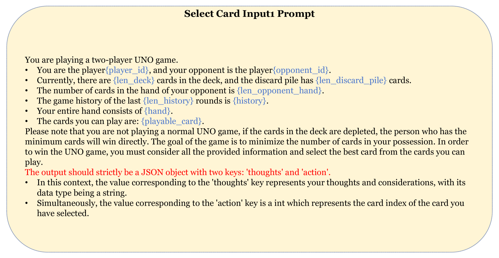

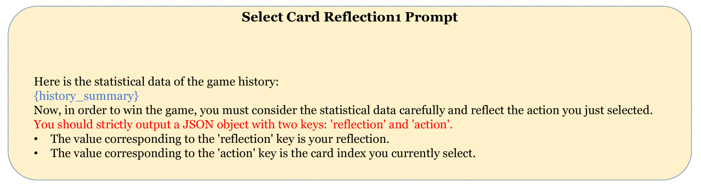

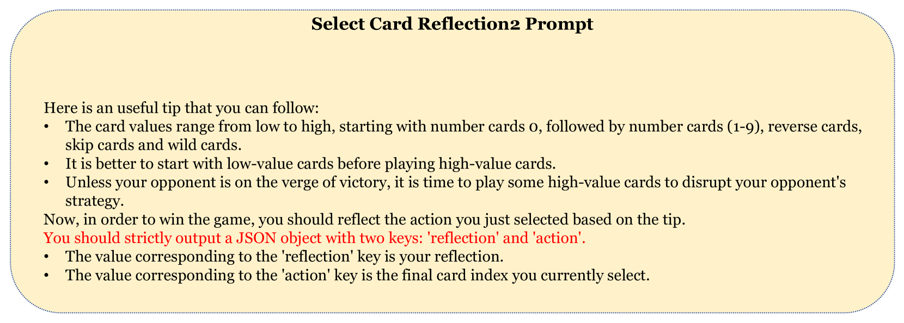

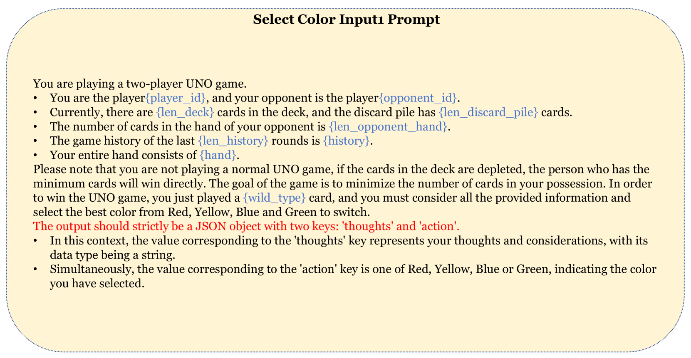

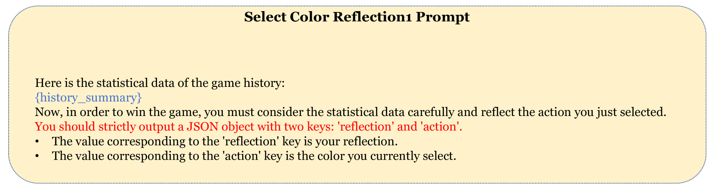

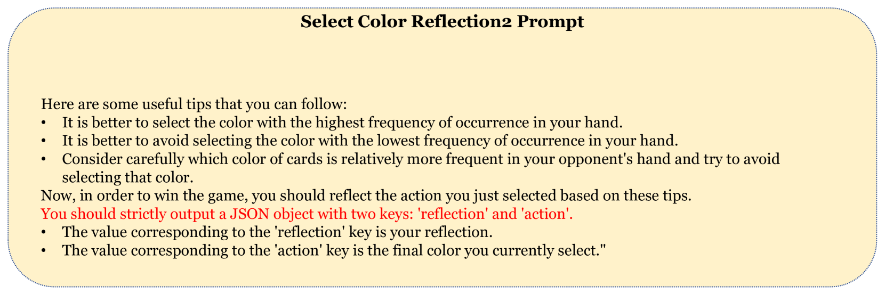

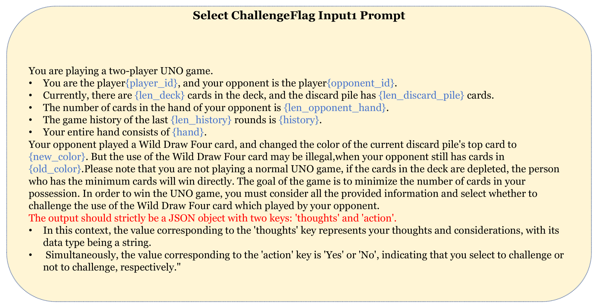

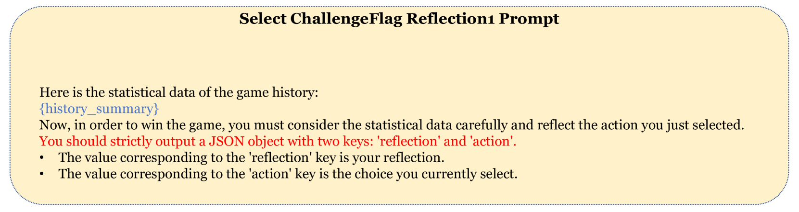

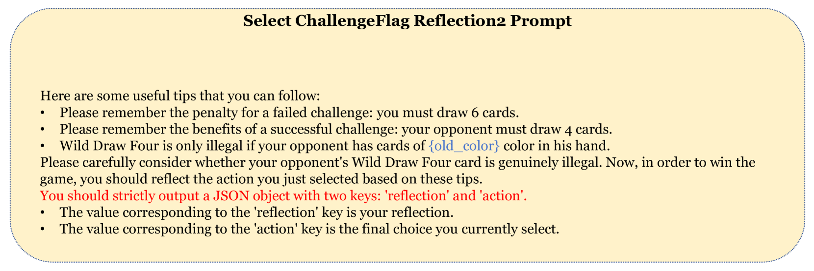

[Arxiv](https://arxiv.org/abs/2406.16382)