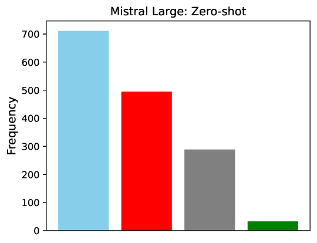

# USDC：长对话中的用户立场与教条主义数据集

发布时间：2024年06月24日

`LLM应用

这篇论文主要探讨了如何利用大型语言模型（如Mistral Large和GPT-4）来自动化地识别长对话线程中的用户意见和立场。通过在Reddit对话中进行零-shot、一-shot和少-shot标注，作者们生成了一个用于微调和指令调整小型语言模型的数据集（USDC数据集）。这种方法和数据集的开发是为了支持立场和教条主义分类，这在多个应用场景中都非常重要，如个性化增强、市场研究、政治活动等。因此，这篇论文属于LLM应用类别，因为它展示了如何将LLM技术应用于实际问题解决和数据集的创建。` `社交媒体分析` `市场研究`

> USDC: A Dataset of $\underline{U}$ser $\underline{S}$tance and $\underline{D}$ogmatism in Long $\underline{C}$onversations

# 摘要

> 在长对话线程中识别用户意见和立场，对于个性化增强、市场研究、政治活动、客户服务、冲突解决、定向广告和内容审核至关重要。为此，我们利用Mistral Large和GPT-4自动进行人工标注，并提供推理，专注于两个任务：用户立场分类和用户教条主义分类。通过这两个LLM在764个Reddit对话中的零-shot、一-shot和少-shot标注，我们生成了USDC数据集，用于微调和指令调整小型语言模型，以进行立场和教条主义分类。我们已公开相关代码和数据集[https://anonymous.4open.science/r/USDC-0F7F]。

> Identifying user's opinions and stances in long conversation threads on various topics can be extremely critical for enhanced personalization, market research, political campaigns, customer service, conflict resolution, targeted advertising, and content moderation. Hence, training language models to automate this task is critical. However, to train such models, gathering manual annotations has multiple challenges: 1) It is time-consuming and costly; 2) Conversation threads could be very long, increasing chances of noisy annotations; and 3) Interpreting instances where a user changes their opinion within a conversation is difficult because often such transitions are subtle and not expressed explicitly. Inspired by the recent success of large language models (LLMs) for complex natural language processing (NLP) tasks, we leverage Mistral Large and GPT-4 to automate the human annotation process on the following two tasks while also providing reasoning: i) User Stance classification, which involves labeling a user's stance of a post in a conversation on a five-point scale; ii) User Dogmatism classification, which deals with labeling a user's overall opinion in the conversation on a four-point scale. The majority voting on zero-shot, one-shot, and few-shot annotations from these two LLMs on 764 multi-user Reddit conversations helps us curate the USDC dataset. USDC is then used to finetune and instruction-tune multiple deployable small language models for the 5-class stance and 4-class dogmatism classification tasks. We make the code and dataset publicly available [https://anonymous.4open.science/r/USDC-0F7F].

[Arxiv](https://arxiv.org/abs/2406.16833)