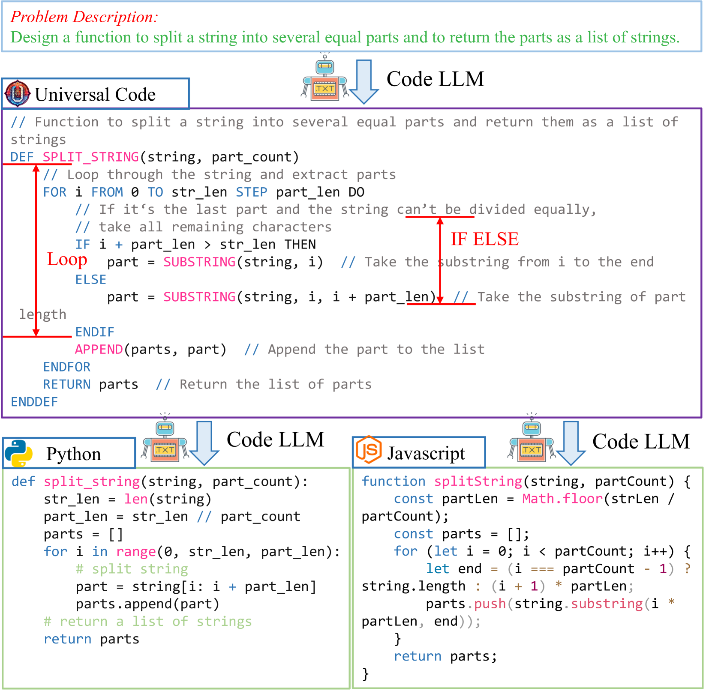
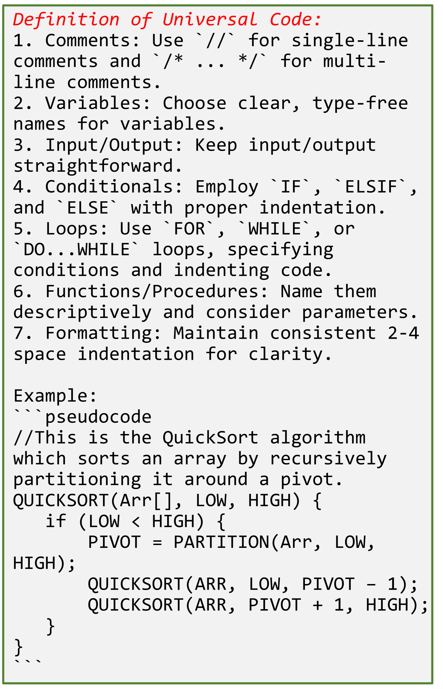
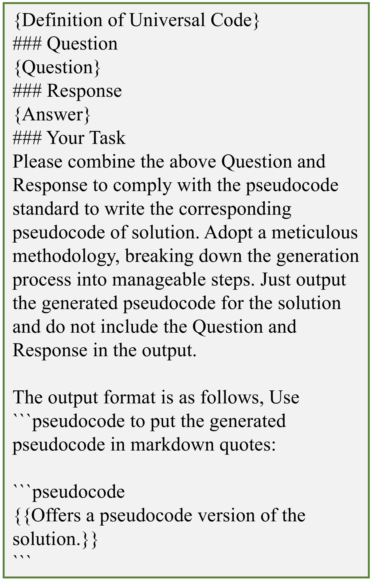
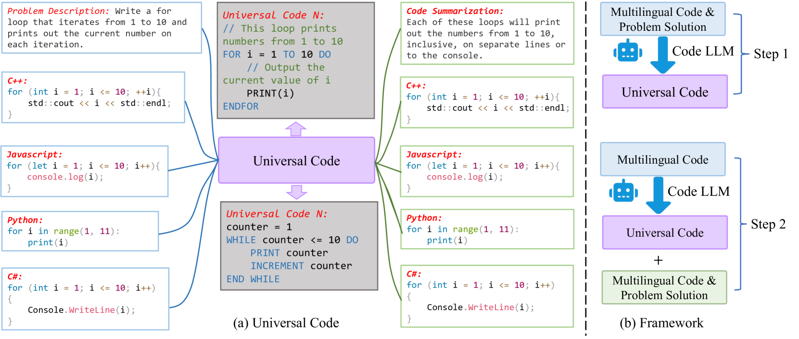

# UniCoder：借助通用代码扩展大型语言模型

发布时间：2024年06月24日

`LLM应用

这篇论文探讨了大型语言模型（LLMs）在代码生成领域的应用，特别是在通过引入一种新的中间表示——通用代码（UniCode）来改进代码生成过程。论文中提出的UniCoder模型和相应的训练数据集UniCoder-Instruct，旨在通过这种新的中间表示提高代码生成的质量和效率。这种方法特别适用于代码翻译或生成任务，因为它解决了传统思维链（CoT）提示方法在代码生成中的局限性。因此，这篇论文属于LLM应用类别，因为它专注于LLMs在特定任务（即代码生成）中的实际应用和改进。` `代码生成`

> UniCoder: Scaling Code Large Language Model via Universal Code

# 摘要

> 中间推理步骤已显著提升大型语言模型（LLMs）在处理多种自然语言处理（NLP）任务上的表现。在代码生成领域，研究者们倾向于引导LLMs通过思维链（CoT）提示来表达中间推理步骤，进而生成代码。但这种方法在代码翻译或生成任务中并不适用，因为CoT的逻辑结构和表达方式与代码存在差异。为此，我们提出了通用代码（UniCode）作为中间表示，它结合了多种编程语言的元素，如赋值、条件和循环结构。我们构建了UniCoder-Instruct数据集，用于训练UniCoder模型，该数据集包含问题描述、代码解决方案及对应的UniCode。实验证明，UniCoder通过使用UniCode，在代码生成质量上大幅超越了传统提示方法，凸显了伪代码结构线索的重要性。

> Intermediate reasoning or acting steps have successfully improved large language models (LLMs) for handling various downstream natural language processing (NLP) tasks. When applying LLMs for code generation, recent works mainly focus on directing the models to articulate intermediate natural-language reasoning steps, as in chain-of-thought (CoT) prompting, and then output code with the natural language or other structured intermediate steps. However, such output is not suitable for code translation or generation tasks since the standard CoT has different logical structures and forms of expression with the code. In this work, we introduce the universal code (UniCode) as the intermediate representation. It is a description of algorithm steps using a mix of conventions of programming languages, such as assignment operator, conditional operator, and loop. Hence, we collect an instruction dataset UniCoder-Instruct to train our model UniCoder on multi-task learning objectives. UniCoder-Instruct comprises natural-language questions, code solutions, and the corresponding universal code. The alignment between the intermediate universal code representation and the final code solution significantly improves the quality of the generated code. The experimental results demonstrate that UniCoder with the universal code significantly outperforms the previous prompting methods by a large margin, showcasing the effectiveness of the structural clues in pseudo-code.

[Arxiv](https://arxiv.org/abs/2406.16441)