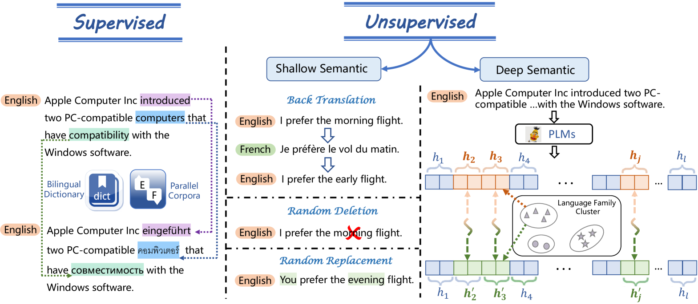
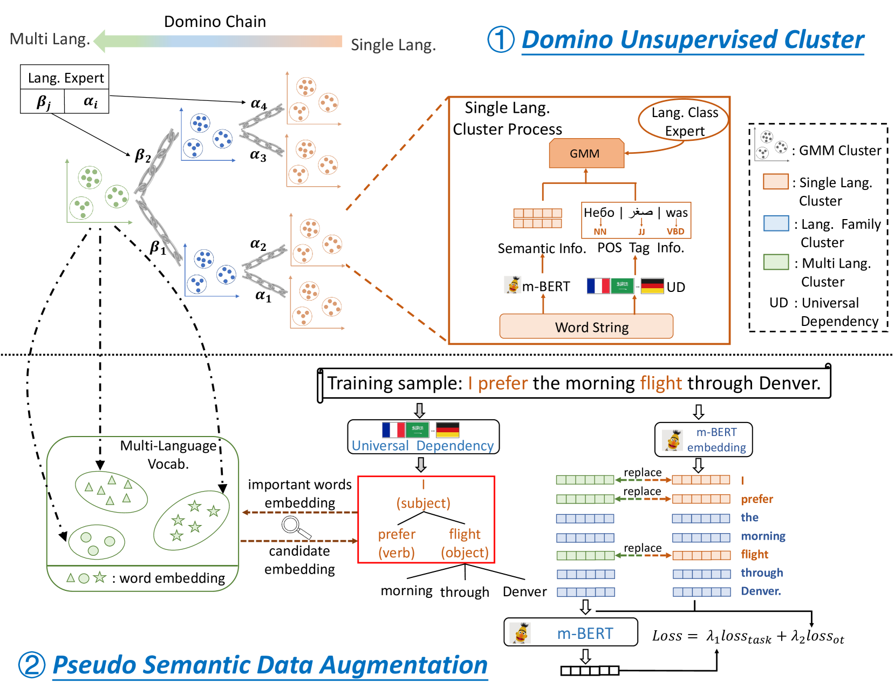
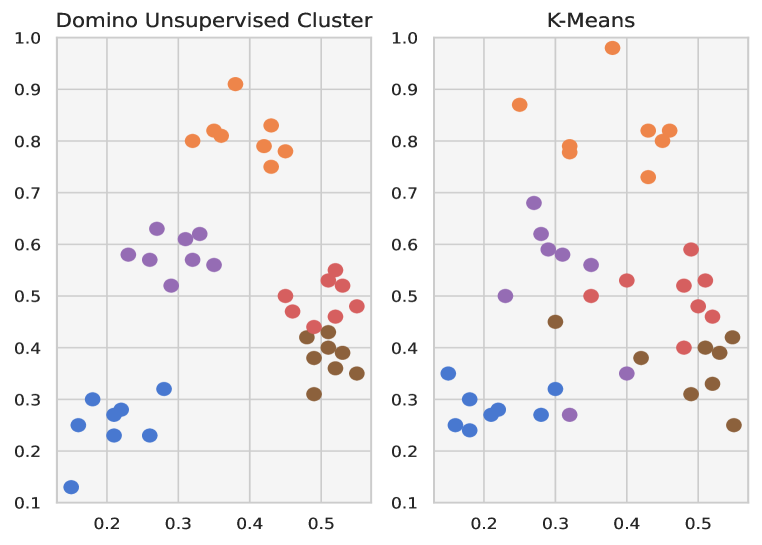
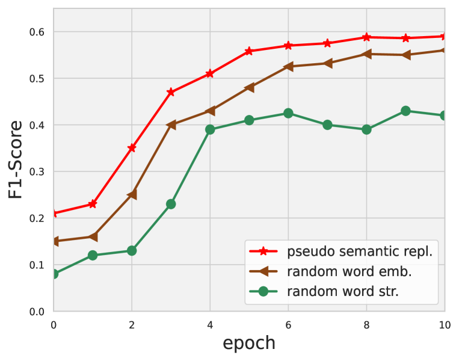

# UniPSDA：零-shot跨语言自然语言理解的非监督伪语义数据增强技术

发布时间：2024年06月24日

`RAG

理由：这篇论文主要关注跨语言表示学习和自然语言理解，提出了一种无监督伪语义数据增强机制（UniPSDA），并展示了其在零-shot跨语言自然语言理解任务上的性能提升。这种方法和研究方向与RAG（Retrieval-Augmented Generation）模型相关，后者通常涉及通过检索增强来改进语言模型的性能，尤其是在跨语言环境中。因此，这篇论文更适合归类于RAG。` `跨语言自然语言理解` `数据增强`

> UniPSDA: Unsupervised Pseudo Semantic Data Augmentation for Zero-Shot Cross-Lingual Natural Language Understanding

# 摘要

> 跨语言表示学习通过将资源丰富的数据知识转移到资源稀缺的数据，提升了不同语言的语义理解能力。但以往研究仅依赖于基于令牌表面匹配的无监督浅层数据，忽视了文本令牌的全局上下文语义。本文提出了一种无监督伪语义数据增强机制（UniPSDA），旨在无需人工干预下丰富跨语言自然语言理解的训练数据。我们设计了一个三阶段的顺序聚类过程，用于跨语言检索意义相近的令牌，并直接用学习到的多语言知识替换句子关键成分，视为伪语义，同时优化了多语言知识的注入过程，采用三种去偏技术，不增加任何神经参数。实验证明，我们的模型在零-shot跨语言自然语言理解任务上，包括序列分类、信息提取和问答，性能均有显著提升。

> Cross-lingual representation learning transfers knowledge from resource-rich data to resource-scarce ones to improve the semantic understanding abilities of different languages. However, previous works rely on shallow unsupervised data generated by token surface matching, regardless of the global context-aware semantics of the surrounding text tokens. In this paper, we propose an Unsupervised Pseudo Semantic Data Augmentation (UniPSDA) mechanism for cross-lingual natural language understanding to enrich the training data without human interventions. Specifically, to retrieve the tokens with similar meanings for the semantic data augmentation across different languages, we propose a sequential clustering process in 3 stages: within a single language, across multiple languages of a language family, and across languages from multiple language families. Meanwhile, considering the multi-lingual knowledge infusion with context-aware semantics while alleviating computation burden, we directly replace the key constituents of the sentences with the above-learned multi-lingual family knowledge, viewed as pseudo-semantic. The infusion process is further optimized via three de-biasing techniques without introducing any neural parameters. Extensive experiments demonstrate that our model consistently improves the performance on general zero-shot cross-lingual natural language understanding tasks, including sequence classification, information extraction, and question answering.

[Arxiv](https://arxiv.org/abs/2406.16372)