# 揭秘语言生成中的认知限制：探索并验证词汇间的活跃自我网络

发布时间：2024年06月24日

`Agent

这篇论文主要关注的是“自我词网络”模型及其在语言生产中的应用，特别是提取活跃部分的认知约束。虽然它涉及到语言模型和数据处理，但其核心在于提出一种新的方法来分析和理解语言生产中的认知过程，这与Agent的自主性和认知能力相关。因此，它更适合归类到Agent分类中。` `语言学` `认知科学`

> Unveiling Cognitive Constraints in Language Production: Extracting and Validating the Active Ego Network of Words

# 摘要

> “自我词网络”模型揭示了语言生产中与认知约束相关的结构特性。以往研究多关注其层级结构和语义特性，但本文指出，关键的活跃网络概念被忽视了。自我词网络的活跃部分仅含个体常用词汇，类似社会网络中个体常维系的关系，均需认知投入。本研究提出了一种提取自我词网络活跃部分的方法，并通过访谈记录和推文验证了其有效性。我们的方法展现了良好的数据适应性和时间稳定性。若无活跃网络概念及相应的数据提取工具，该模型难以准确评估认知努力，且易受数据量影响，导致大型数据集中的层级结构消失。研究结果与先前分析相吻合，凸显了数据限制下对网络活跃部分的隐含关注。此外，MediaSum数据集的验证表明，该模型在多领域具有普适性，并揭示了语言使用中的深层认知约束。

> The "ego network of words" model captures structural properties in language production associated with cognitive constraints. While previous research focused on the layer-based structure and its semantic properties, this paper argues that an essential element, the concept of an active network, is missing. The active part of the ego network of words only includes words that are regularly used by individuals, akin to the ego networks in the social domain, where the active part includes relationships regularly nurtured by individuals and hence demanding cognitive effort. In this work, we define a methodology for extracting the active part of the ego network of words and validate it using interview transcripts and tweets. The robustness of our method to varying input data sizes and temporal stability is demonstrated. We also demonstrate that without the active network concept (and a tool for properly extracting the active network from data), the "ego network of words" model is not able to properly estimate the cognitive effort involved and it becomes vulnerable to the amount of data considered (leading to the disappearance of the layered structure in large datasets). Our results are well-aligned with prior analyses of the ego network of words, where the limitation of the data collected led automatically (and implicitly) to approximately consider the active part of the network only. Moreover, the validation on the transcripts dataset (MediaSum) highlights the generalizability of the model across diverse domains and the ingrained cognitive constraints in language usage.

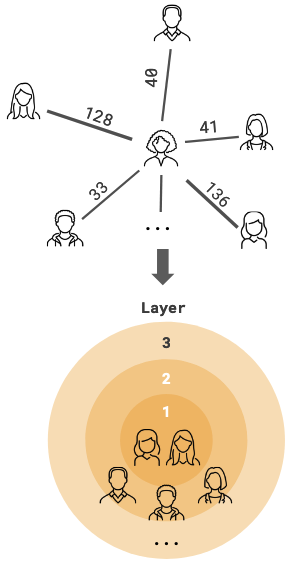

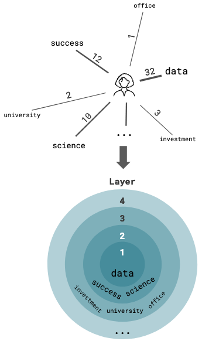

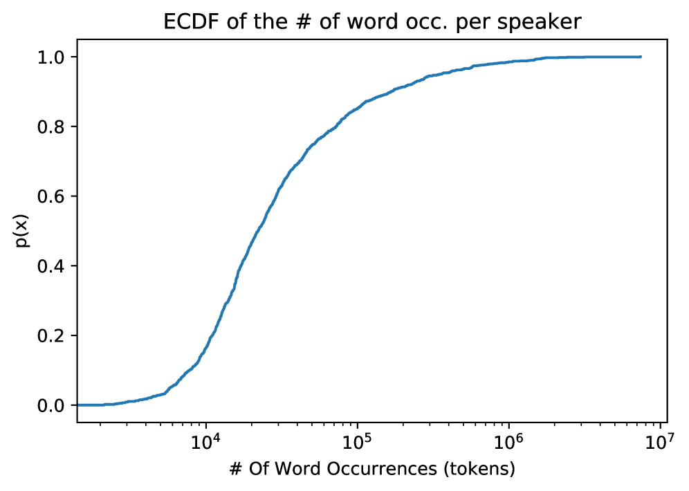

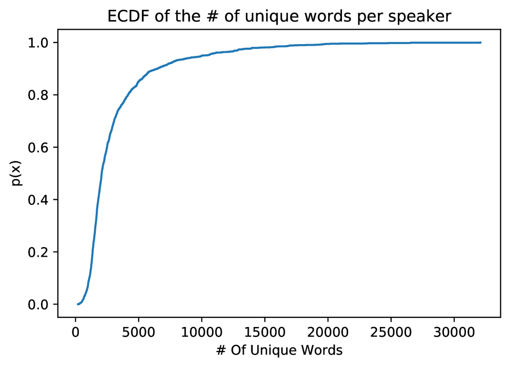

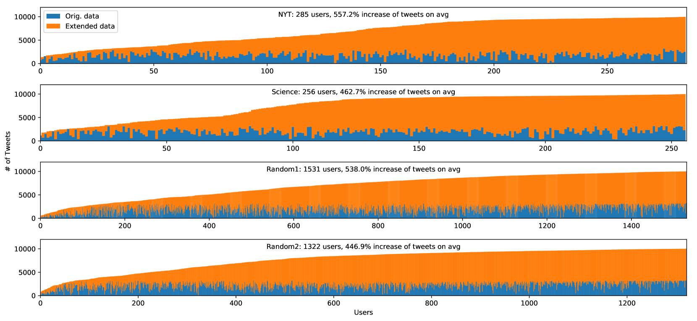

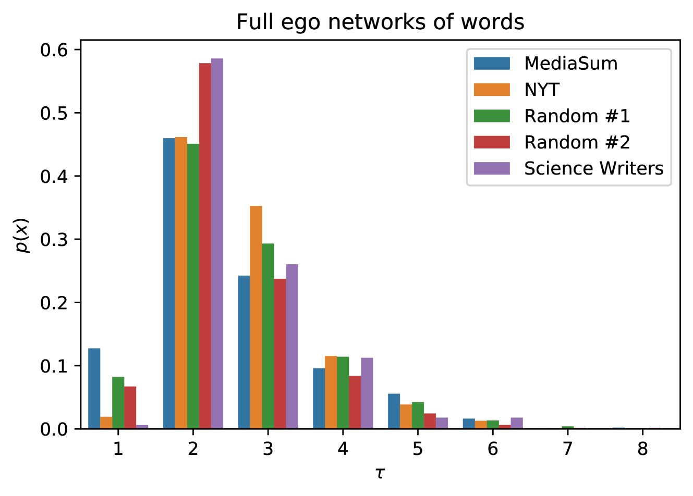

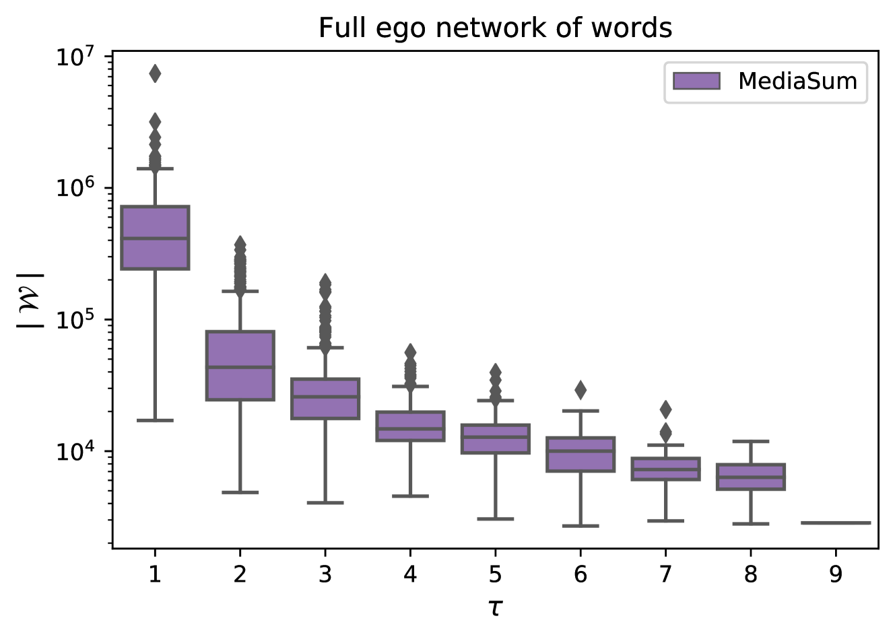

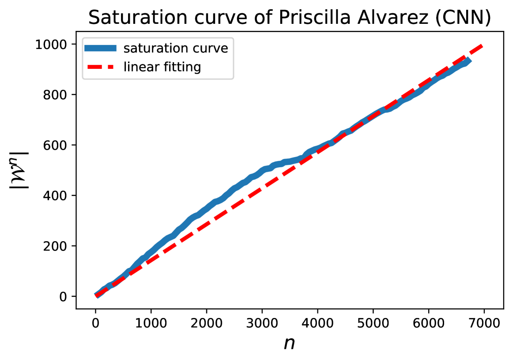

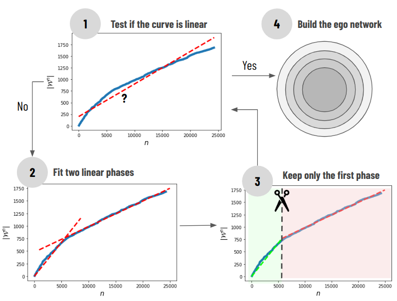

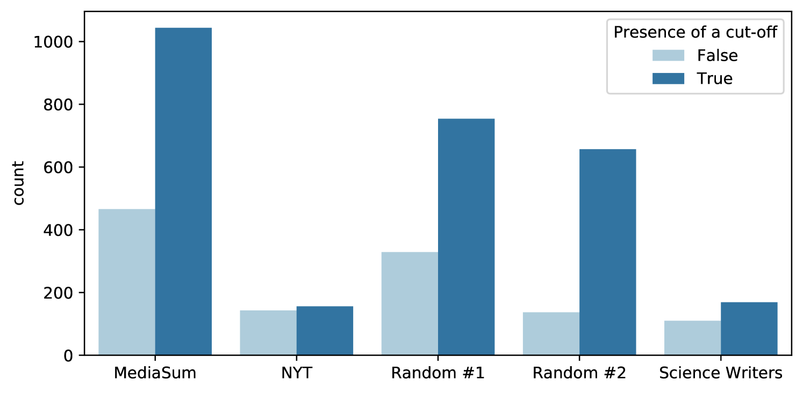

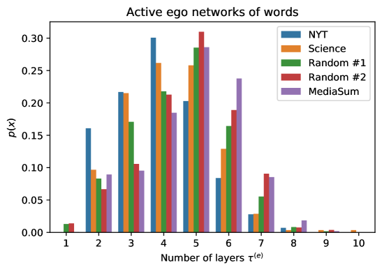

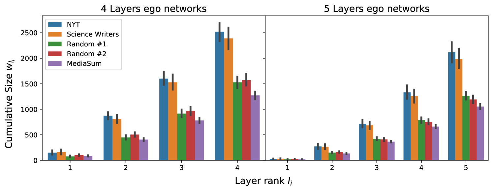

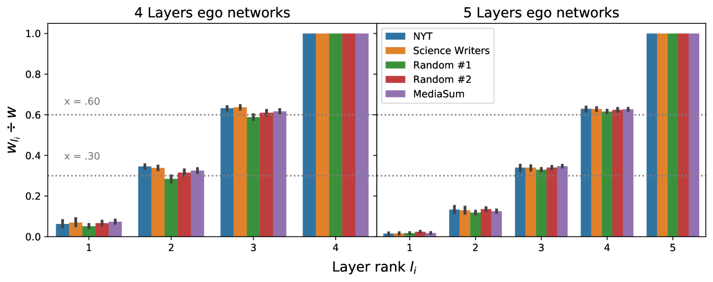

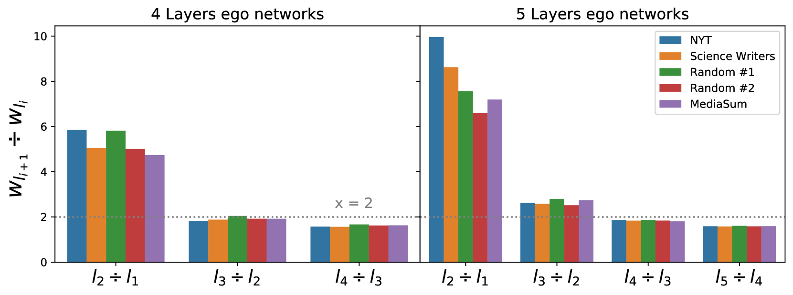

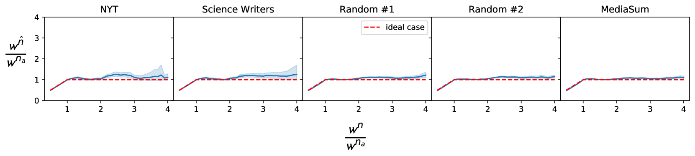

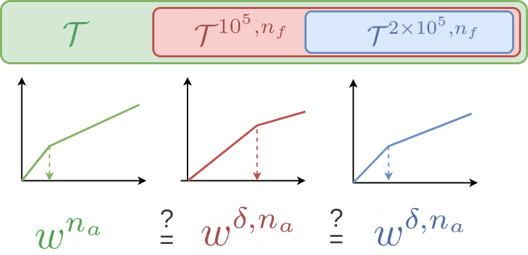

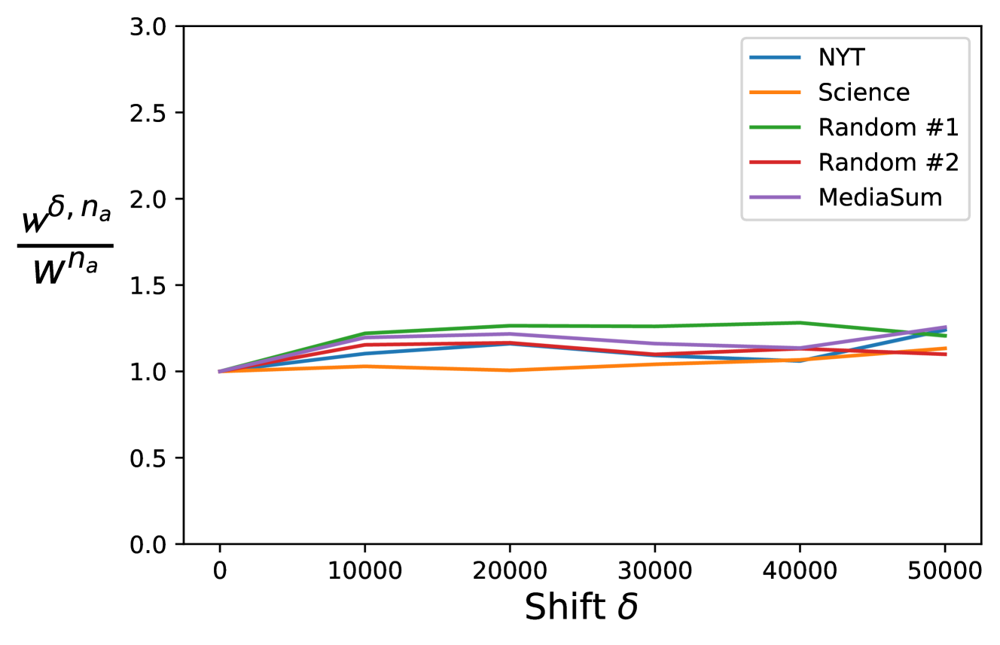

[Arxiv](https://arxiv.org/abs/2406.16676)