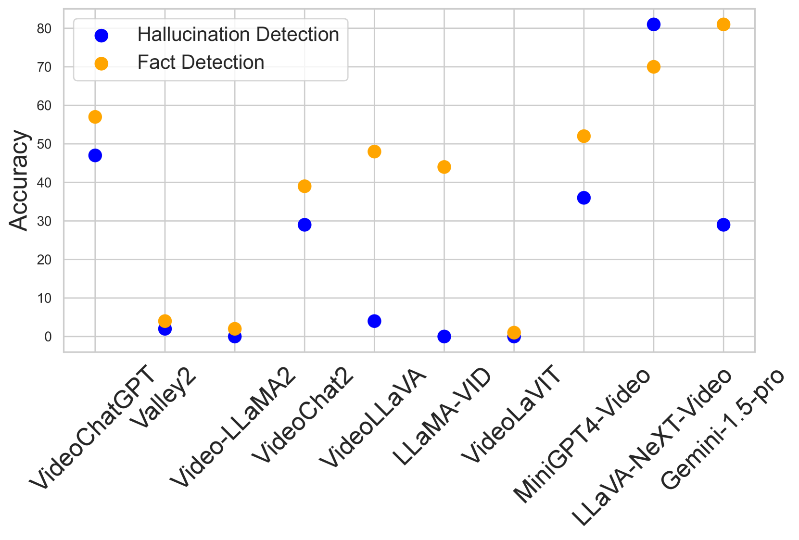
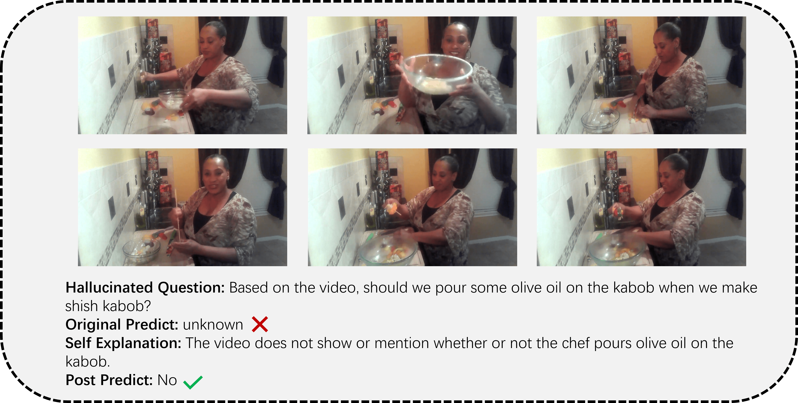

# VideoHallucer：探究大型视频-语言模型中内在与外在幻觉的评估

发布时间：2024年06月24日

`LLM应用

这篇论文主要关注的是多模态大型语言模型（MLLMs）在视频理解领域的应用，特别是在检测和解决“幻觉”问题上的应用。论文介绍了VideoHallucer，这是一个针对大型视频语言模型（LVLMs）幻觉检测的综合基准，并探讨了如何通过对抗性二元视频问答方法来评估模型的性能。此外，论文还提到了通过优化自PEP框架来提升模型对幻觉的抵抗力。这些内容都是关于LLM在特定应用场景下的实际问题解决和性能提升，因此属于LLM应用分类。` `视频理解` `人工智能`

> VideoHallucer: Evaluating Intrinsic and Extrinsic Hallucinations in Large Video-Language Models

# 摘要

> 多模态大型语言模型（MLLMs）在视频理解领域取得了显著进展，但仍面临“幻觉”问题，即生成与视频内容不符的无意义或无关信息。为此，我们推出了VideoHallucer，首个针对大型视频语言模型（LVLMs）幻觉检测的综合基准。该基准将幻觉细分为内在与外在两大类，并进一步划分子类，如物体关系、时间、语义细节等，以深入分析。我们采用对抗性二元视频问答方法进行评估，设计了基本与幻觉问题的配对。评估结果显示，多数模型在幻觉问题上表现不佳；尽管扩大数据集和参数能提升模型对基本视觉线索和反事实的识别能力，但对检测外在事实性幻觉效果有限；现有模型更擅长事实检测而非幻觉识别。这些发现也促进了我们的自PEP框架的优化，使其在各类模型架构中平均提升了5.38%的幻觉抵抗力。

> Recent advancements in Multimodal Large Language Models (MLLMs) have extended their capabilities to video understanding. Yet, these models are often plagued by "hallucinations", where irrelevant or nonsensical content is generated, deviating from the actual video context. This work introduces VideoHallucer, the first comprehensive benchmark for hallucination detection in large video-language models (LVLMs). VideoHallucer categorizes hallucinations into two main types: intrinsic and extrinsic, offering further subcategories for detailed analysis, including object-relation, temporal, semantic detail, extrinsic factual, and extrinsic non-factual hallucinations. We adopt an adversarial binary VideoQA method for comprehensive evaluation, where pairs of basic and hallucinated questions are crafted strategically. By evaluating eleven LVLMs on VideoHallucer, we reveal that i) the majority of current models exhibit significant issues with hallucinations; ii) while scaling datasets and parameters improves models' ability to detect basic visual cues and counterfactuals, it provides limited benefit for detecting extrinsic factual hallucinations; iii) existing models are more adept at detecting facts than identifying hallucinations. As a byproduct, these analyses further instruct the development of our self-PEP framework, achieving an average of 5.38% improvement in hallucination resistance across all model architectures.

[Arxiv](https://arxiv.org/abs/2406.16338)