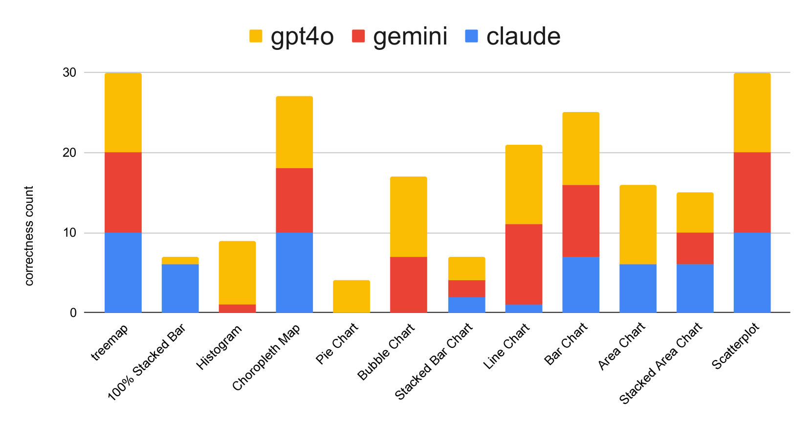
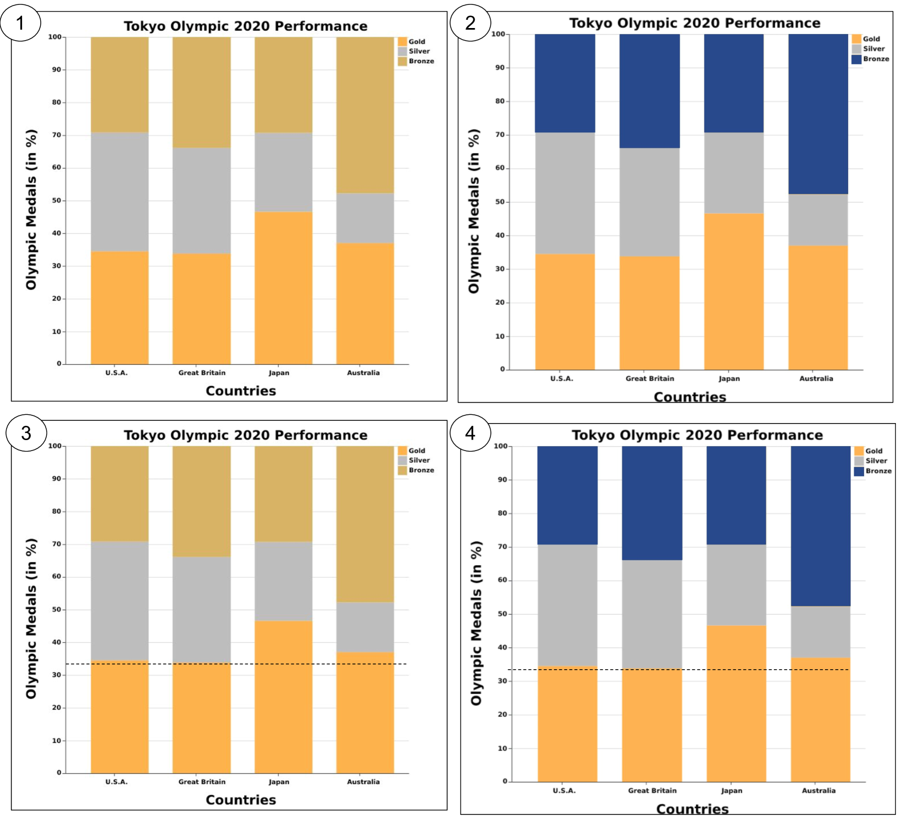
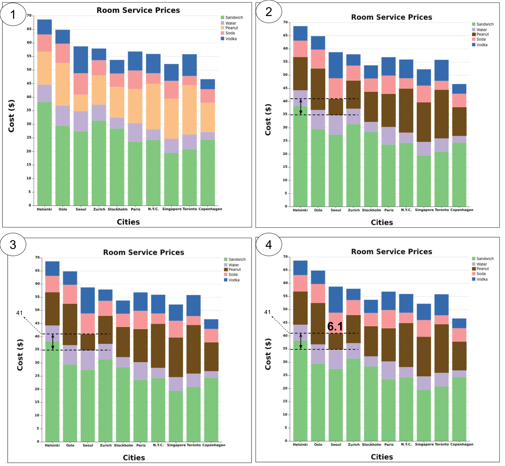
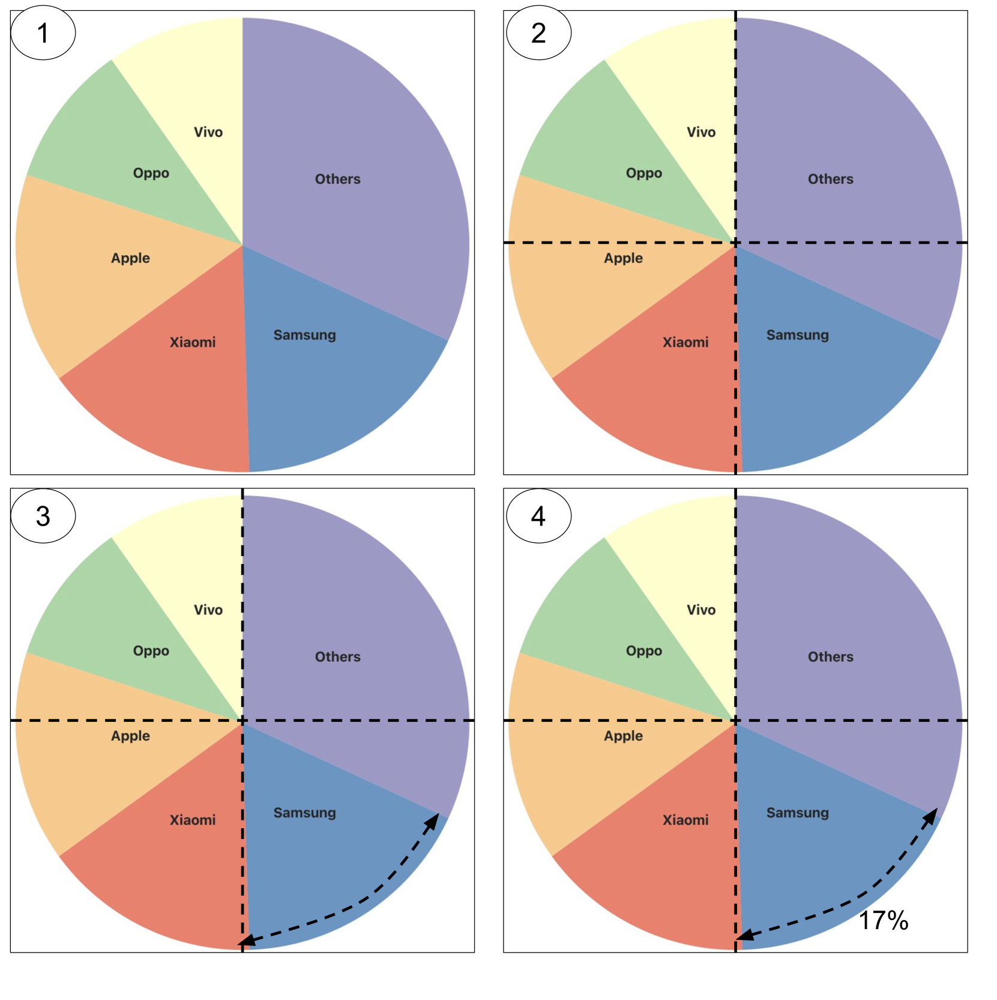
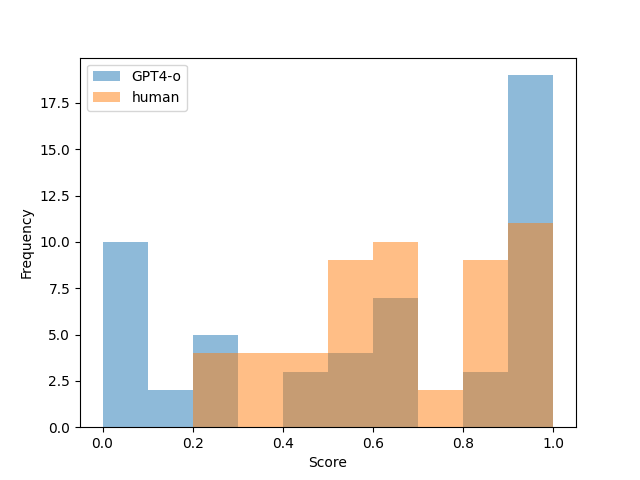
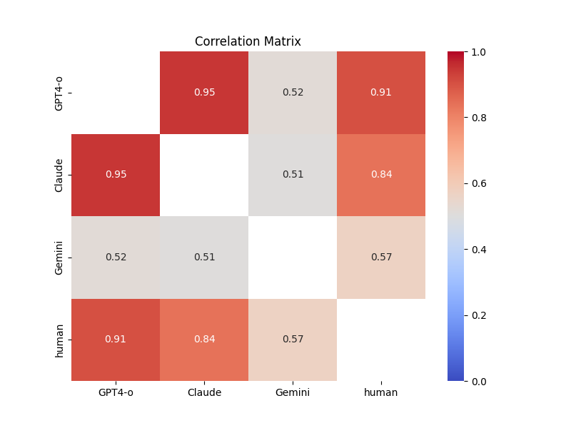
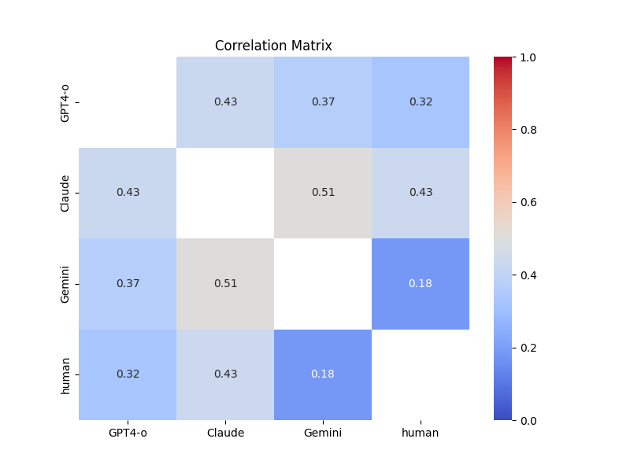

# 探究多模态大型语言模型的可视化能力：一项对比研究

发布时间：2024年06月24日

`LLM应用` `可视化`

> Visualization Literacy of Multimodal Large Language Models: A Comparative Study

# 摘要

> 多模态大型语言模型 (MLLMs) 的最新进展，不仅继承了大型语言模型的强大能力，还增强了多模态上下文的推理能力。这些模型的应用潜力远超仅处理文本的模型。近期在可视化领域的研究显示，MLLMs 不仅能理解并解释可视化结果，还能用自然语言向用户阐述其内容。尽管机器学习界已通过多项视觉理解基准测试了 MLLMs 的视觉能力，但其基于视觉感知执行特定可视化任务的能力，尤其是从可视化视角出发，仍未得到充分研究。本研究中，我们通过引入可视化素养概念，旨在评估 MLLMs 在这方面的表现。我们利用两个广泛认可的可视化素养评估数据集（VLAT 和 mini-VLAT）进行测试。在可视化素养框架内，我们设计了一套通用比较方案，不仅涵盖了多种多模态大型语言模型（如 GPT4-o、Claude 3 Opus、Gemini 1.5 Pro），还与人类基准进行了对比。研究结果表明，MLLMs 在可视化素养任务中表现卓越，尤其在识别相关性、集群和层次结构等特定任务上，其表现超越了人类。

> The recent introduction of multimodal large language models (MLLMs) combine the inherent power of large language models (LLMs) with the renewed capabilities to reason about the multimodal context. The potential usage scenarios for MLLMs significantly outpace their text-only counterparts. Many recent works in visualization have demonstrated MLLMs' capability to understand and interpret visualization results and explain the content of the visualization to users in natural language. In the machine learning community, the general vision capabilities of MLLMs have been evaluated and tested through various visual understanding benchmarks. However, the ability of MLLMs to accomplish specific visualization tasks based on visual perception has not been properly explored and evaluated, particularly, from a visualization-centric perspective.
  In this work, we aim to fill the gap by utilizing the concept of visualization literacy to evaluate MLLMs. We assess MLLMs' performance over two popular visualization literacy evaluation datasets (VLAT and mini-VLAT). Under the framework of visualization literacy, we develop a general setup to compare different multimodal large language models (e.g., GPT4-o, Claude 3 Opus, Gemini 1.5 Pro) as well as against existing human baselines. Our study demonstrates MLLMs' competitive performance in visualization literacy, where they outperform humans in certain tasks such as identifying correlations, clusters, and hierarchical structures.

[Arxiv](https://arxiv.org/abs/2407.10996)