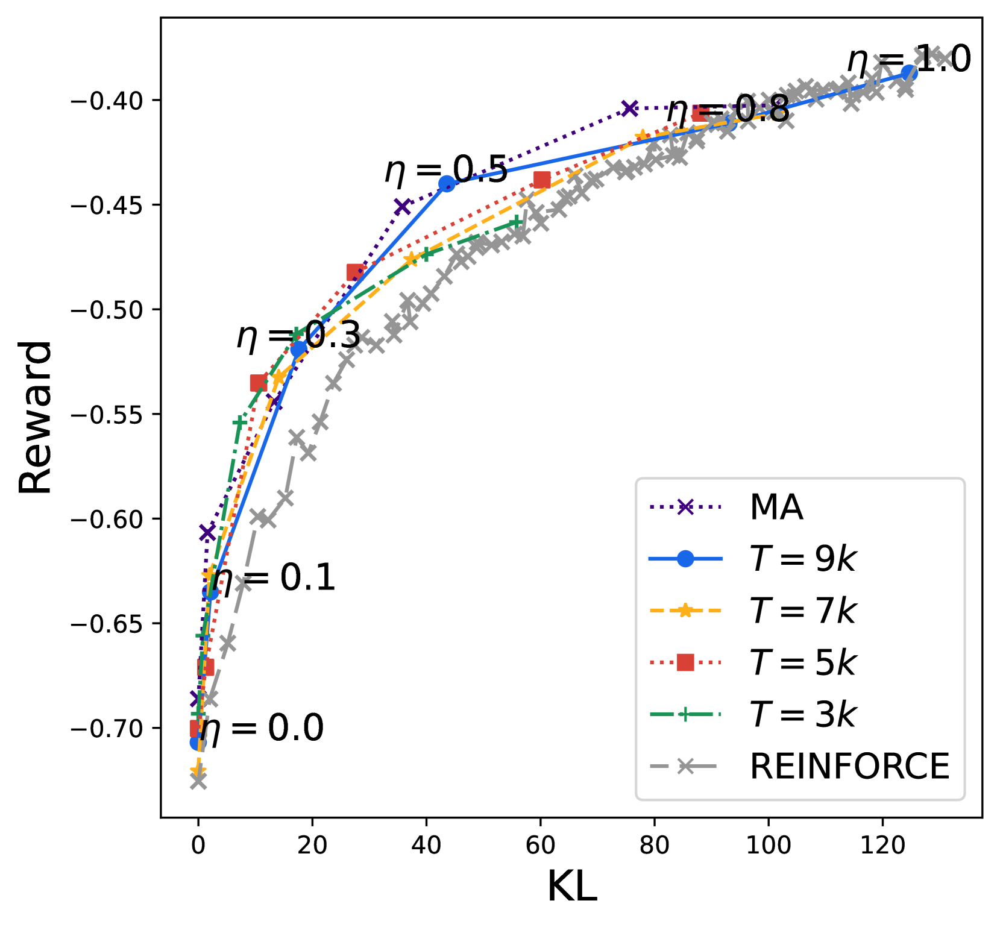
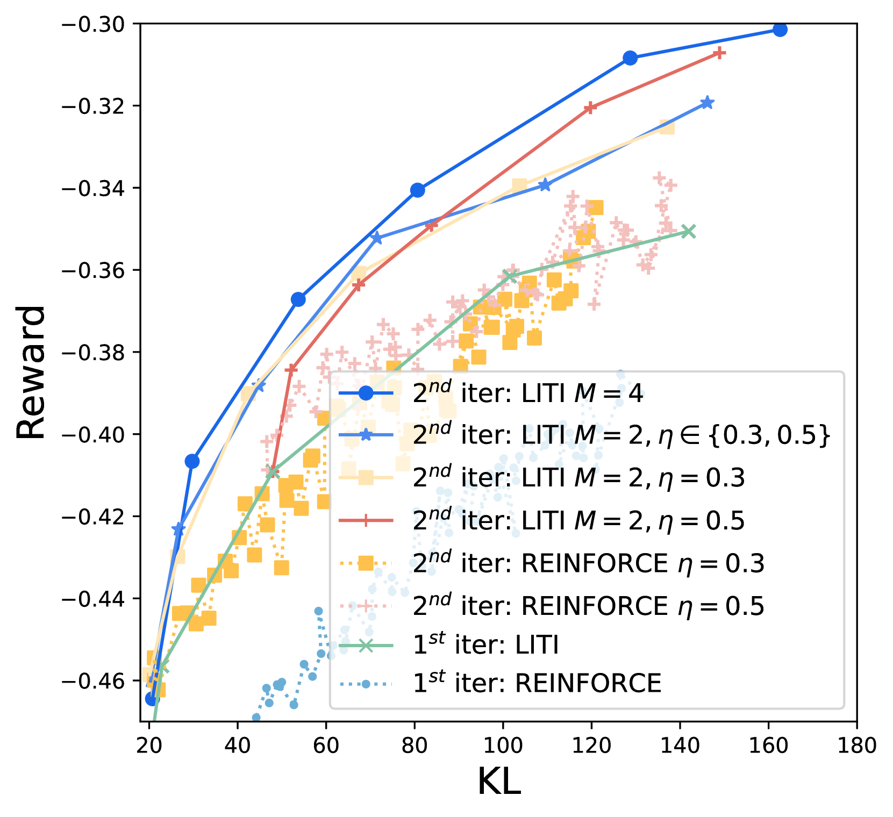

# WARP：探讨加权平均奖励策略的优势

发布时间：2024年06月24日

`LLM理论

理由：这篇论文探讨了大型语言模型（LLMs）的调整和优化策略，特别是在通过人类反馈的强化学习（RLHF）中如何平衡KL正则化与奖励优化。论文提出的加权平均奖励策略（WARP）是一种创新的策略对齐方法，旨在优化模型性能同时保持预训练知识的完整性。这种方法涉及到模型策略的深度调整和优化，属于LLM的理论研究范畴，因为它不仅关注模型的应用，还深入探讨了模型内部机制和优化算法。因此，这篇论文更适合归类于LLM理论。` `人工智能` `机器学习`

> WARP: On the Benefits of Weight Averaged Rewarded Policies

# 摘要

> 通过人类反馈的强化学习（RLHF）利用基于人类偏好的奖励模型，激励大型语言模型（LLMs）生成高奖励内容，以此来调整模型。为了防止预训练知识的遗忘，RLHF通常会引入KL正则化，确保策略接近其监督微调的初始状态，尽管这限制了奖励的优化。为了平衡KL正则化与奖励优化，本文提出了一种创新的策略对齐方法——加权平均奖励策略（WARP）。WARP在三个关键阶段通过权重空间合并策略：首先，利用策略的指数移动平均作为KL正则化的动态基准；其次，通过球面插值将多个独立微调的策略融合成一个增强版；最后，通过线性插值在融合模型与初始模型之间恢复预训练特征。这一过程通过迭代进行，每次迭代的最终模型作为下一次迭代的优化初始化，逐步提升KL-奖励的帕累托前沿，实现在固定KL下的更高奖励。实验证明，WARP显著提升了GEMMA策略的质量和对齐性，超越了其他开源LLMs。

> Reinforcement learning from human feedback (RLHF) aligns large language models (LLMs) by encouraging their generations to have high rewards, using a reward model trained on human preferences. To prevent the forgetting of pre-trained knowledge, RLHF usually incorporates a KL regularization; this forces the policy to remain close to its supervised fine-tuned initialization, though it hinders the reward optimization. To tackle the trade-off between KL and reward, in this paper we introduce a novel alignment strategy named Weight Averaged Rewarded Policies (WARP). WARP merges policies in the weight space at three distinct stages. First, it uses the exponential moving average of the policy as a dynamic anchor in the KL regularization. Second, it applies spherical interpolation to merge independently fine-tuned policies into a new enhanced one. Third, it linearly interpolates between this merged model and the initialization, to recover features from pre-training. This procedure is then applied iteratively, with each iteration's final model used as an advanced initialization for the next, progressively refining the KL-reward Pareto front, achieving superior rewards at fixed KL. Experiments with GEMMA policies validate that WARP improves their quality and alignment, outperforming other open-source LLMs.

[Arxiv](https://arxiv.org/abs/2406.16768)