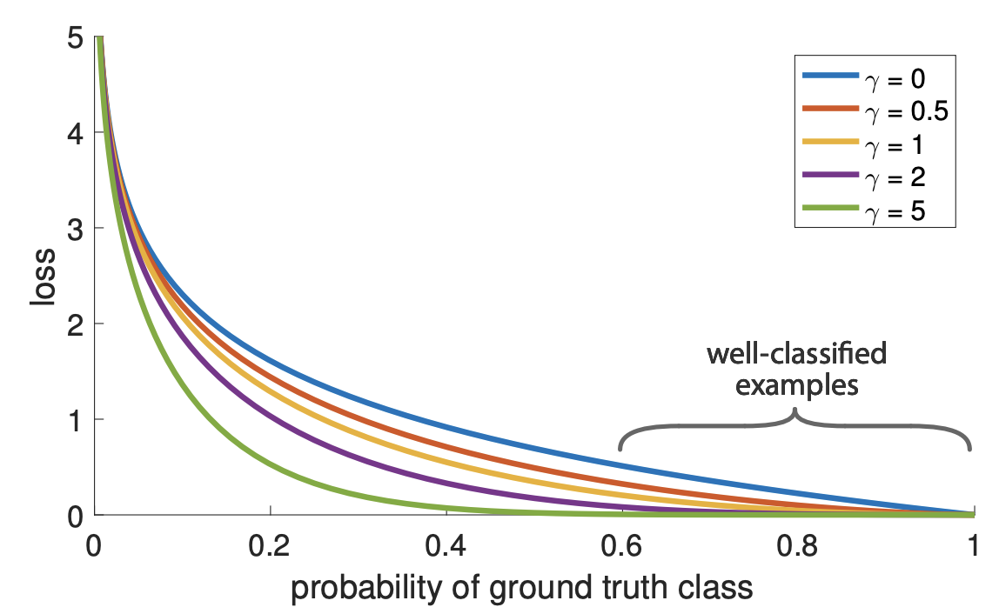

# eagerlearners 参与 SemEval2024 的第五项挑战：民事诉讼程序中的法律论证推理任务。

发布时间：2024年06月24日

`LLM应用

这篇论文摘要描述了一项研究，该研究探讨了零-shot方法在处理法律数据时的表现，特别是使用了三种大型语言模型、两种大输入令牌模型及两种法律数据预训练模型。研究的重点是这些模型在理解美国民事诉讼领域的复杂数据时的效率。由于研究关注的是大型语言模型在特定应用场景（法律数据分类）中的实际应用和性能评估，因此应归类为LLM应用。` `数据分类`

> eagerlearners at SemEval2024 Task 5: The Legal Argument Reasoning Task in Civil Procedure

# 摘要

> 本研究探讨了零-shot方法在利用三种大型语言模型、两种大输入令牌模型及两种法律数据预训练模型进行数据分类时的表现。研究数据源自美国民事诉讼领域，涵盖法律案例摘要、问题、答案及解决方案的相关性解释，资料来源于一本法律学生用书。通过方法对比，我们旨在揭示这些方法处理法律数据复杂性的效率。研究结果表明，大型语言模型的零-shot方法在理解复杂数据方面表现出色，实验中我们取得了64%的最高F1分数。

> This study investigates the performance of the zero-shot method in classifying data using three large language models, alongside two models with large input token sizes and the two pre-trained models on legal data. Our main dataset comes from the domain of U.S. civil procedure. It includes summaries of legal cases, specific questions, potential answers, and detailed explanations for why each solution is relevant, all sourced from a book aimed at law students. By comparing different methods, we aimed to understand how effectively they handle the complexities found in legal datasets. Our findings show how well the zero-shot method of large language models can understand complicated data. We achieved our highest F1 score of 64% in these experiments.

[Arxiv](https://arxiv.org/abs/2406.16490)