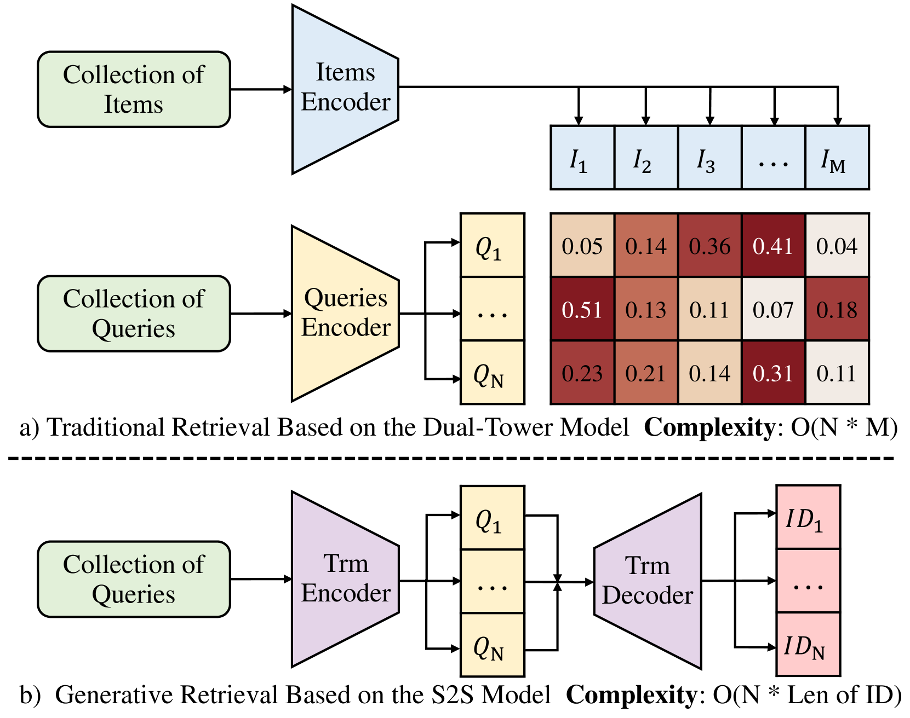

# ACE：一种生成式跨模态检索框架，采用由粗至细的语义建模策略

发布时间：2024年06月25日

`RAG

理由：这篇论文主要介绍了一种新的跨模态检索框架（ACE），该框架通过生成式方法处理多模态数据，并特别强调了其在文本到图像/音频/视频检索中的应用。这种方法与传统的基于嵌入的双塔模型不同，它通过序列到序列模型直接生成候选标识，从而提高了检索的速度和准确性。这与RAG（Retrieval-Augmented Generation）的概念相符，即通过检索增强生成过程，特别是在处理多模态数据时。因此，这篇论文更适合归类为RAG。` `跨模态检索` `多媒体检索`

> ACE: A Generative Cross-Modal Retrieval Framework with Coarse-To-Fine Semantic Modeling

# 摘要

> 生成式检索通过序列到序列模型，直接根据自然语言查询生成候选标识，已在文本到文本检索中显示出其优越性。它无需计算查询与候选间的相似度，便在大规模语料库上以更快的速度和更高的准确性超越了双塔模型，为跨模态检索开辟了新思路。然而，多模态数据的标识构建仍是一片未开发的领域，自然语言与多模态候选间的模态差异，因缺少额外编码器而成为检索性能的绊脚石。为此，我们创新性地提出了生成式跨模态检索框架（ACE），这是一个端到端的跨模态检索框架，通过粗到细的语义建模实现。我们采用K-Means与RQ-VAE相结合的方法，为多模态数据构建粗细令牌标识。同时，我们设计了粗到细的特征融合策略，有效对齐自然语言查询与候选标识。ACE首次全面验证了生成方法在文本到图像/音频/视频检索中的可行性，挑战了基于嵌入的双塔架构的霸主地位。实验结果显示，ACE在跨模态检索领域达到了顶尖水平，平均Recall@1超越了强基线15.27%。

> Generative retrieval, which has demonstrated effectiveness in text-to-text retrieval, utilizes a sequence-to-sequence model to directly generate candidate identifiers based on natural language queries. Without explicitly computing the similarity between queries and candidates, generative retrieval surpasses dual-tower models in both speed and accuracy on large-scale corpora, providing new insights for cross-modal retrieval. However, constructing identifiers for multimodal data remains an untapped problem, and the modality gap between natural language queries and multimodal candidates hinders retrieval performance due to the absence of additional encoders. To this end, we propose a pioneering generAtive Cross-modal rEtrieval framework (ACE), which is a comprehensive framework for end-to-end cross-modal retrieval based on coarse-to-fine semantic modeling. We propose combining K-Means and RQ-VAE to construct coarse and fine tokens, serving as identifiers for multimodal data. Correspondingly, we design the coarse-to-fine feature fusion strategy to efficiently align natural language queries and candidate identifiers. ACE is the first work to comprehensively demonstrate the feasibility of generative approach on text-to-image/audio/video retrieval, challenging the dominance of the embedding-based dual-tower architecture. Extensive experiments show that ACE achieves state-of-the-art performance in cross-modal retrieval and outperforms the strong baselines on Recall@1 by 15.27% on average.

[Arxiv](https://arxiv.org/abs/2406.17507)