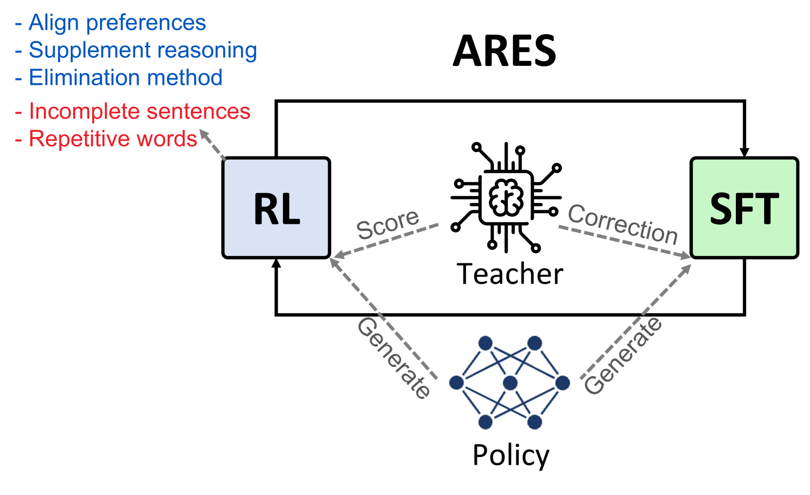
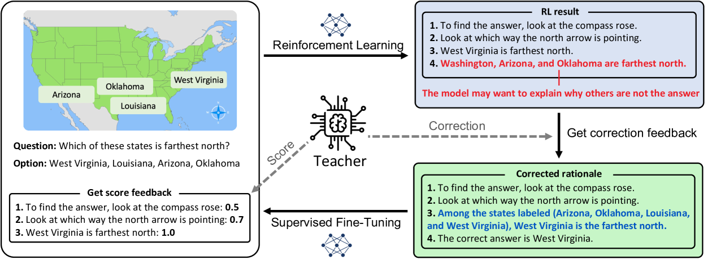
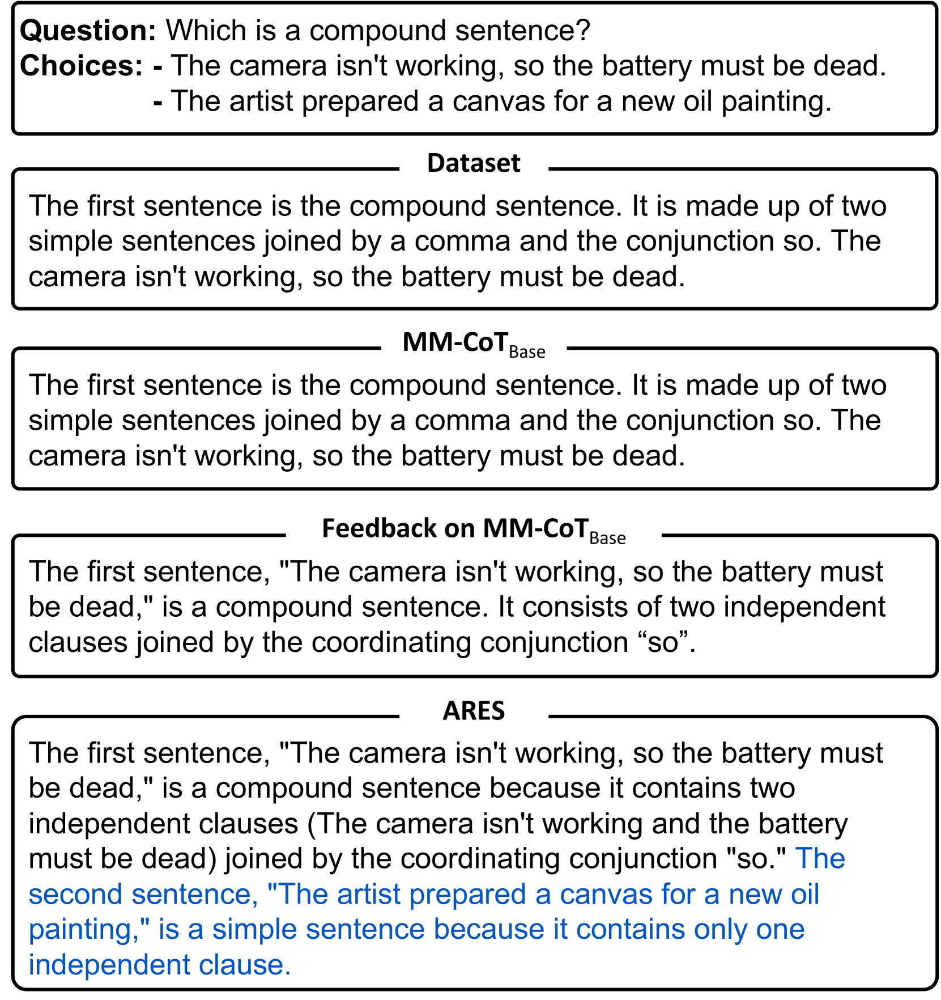
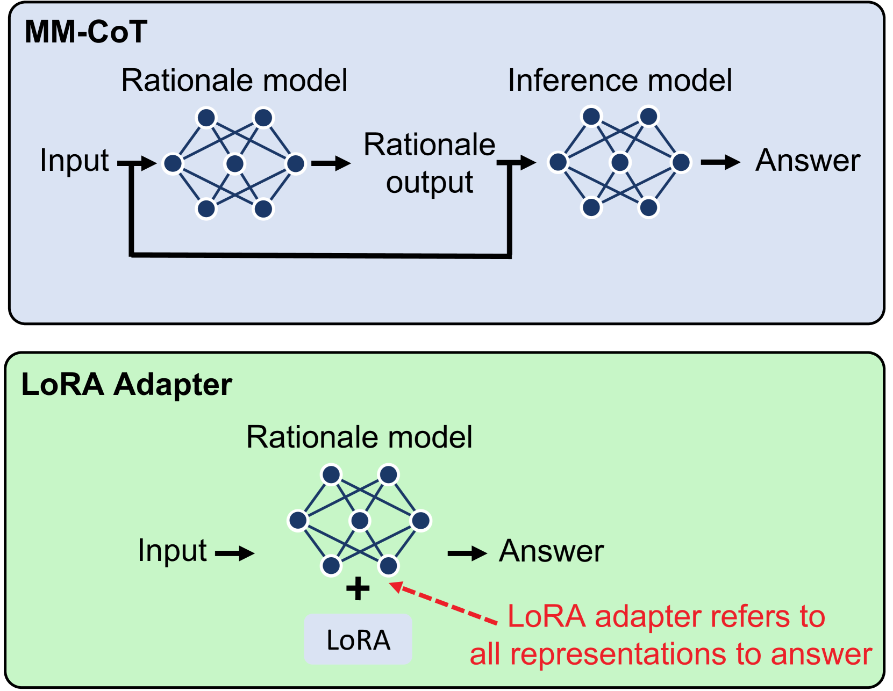

# ARES 方法结合强化学习与监督微调，通过多元AI反馈提升多模态思维链推理能力。

发布时间：2024年06月25日

`Agent` `人工智能`

> ARES: Alternating Reinforcement Learning and Supervised Fine-Tuning for Enhanced Multi-Modal Chain-of-Thought Reasoning Through Diverse AI Feedback

# 摘要

> 大型多模态模型 (LMMs) 在理解人类指令方面表现出色，并在多种任务中取得显著成绩。通过从人类和 AI 反馈中进行强化学习 (RLHF 和 RLAIF)，这些模型进一步与特定偏好对齐，主要采用基于排名的反馈来评估整个生成内容。利用 GPT-4 和 Claude 3 Opus 等先进 AI 模型，我们能获取人类难以提供的详细反馈。我们提出的 ARES 算法分两阶段进行：首先，教师模型评估每句话在解决问题的思维链中的贡献，提供句子级反馈，增强 RL 过程的奖励细粒度；其次，教师模型在 RL 后纠正推理错误，通过 SFT 稳定模型。实验表明，ARES 在多模态数据集上的推理理由胜率约 70%，推理答案准确性提升 2.5%。

> Large Multimodal Models (LMMs) excel at comprehending human instructions and demonstrate remarkable results across a broad spectrum of tasks. Reinforcement Learning from Human Feedback (RLHF) and AI Feedback (RLAIF) further refine LLMs by aligning them with specific preferences. These methods primarily use ranking-based feedback for entire generations. With advanced AI models (Teacher), such as GPT-4 and Claude 3 Opus, we can request various types of detailed feedback that are expensive for humans to provide. We propose a two-stage algorithm ARES that Alternates REinforcement Learning (RL) and Supervised Fine-Tuning (SFT). First, we request the Teacher to score how much each sentence contributes to solving the problem in a Chain-of-Thought (CoT). This sentence-level feedback allows us to consider individual valuable segments, providing more granular rewards for the RL procedure. Second, we ask the Teacher to correct the wrong reasoning after the RL stage. The RL procedure requires massive efforts for hyperparameter tuning and often generates errors like repetitive words and incomplete sentences. With the correction feedback, we stabilize the RL fine-tuned model through SFT. We conduct experiments on multi-model dataset ScienceQA and A-OKVQA to demonstrate the effectiveness of our proposal. ARES rationale reasoning achieves around 70% win rate against baseline models judged by GPT-4o. Additionally, we observe that the improved rationale reasoning leads to a 2.5% increase in inference answer accuracy on average for the multi-modal datasets.

[Arxiv](https://arxiv.org/abs/2407.00087)