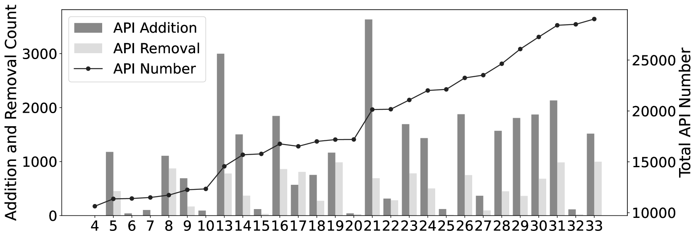
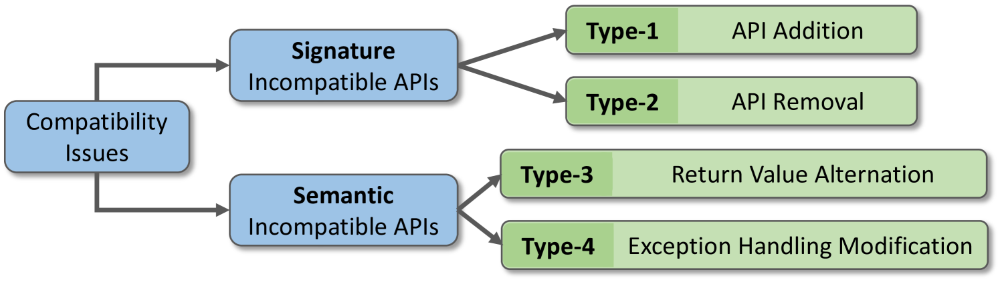
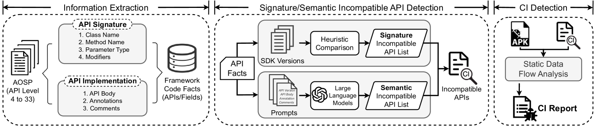
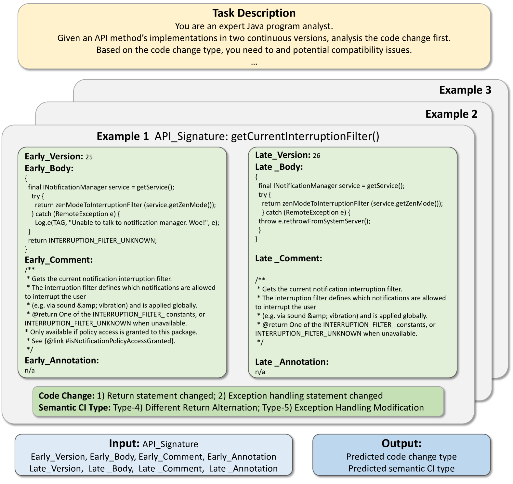
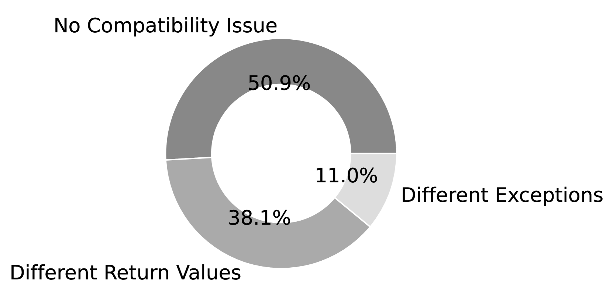
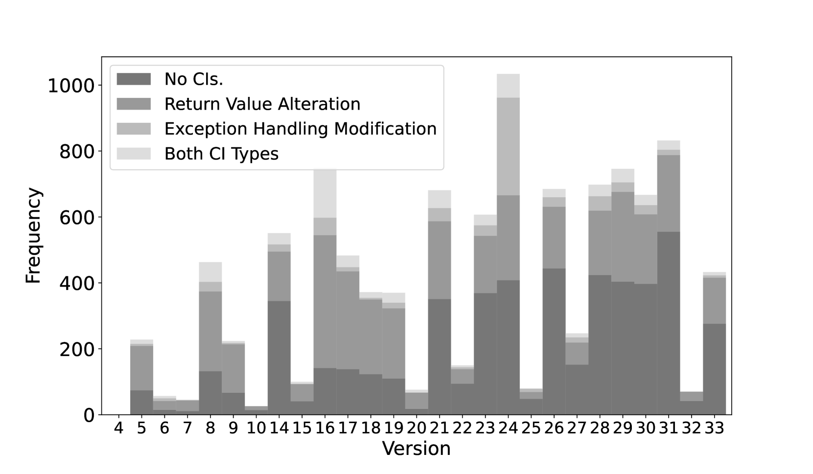
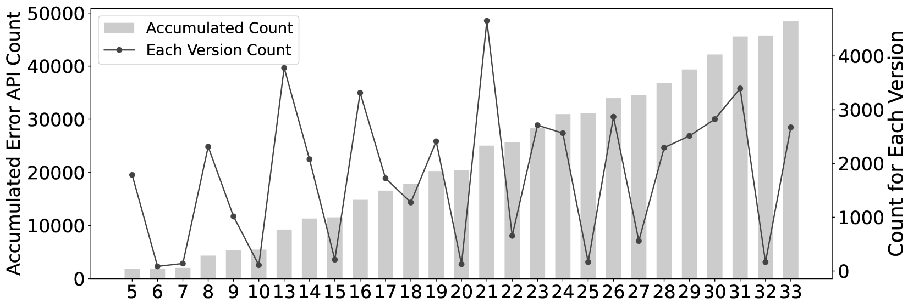

# 深入探究安卓应用兼容性问题根源：大规模分析语义不兼容API

发布时间：2024年06月25日

`LLM应用

这篇论文主要探讨了如何利用大型语言模型（LLM）和静态分析技术来识别Android操作系统中API的兼容性问题，特别是在处理复杂的语义变化方面。这种方法的应用性质明显，因为它直接应用于解决实际的软件开发问题，即Android API的兼容性问题。因此，这篇论文应归类于LLM应用。` `移动开发` `软件工程`

> A Large-scale Investigation of Semantically Incompatible APIs behind Compatibility Issues in Android Apps

# 摘要

> API不兼容一直是Android开发的难题。随着Android API的快速演进，相邻版本间的API增删改频繁，常导致兼容性问题，且开发者往往未获充分通知。虽然已有研究关注API签名变化引发的兼容性问题，但复杂的语义变化问题常被忽略。为此，我们利用静态分析和大型语言模型，在AOSP的相邻版本中大规模识别不兼容API。我们提出了一套统一框架，特别针对语义变化进行检测，实现了0.83的F1分数。最终，我们发现了从版本4至33的5,481个不兼容API，并证明了该方法能有效补充现有技术，检测到之前被忽视的更广泛的兼容性问题，增幅达92.3%。

> Application Programming Interface (API) incompatibility is a long-standing issue in Android application development. The rapid evolution of Android APIs results in a significant number of API additions, removals, and changes between adjacent versions. Unfortunately, this high frequency of alterations may lead to compatibility issues, often without adequate notification to developers regarding these changes. Although researchers have proposed some work on detecting compatibility issues caused by changes in API signatures, they often overlook compatibility issues stemming from sophisticated semantic changes. In response to this challenge, we conducted a large-scale discovery of incompatible APIs in the Android Open Source Project (AOSP) by leveraging static analysis and pre-trained Large Language Models (LLMs) across adjacent versions. We systematically formulate the problem and propose a unified framework to detect incompatible APIs, especially for semantic changes. It's worth highlighting that our approach achieves a 0.83 F1-score in identifying semantically incompatible APIs in the Android framework. Ultimately, our approach detects 5,481 incompatible APIs spanning from version 4 to version 33. We further demonstrate its effectiveness in supplementing the state-of-the-art methods in detecting a broader spectrum of compatibility issues (+92.3%) that have been previously overlooked.

[Arxiv](https://arxiv.org/abs/2406.17431)