# 文本的价值远超几个标记：LLMs 的文本嵌入巧妙地与关键标记对齐，揭示了其深层的一致性。

发布时间：2024年06月25日

`LLM理论

理由：这篇论文主要探讨了大型语言模型（LLMs）中文本嵌入的特性，特别是在嵌入空间中令牌对齐的现象，并分析了其背后的原理。此外，论文还展示了这一发现的应用，如提出一种高效的稀疏检索方法和为理解模糊概念提供新视角。这些内容更偏向于对LLMs理论层面的探讨和理解，而不是具体的应用案例或Agent的设计，因此归类为LLM理论。` `信息检索` `语义分析`

> A Text is Worth Several Tokens: Text Embedding from LLMs Secretly Aligns Well with The Key Tokens

# 摘要

> 大型语言模型（LLMs）的文本嵌入在信息检索和语义文本相似性等任务中表现出色。我们发现，当文本输入嵌入式LLMs时，其嵌入能与输入文本的关键令牌精准对齐。这一现象在八种嵌入式LLMs中普遍存在，不受模型设计、训练方法或嵌入技术的影响。深入分析揭示，嵌入空间的主要变化在于第一主成分，调整它即可实现令牌对齐。我们展示了这一发现的实际应用：（1）提出一种高效的稀疏检索方法，计算量大幅减少，效果却能达到密集检索的80%；（2）为理解模糊概念和新兴技术提供了新视角，如区分语义相关性与相似性，以及指令跟随嵌入技术。

> Text embeddings from large language models (LLMs) have achieved excellent results in tasks such as information retrieval, semantic textual similarity, etc. In this work, we show an interesting finding: when feeding a text into the embedding LLMs, the obtained text embedding will be able to be aligned with the key tokens in the input text. We first fully analyze this phenomenon on eight embedding LLMs and show that this phenomenon is universal and is not affected by model architecture, training strategy, and embedding method. With a deeper analysis, we then find that the main change in embedding space between the embedding LLMs and their original generative LLMs is in the first principal component. By adjusting the first principal component, we can align text embedding with the key tokens. Finally, we give several examples to demonstrate the vast application potential of this finding: (1) we propose a simple and practical sparse retrieval method based on the aligned tokens, which can achieve 80\% of the dense retrieval effect of the same model while reducing the computation significantly; (2) we show that our findings provide a fresh perspective to help understand fuzzy concepts (e.g., semantic relatedness vs. semantic similarity) and emerging technologies (e.g., instruction-following embedding) in this field.

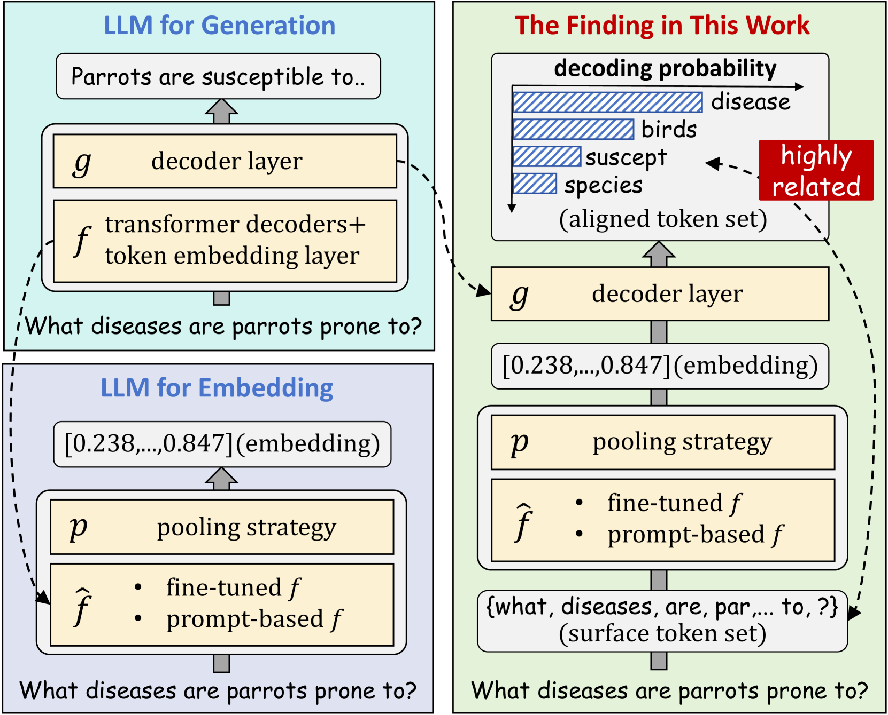

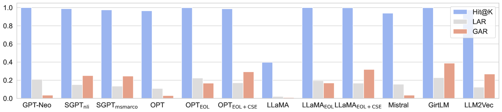

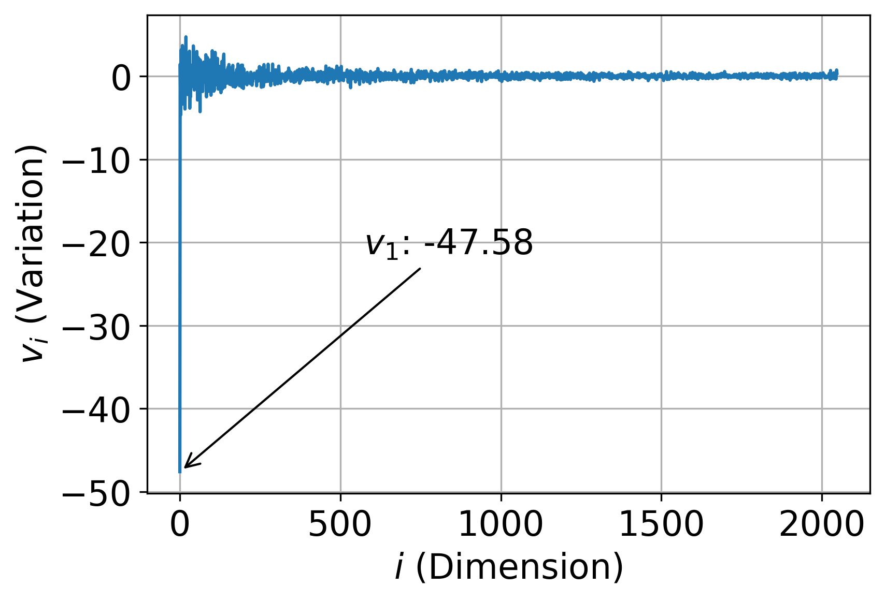

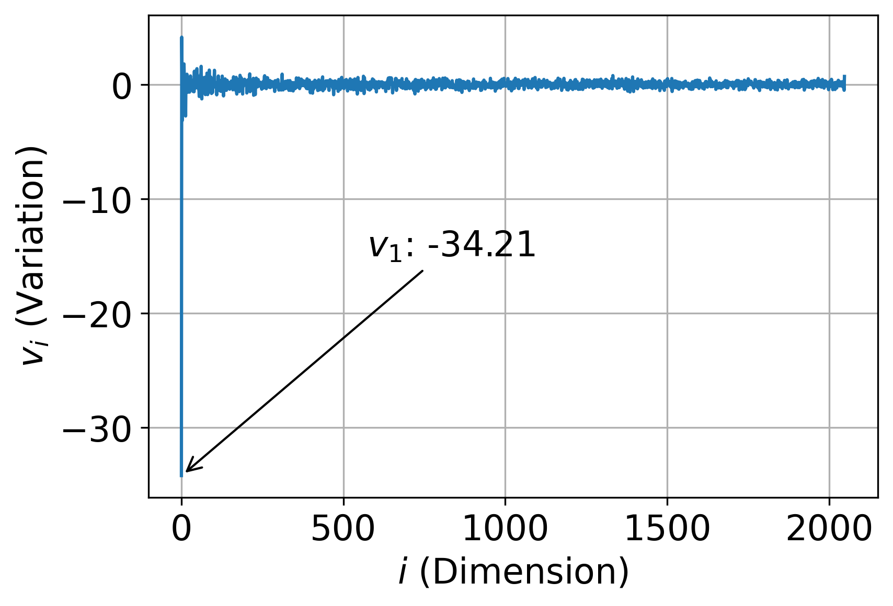

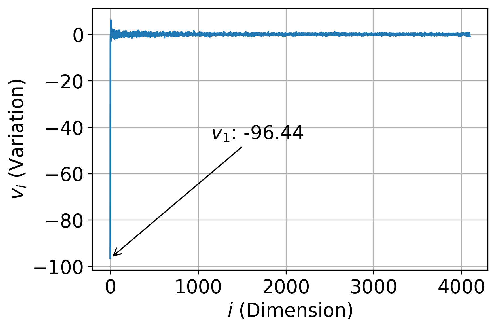

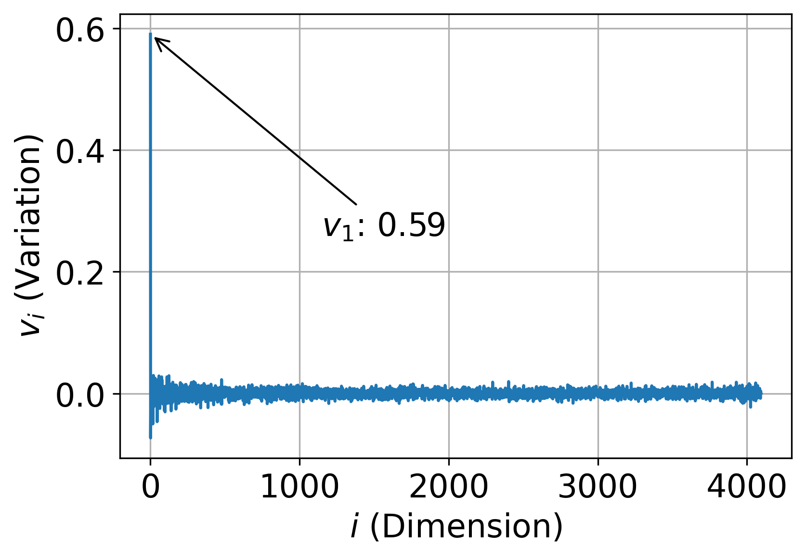

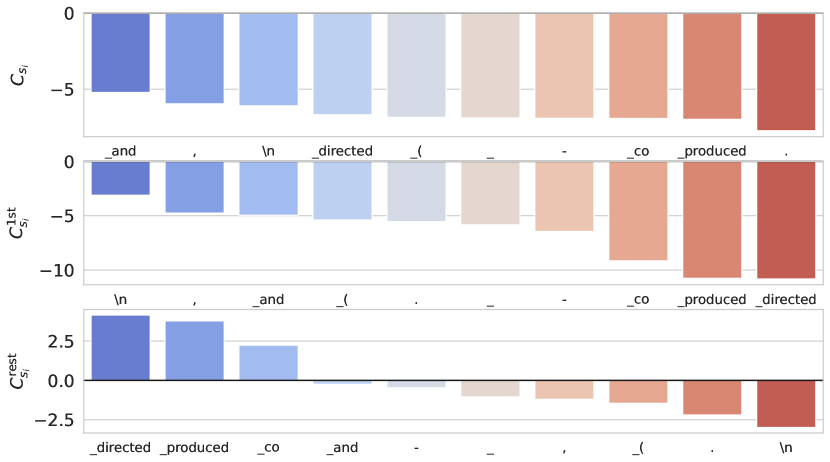

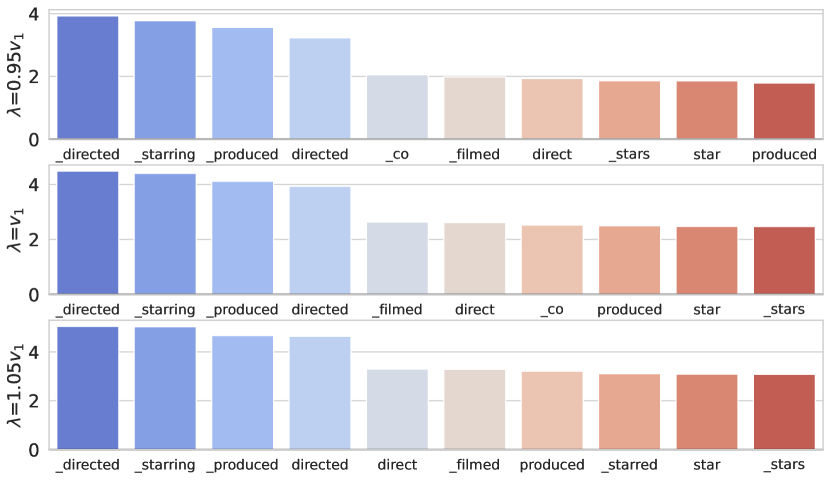

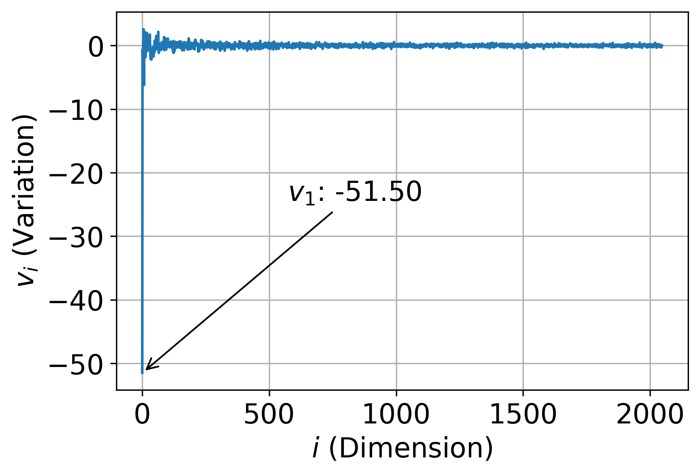

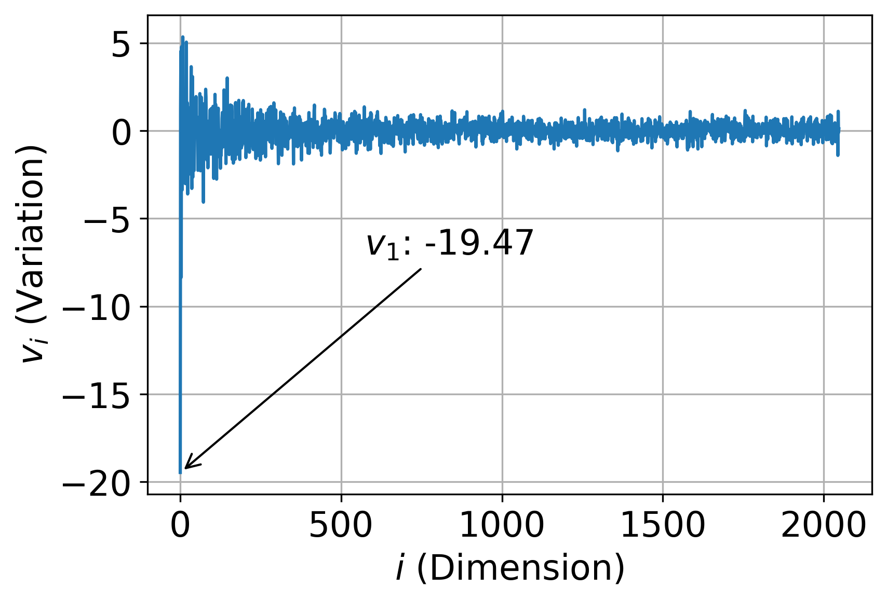

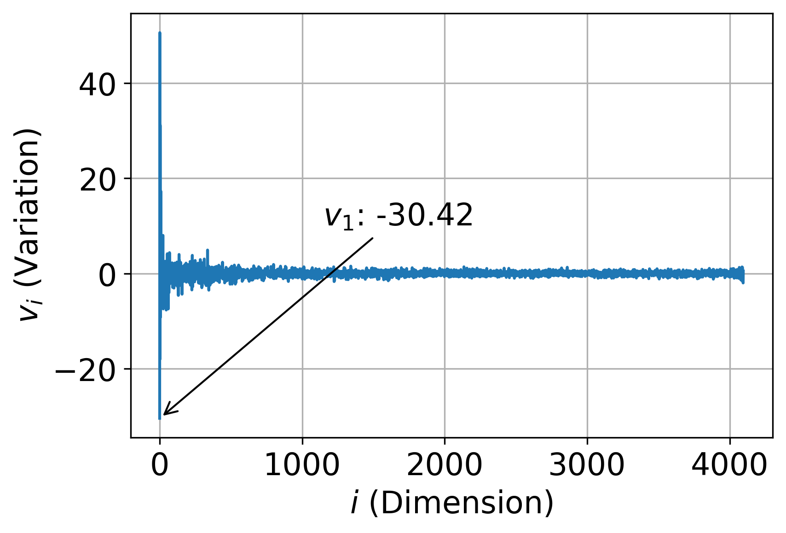

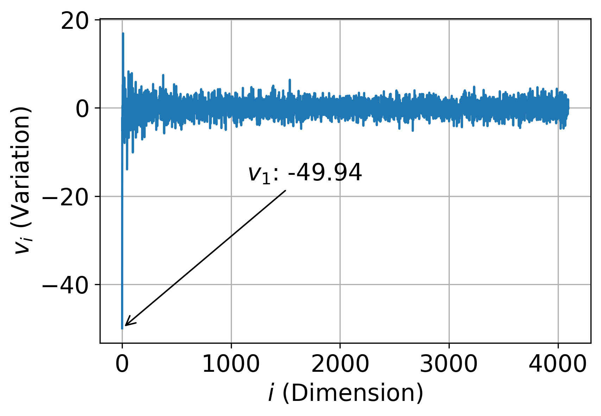

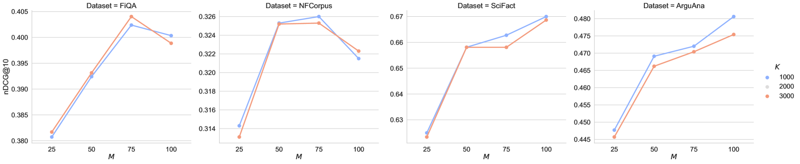

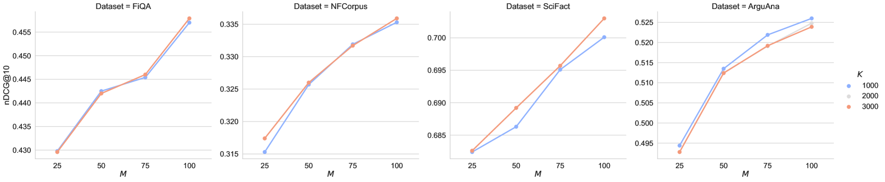

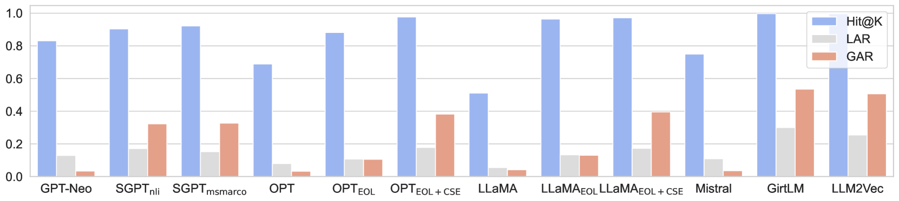

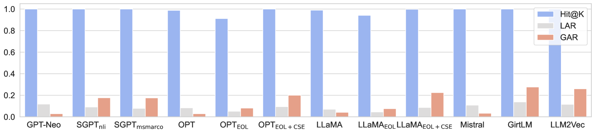

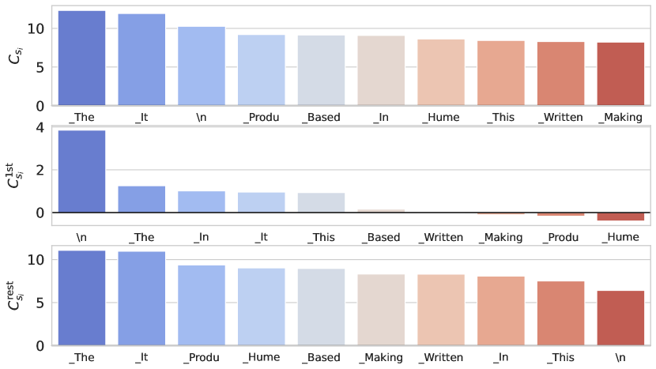

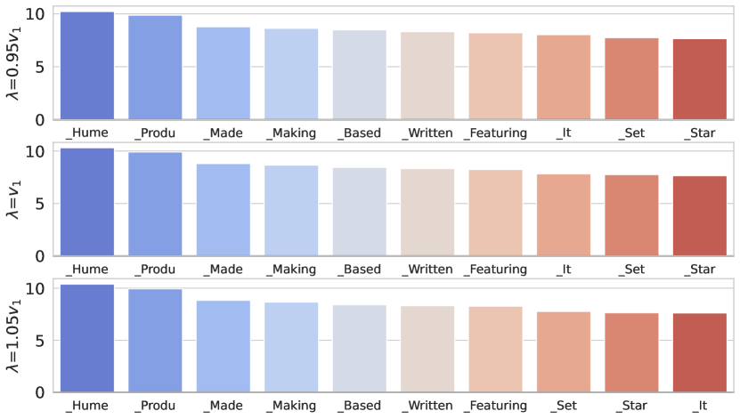

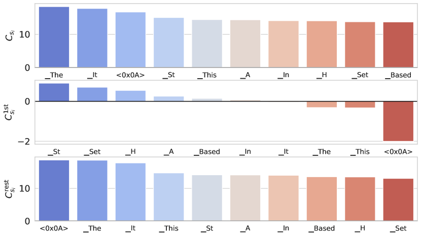

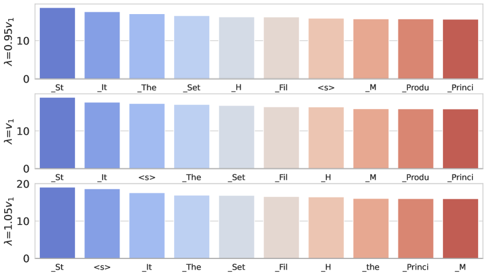

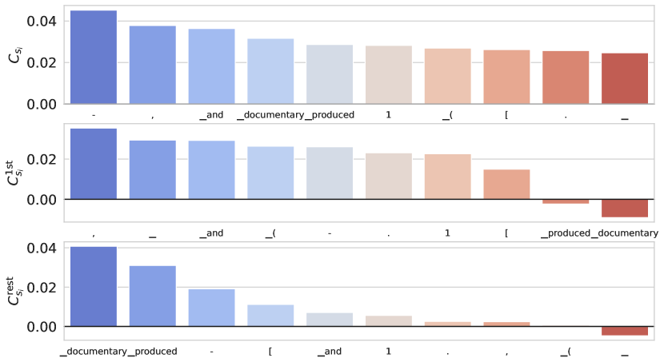

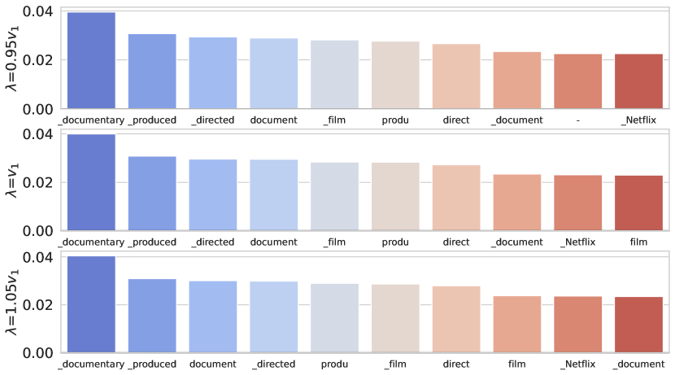

[Arxiv](https://arxiv.org/abs/2406.17378)