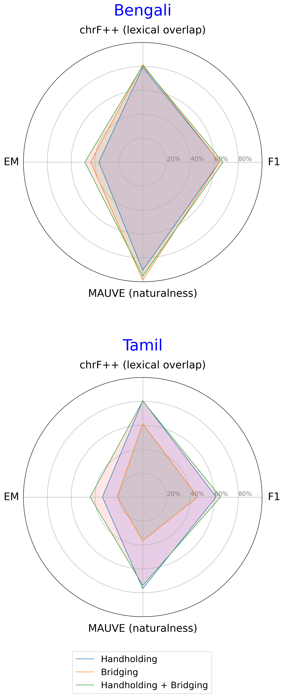
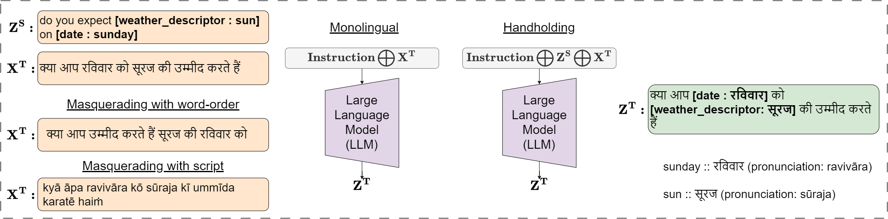
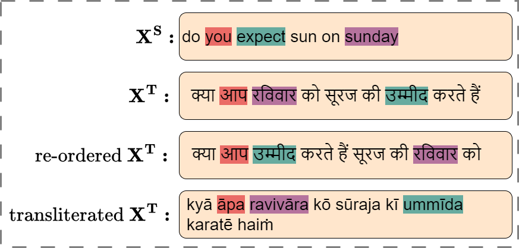

# 多语言大型语言模型的跨语言适应：三重策略

发布时间：2024年06月25日

`LLM应用

这篇论文探讨了如何通过跨语言方法帮助大型语言模型（LLM）适应新语言的任务，特别是在低资源语言环境下的应用。研究集中在如何通过添加监督信号、调整词序重排和持续预训练等方法来提升模型在特定语言（如孟加拉语、印地语和泰米尔语）上的性能。这些方法和实验结果展示了LLM在多语言环境中的应用潜力和挑战，因此属于LLM应用分类。` `跨语言迁移`

> A Three-Pronged Approach to Cross-Lingual Adaptation with Multilingual LLMs

# 摘要

> 低资源语言在大型语言模型的预训练语料库中往往代表性不足。本研究探讨了三种跨语言方法，帮助LLM适应新语言的任务。以英语为主的Llama-2模型，在2万亿令牌的预训练语料库中，印度语言等语系的贡献不足$0.005\%$。我们尝试将Llama-2用于孟加拉语、印地语和泰米尔语这三种印度语言的跨语言迁移。研究发现，通过主导语言添加监督信号，无论是在ICL还是微调中，都能提升性能。此外，在ICL中调整词序重排对目标语言有益，但在微调中效果减弱。最后，对一个低资源语言的持续预训练能提升模型对其他相关低资源语言的性能。

> Low-resource languages, by its very definition, tend to be under represented in the pre-training corpora of Large Language Models. In this work, we investigate three low-resource cross-lingual approaches that enable an LLM adapt to tasks in previously unseen languages. Llama-2 is an LLM where Indic languages, among many other language families, contribute to less than $0.005\%$ of the total $2$ trillion token pre-training corpora. In this work, we experiment with the English-dominated Llama-2 for cross-lingual transfer to three Indic languages, Bengali, Hindi, and Tamil as target languages. We study three approaches for cross-lingual transfer, under ICL and fine-tuning. One, we find that adding additional supervisory signals via a dominant language in the LLM, leads to improvements, both under in-context learning and fine-tuning. Two, adapting the target languages to word reordering may be beneficial under ICL, but its impact diminishes with fine tuning. Finally, continued pre-training in one low-resource language can improve model performance for other related low-resource languages.

[Arxiv](https://arxiv.org/abs/2406.17377)