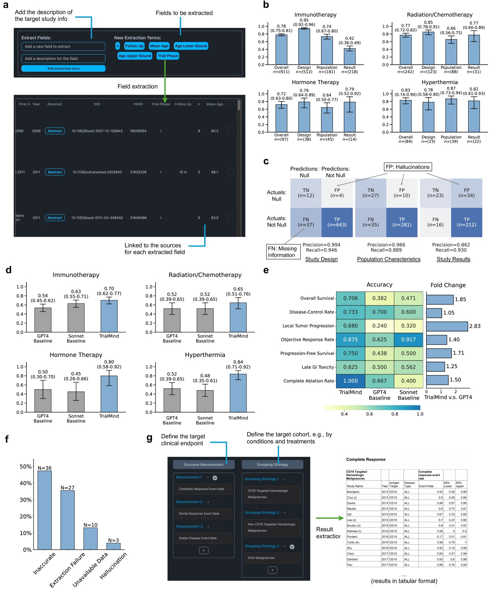
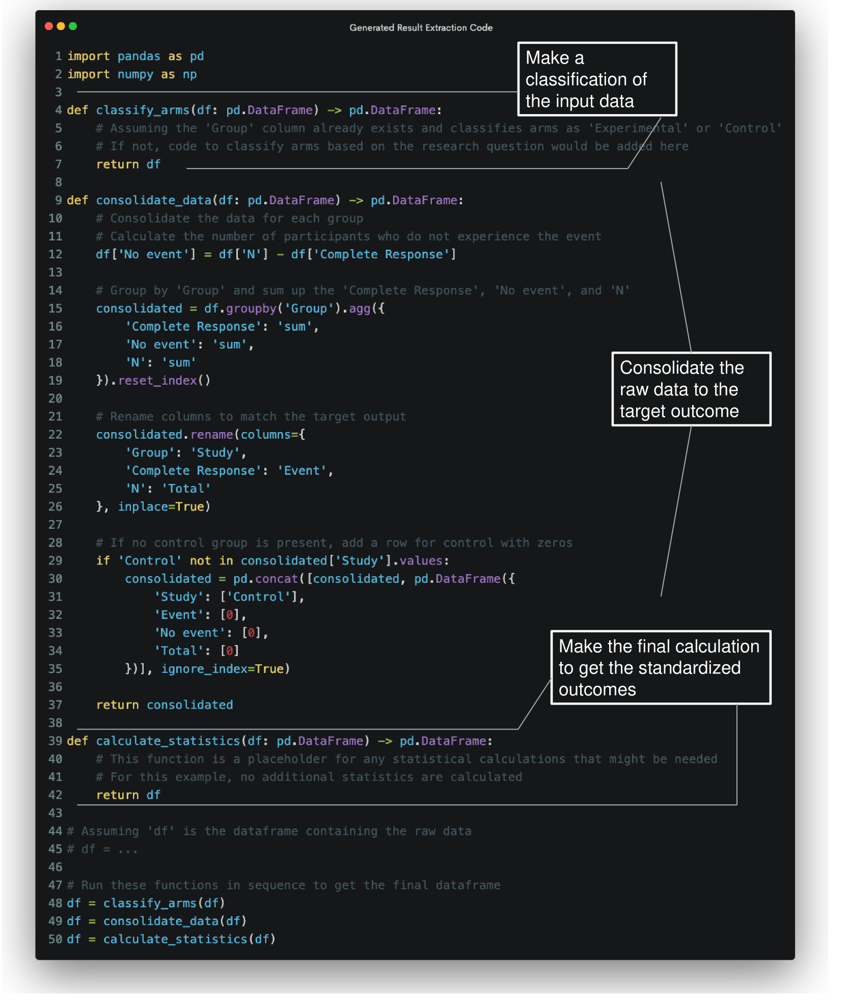
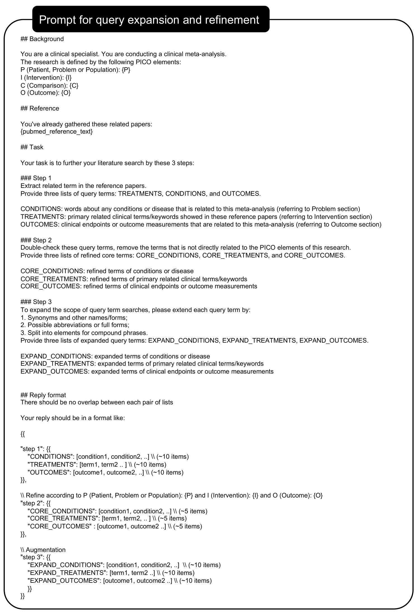

# 借助大型语言模型，加速临床证据的综合分析

发布时间：2024年06月25日

`LLM应用

这篇论文介绍了TrialMind系统，它是一个基于生成AI的系统，专门设计用于从大量医学文献中提取和综合临床证据。该系统利用大型语言模型（LLMs）进行研究搜索、筛选和数据提取，并结合专家监督以确保准确性。论文中提到的TrialReviewBench数据集和系统在文献回顾中的高效性，以及在结果提取和临床证据综合方面的优越表现，都直接关联到LLM的具体应用，特别是在医学研究和临床证据处理领域。因此，这篇论文应归类为LLM应用。` `临床研究`

> Accelerating Clinical Evidence Synthesis with Large Language Models

# 摘要

> AI自动进行医学发现是众多研究者的梦想。为了实现这一目标，我们开发了TrialMind，一个基于生成AI的系统，旨在从海量文献中智能提取和综合临床证据。该系统利用大型语言模型（LLMs）进行高效的研究搜索、筛选和数据提取，同时辅以专家监督以确保准确性。我们创建的TrialReviewBench数据集，包含870个注释临床研究，证明了TrialMind在文献回顾中的高效性，其召回率高达0.897-1.000，并显著优于传统方法。此外，TrialMind在结果提取的准确性上超越了GPT-4，且在临床证据综合方面得到了专家的青睐，胜率达62.5%-100%。这些成果展示了TrialMind在提高临床研究效率方面的巨大潜力。

> Automatic medical discovery by AI is a dream of many. One step toward that goal is to create an AI model to understand clinical studies and synthesize clinical evidence from the literature. Clinical evidence synthesis currently relies on systematic reviews of clinical trials and retrospective analyses from medical literature. However, the rapid expansion of publications presents challenges in efficiently identifying, summarizing, and updating evidence. We introduce TrialMind, a generative AI-based pipeline for conducting medical systematic reviews, encompassing study search, screening, and data extraction phases. We utilize large language models (LLMs) to drive each pipeline component while incorporating human expert oversight to minimize errors. To facilitate evaluation, we also create a benchmark dataset TrialReviewBench, a custom dataset with 870 annotated clinical studies from 25 meta-analysis papers across various medical treatments. Our results demonstrate that TrialMind significantly improves the literature review process, achieving high recall rates (0.897-1.000) in study searching from over 20 million PubMed studies and outperforming traditional language model embeddings-based methods in screening (Recall@20 of 0.227-0.246 vs. 0.000-0.102). Furthermore, our approach surpasses direct GPT-4 performance in result extraction, with accuracy ranging from 0.65 to 0.84. We also support clinical evidence synthesis in forest plots, as validated by eight human annotators who preferred TrialMind over the GPT-4 baseline with a winning rate of 62.5%-100% across the involved reviews. Our findings suggest that an LLM-based clinical evidence synthesis approach, such as TrialMind, can enable reliable and high-quality clinical evidence synthesis to improve clinical research efficiency.

[Arxiv](https://arxiv.org/abs/2406.17755)